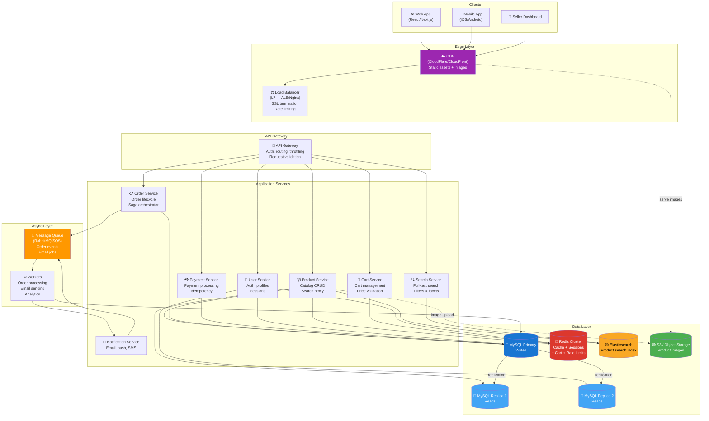
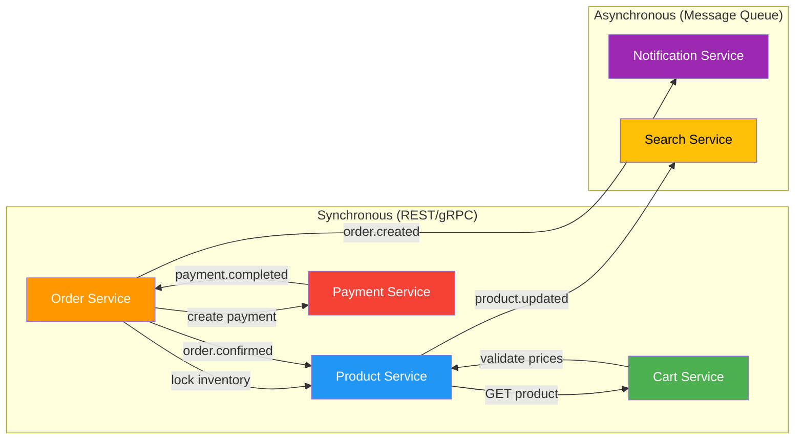
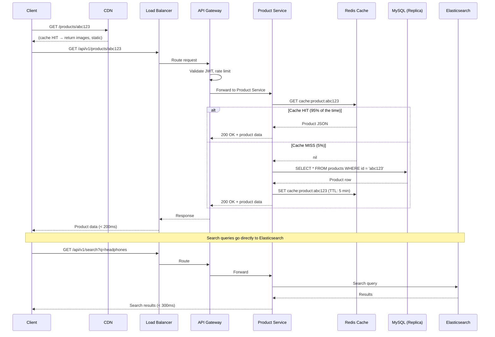
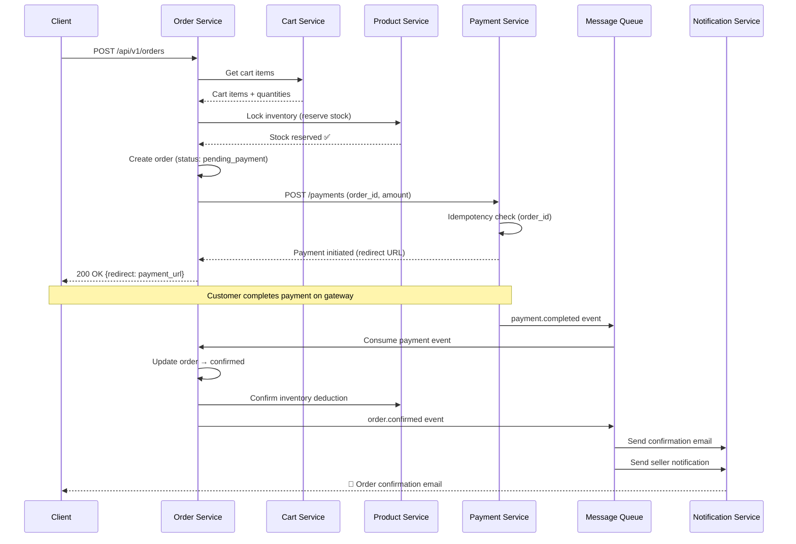

# 2. High-Level Architecture

## 🏗 System Architecture Diagram



---

## 🚪 API Design

### Core API Endpoints

#### Product Service

```
GET    /api/v1/products                    # List products (paginated, filtered)
GET    /api/v1/products/:id                # Get product detail
POST   /api/v1/products                    # Create product (seller)
PUT    /api/v1/products/:id                # Update product (seller)
DELETE /api/v1/products/:id                # Soft-delete product (seller)
GET    /api/v1/products/:id/reviews        # Get product reviews
POST   /api/v1/products/:id/reviews        # Add review (buyer, post-purchase)
GET    /api/v1/categories                  # Get category tree
GET    /api/v1/search?q=...&category=...   # Full-text search with filters
```

#### Cart Service

```
GET    /api/v1/cart                         # Get current cart
POST   /api/v1/cart/items                   # Add item to cart
PUT    /api/v1/cart/items/:sku_id           # Update quantity
DELETE /api/v1/cart/items/:sku_id           # Remove item
DELETE /api/v1/cart                         # Clear cart
```

#### Order Service

```
POST   /api/v1/orders                       # Create order (checkout)
GET    /api/v1/orders                       # List user's orders
GET    /api/v1/orders/:id                   # Get order detail
PUT    /api/v1/orders/:id/cancel            # Cancel order (if eligible)
GET    /api/v1/seller/orders                # Seller: list orders to fulfill
PUT    /api/v1/seller/orders/:id/ship       # Seller: mark as shipped
```

#### Payment Service

```
POST   /api/v1/payments                     # Initiate payment
GET    /api/v1/payments/:id                 # Get payment status
POST   /api/v1/payments/:id/webhook         # Payment gateway callback
```

#### User Service

```
POST   /api/v1/auth/register                # Register
POST   /api/v1/auth/login                   # Login (returns JWT)
POST   /api/v1/auth/refresh                 # Refresh token
GET    /api/v1/users/me                     # Get profile
PUT    /api/v1/users/me                     # Update profile
```

### API Response Format

```json
{
  "status": "success",
  "data": {
    "id": "prod_abc123",
    "title": "Wireless Bluetooth Headphones",
    "price": 2499,
    "currency": "EGP",
    "stock": 42,
    "seller": {
      "id": "seller_xyz",
      "name": "TechStore Egypt",
      "rating": 4.7
    },
    "images": [
      "https://cdn.marketplace.com/products/prod_abc123/1.webp",
      "https://cdn.marketplace.com/products/prod_abc123/2.webp"
    ]
  },
  "meta": {
    "request_id": "req_7f8a9b2c",
    "timestamp": "2026-02-23T10:30:00Z"
  }
}
```

> 💡 **Design decisions**:
> - Prices in **smallest currency unit** (cents/piasters) — avoids floating-point issues
> - All responses include **request_id** for tracing
> - Image URLs point to **CDN**, not the API server
> - Seller info **embedded** in product response to avoid N+1 frontend calls

---

## 🔀 Service Boundaries — Why These Services?

| Service | Owns | Why Separate? |
|---------|------|---------------|
| **Product Service** | Products, SKUs, Categories, Reviews | Highest traffic — needs independent scaling |
| **Cart Service** | Cart, CartItems | Redis-backed, stateful per user, very different access pattern |
| **Order Service** | Orders, OrderItems | Transactional, needs saga orchestration |
| **Payment Service** | Payments, Refunds | Highest security requirements, PCI compliance scope |
| **User Service** | Users, Auth, Sessions | Shared dependency — must be highly available |
| **Search Service** | ES index | Different tech stack, own scaling characteristics |
| **Notification Service** | Notification logs | Purely async, fire-and-forget, own rate limits |

### Service Communication



### ✅ Decision: Synchronous for Reads, Async for Side Effects

| Communication | Pattern | Why |
|--------------|---------|-----|
| Cart → Product (validate price) | **Sync** (REST) | User is waiting, needs immediate response |
| Order → Payment (charge) | **Sync** (REST) | Checkout flow — user must know result |
| Order → Notification (send email) | **Async** (Queue) | User doesn't need to wait for email |
| Product update → Search index | **Async** (Queue) | Eventual consistency is fine (seconds-delay OK) |
| Payment webhook → Order status | **Async** (Queue) | Decouples payment gateway from order logic |

> ⚖️ **Trade-off**: Async means eventual consistency. Product search results may be stale by 1-5 seconds after a product update. This is acceptable for a marketplace.

> **⚠️ Mitigation: Synchronous Coupling on Checkout Path**
>
> The checkout path's synchronous dependency on Product Service (for price verification) and Cart Service (for item retrieval) is managed with: (1) **timeout budgets** — each sync call has a 500ms budget; if exceeded, the call fails fast rather than blocking checkout, (2) **circuit breakers** — after 5 consecutive failures to Product Service, the circuit opens and checkout uses the last-known cached price (with a "price may have changed" flag), (3) **bulkhead pattern** — checkout's connection pool to Product Service is isolated from browse/search traffic, preventing a search traffic spike from exhausting checkout's connections.

---

## 🚦 Request Flow: Product Page Load



---

## 🚦 Request Flow: Checkout



---

## 🏛 Why Not Microservices on Day 1?

> ⚠️ **Common interview mistake**: Immediately jumping to microservices.

### Recommended Evolution Path

```
Day 1 (0–100K users):
  → Modular Monolith
  → Single Laravel/Django app with clear module boundaries
  → 1 MySQL + 1 Redis + 1 Elasticsearch
  → Deploy: 2 app servers behind LB
  → Cost: ~$500/month

Growth (100K–1M users):
  → Extract Payment Service (PCI compliance)
  → Add read replicas
  → Add worker queue (async processing)
  → Cost: ~$3,000/month

Scale (1M–10M users):
  → Extract Cart Service (Redis-backed)
  → Extract Search Service (Elasticsearch-specific)
  → Add CDN for images
  → Cost: ~$15,000/month

Full Scale (10M+ users):
  → Full service decomposition
  → Sharding for orders/products
  → Multi-region deployment
  → Cost: ~$33,000+/month
```

### ✅ Decision: Start Modular, Extract When Needed

| Approach | Pros | Cons |
|----------|------|------|
| **Microservices Day 1** | Clean boundaries | Operational complexity, network latency, debugging nightmares |
| **Monolith forever** | Simple | Coupling grows, can't scale independently |
| **Modular Monolith → Extract** ✅ | Best of both — clear modules, extract when pain is real | Need discipline to keep modules separate |

> ⚖️ **Trade-off**: We accept short-term coupling in exchange for faster development and simpler operations. We extract services when the **pain of coupling exceeds the pain of distribution**.

---

## ⬅️ [← Capacity Estimation](01-capacity-estimation.md) · [Data Model →](03-data-model.md)
