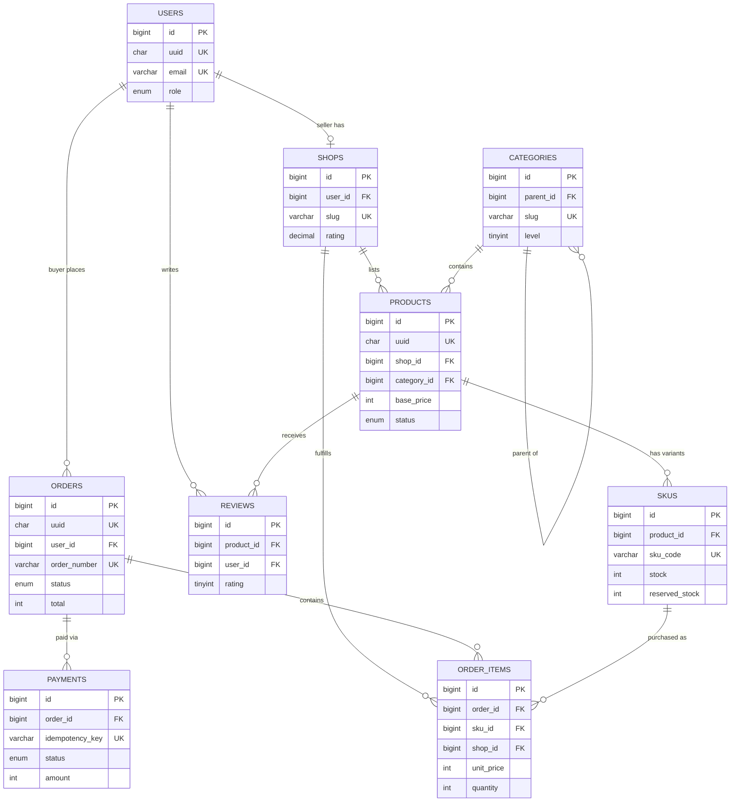

# 3. Data Model — Schema Design, Indexes & Database Choice

## 🗄 Database Choice

### ✅ Decision: MySQL 8.0 (Primary) + Elasticsearch (Search) + Redis (Cache/Cart)

| Requirement | MySQL | PostgreSQL | MongoDB | DynamoDB |
|-------------|-------|-----------|---------|----------|
| **ACID transactions** (payments) | ✅ | ✅ | ⚠️ (multi-doc) | ⚠️ (limited) |
| **Complex joins** (order + items + products) | ✅ | ✅ | ❌ | ❌ |
| **Read replicas** | ✅ Native | ✅ Native | ✅ | N/A (managed) |
| **JSON columns** (product attributes) | ✅ (since 5.7) | ✅ (JSONB) | ✅ Native | ✅ Native |
| **Ecosystem** (Laravel, ORMs) | ✅ Best | ✅ Good | ⚠️ | ⚠️ |
| **Operational simplicity** | ✅ | ✅ | ✅ | ✅✅ (managed) |
| **Sharding** (future) | ⚠️ Manual | ⚠️ Manual | ✅ Built-in | ✅ Built-in |
| **Cost** (10M users) | $$ | $$ | $$$ | $$$ |

> ⚖️ **Trade-off**: MySQL over PostgreSQL — MySQL has better read replica ecosystem, wider Laravel support, and simpler operations. PostgreSQL has JSONB and better analytical queries. For a write-light marketplace, MySQL wins on operational experience.

> ⚖️ **Trade-off**: MySQL over MongoDB — We need ACID for payments and complex joins for order reports. MongoDB's flexibility isn't worth the consistency trade-off for financial transactions.

---

## 📐 Schema Design

### Users Table

```sql
CREATE TABLE users (
    id              BIGINT UNSIGNED AUTO_INCREMENT PRIMARY KEY,
    uuid            CHAR(36) NOT NULL UNIQUE,         -- External ID (API exposure)
    email           VARCHAR(255) NOT NULL UNIQUE,
    phone           VARCHAR(20) NULL UNIQUE,
    password_hash   VARCHAR(255) NOT NULL,
    name            VARCHAR(255) NOT NULL,
    role            ENUM('buyer', 'seller', 'admin') NOT NULL DEFAULT 'buyer',
    email_verified  BOOLEAN NOT NULL DEFAULT FALSE,
    avatar_url      VARCHAR(500) NULL,
    created_at      TIMESTAMP NOT NULL DEFAULT CURRENT_TIMESTAMP,
    updated_at      TIMESTAMP NOT NULL DEFAULT CURRENT_TIMESTAMP ON UPDATE CURRENT_TIMESTAMP,
    deleted_at      TIMESTAMP NULL,                   -- Soft delete

    INDEX idx_email (email),
    INDEX idx_phone (phone),
    INDEX idx_role (role),
    INDEX idx_created (created_at)
) ENGINE=InnoDB DEFAULT CHARSET=utf8mb4 COLLATE=utf8mb4_unicode_ci;
```

> 💡 **Why UUID + auto-increment ID?**
> - `id` (BIGINT): Internal — used for joins, foreign keys, indexes (compact, fast)
> - `uuid` (CHAR(36)): External — exposed in API (non-guessable, no info leakage)
> - Never expose auto-increment IDs in URLs (`/users/42` reveals total user count)

### Shops Table

```sql
CREATE TABLE shops (
    id              BIGINT UNSIGNED AUTO_INCREMENT PRIMARY KEY,
    uuid            CHAR(36) NOT NULL UNIQUE,
    user_id         BIGINT UNSIGNED NOT NULL UNIQUE,   -- 1 seller = 1 shop
    name            VARCHAR(255) NOT NULL,
    slug            VARCHAR(255) NOT NULL UNIQUE,      -- URL-friendly name
    description     TEXT NULL,
    logo_url        VARCHAR(500) NULL,
    rating          DECIMAL(3,2) NOT NULL DEFAULT 0.00,
    total_reviews   INT UNSIGNED NOT NULL DEFAULT 0,
    status          ENUM('active', 'suspended', 'pending') NOT NULL DEFAULT 'pending',
    created_at      TIMESTAMP NOT NULL DEFAULT CURRENT_TIMESTAMP,
    updated_at      TIMESTAMP NOT NULL DEFAULT CURRENT_TIMESTAMP ON UPDATE CURRENT_TIMESTAMP,

    FOREIGN KEY (user_id) REFERENCES users(id) ON DELETE CASCADE,
    INDEX idx_slug (slug),
    INDEX idx_status (status),
    INDEX idx_rating (rating DESC)
) ENGINE=InnoDB DEFAULT CHARSET=utf8mb4 COLLATE=utf8mb4_unicode_ci;
```

### Categories Table (Self-referencing tree)

```sql
CREATE TABLE categories (
    id              BIGINT UNSIGNED AUTO_INCREMENT PRIMARY KEY,
    name            VARCHAR(255) NOT NULL,
    slug            VARCHAR(255) NOT NULL UNIQUE,
    parent_id       BIGINT UNSIGNED NULL,
    level           TINYINT UNSIGNED NOT NULL DEFAULT 0,  -- 0 = root, 1, 2, 3
    sort_order      INT NOT NULL DEFAULT 0,
    icon_url        VARCHAR(500) NULL,
    is_active       BOOLEAN NOT NULL DEFAULT TRUE,

    FOREIGN KEY (parent_id) REFERENCES categories(id) ON DELETE SET NULL,
    INDEX idx_parent (parent_id),
    INDEX idx_active_sort (is_active, sort_order)
) ENGINE=InnoDB DEFAULT CHARSET=utf8mb4 COLLATE=utf8mb4_unicode_ci;
```

> 💡 **Adjacency list** for category tree (simple). If category tree becomes deep (>5 levels), consider **nested set** or **closure table** patterns.

### Products Table

```sql
CREATE TABLE products (
    id              BIGINT UNSIGNED AUTO_INCREMENT PRIMARY KEY,
    uuid            CHAR(36) NOT NULL UNIQUE,
    shop_id         BIGINT UNSIGNED NOT NULL,
    category_id     BIGINT UNSIGNED NOT NULL,
    title           VARCHAR(500) NOT NULL,
    slug            VARCHAR(500) NOT NULL,
    description     TEXT NOT NULL,
    attributes      JSON NULL,                         -- {"color": "red", "material": "cotton"}
    base_price      INT UNSIGNED NOT NULL,             -- Price in smallest unit (cents/piasters)
    currency        CHAR(3) NOT NULL DEFAULT 'USD',
    status          ENUM('active', 'draft', 'suspended', 'out_of_stock') NOT NULL DEFAULT 'draft',
    total_sold      INT UNSIGNED NOT NULL DEFAULT 0,
    rating          DECIMAL(3,2) NOT NULL DEFAULT 0.00,
    total_reviews   INT UNSIGNED NOT NULL DEFAULT 0,
    created_at      TIMESTAMP NOT NULL DEFAULT CURRENT_TIMESTAMP,
    updated_at      TIMESTAMP NOT NULL DEFAULT CURRENT_TIMESTAMP ON UPDATE CURRENT_TIMESTAMP,
    deleted_at      TIMESTAMP NULL,

    FOREIGN KEY (shop_id) REFERENCES shops(id) ON DELETE CASCADE,
    FOREIGN KEY (category_id) REFERENCES categories(id),

    INDEX idx_shop (shop_id),
    INDEX idx_category (category_id),
    INDEX idx_status (status),
    INDEX idx_slug (slug),
    INDEX idx_shop_status (shop_id, status),            -- Seller dashboard queries
    INDEX idx_category_status_price (category_id, status, base_price),  -- Browse + filter
    INDEX idx_rating (rating DESC),                     -- Sort by rating
    INDEX idx_total_sold (total_sold DESC),             -- Sort by popularity
    FULLTEXT idx_search (title, description)            -- Basic search (ES is primary)
) ENGINE=InnoDB DEFAULT CHARSET=utf8mb4 COLLATE=utf8mb4_unicode_ci;
```

### SKUs Table (Product Variants)

```sql
CREATE TABLE skus (
    id              BIGINT UNSIGNED AUTO_INCREMENT PRIMARY KEY,
    uuid            CHAR(36) NOT NULL UNIQUE,
    product_id      BIGINT UNSIGNED NOT NULL,
    sku_code        VARCHAR(100) NOT NULL UNIQUE,      -- e.g., "HEADPHONES-BLK-L"
    variant_name    VARCHAR(255) NOT NULL,             -- e.g., "Black, Large"
    attributes      JSON NULL,                         -- {"size": "L", "color": "black"}
    price           INT UNSIGNED NOT NULL,             -- Override or same as base_price
    stock           INT NOT NULL DEFAULT 0,            -- Current inventory (can be negative temporarily)
    reserved_stock  INT UNSIGNED NOT NULL DEFAULT 0,   -- Reserved during checkout
    low_stock_threshold INT UNSIGNED NOT NULL DEFAULT 5,
    is_active       BOOLEAN NOT NULL DEFAULT TRUE,
    created_at      TIMESTAMP NOT NULL DEFAULT CURRENT_TIMESTAMP,
    updated_at      TIMESTAMP NOT NULL DEFAULT CURRENT_TIMESTAMP ON UPDATE CURRENT_TIMESTAMP,

    FOREIGN KEY (product_id) REFERENCES products(id) ON DELETE CASCADE,
    INDEX idx_product (product_id),
    INDEX idx_sku_code (sku_code),
    INDEX idx_stock (stock),                           -- Find out-of-stock items
    INDEX idx_product_active (product_id, is_active)
) ENGINE=InnoDB DEFAULT CHARSET=utf8mb4 COLLATE=utf8mb4_unicode_ci;
```

> 💡 **Why separate Products and SKUs?**
> - A "T-Shirt" is 1 product but may have 12 SKUs (3 sizes × 4 colors)
> - Each SKU tracks its own inventory independently
> - Prices can vary by variant (XL may cost more)
> - This is the Amazon/Shopify model

### Orders Table

```sql
CREATE TABLE orders (
    id              BIGINT UNSIGNED AUTO_INCREMENT PRIMARY KEY,
    uuid            CHAR(36) NOT NULL UNIQUE,
    user_id         BIGINT UNSIGNED NOT NULL,
    order_number    VARCHAR(20) NOT NULL UNIQUE,       -- Human-readable: "ORD-20260223-001"
    status          ENUM('pending_payment', 'confirmed', 'processing',
                         'shipped', 'delivered', 'cancelled', 'refunded')
                    NOT NULL DEFAULT 'pending_payment',
    subtotal        INT UNSIGNED NOT NULL,             -- Sum of items before fees
    shipping_fee    INT UNSIGNED NOT NULL DEFAULT 0,
    tax             INT UNSIGNED NOT NULL DEFAULT 0,
    discount        INT UNSIGNED NOT NULL DEFAULT 0,
    total           INT UNSIGNED NOT NULL,             -- Final amount charged
    currency        CHAR(3) NOT NULL DEFAULT 'USD',
    shipping_address JSON NOT NULL,                    -- Snapshot (address may change later)
    notes           TEXT NULL,
    cancelled_at    TIMESTAMP NULL,
    cancel_reason   VARCHAR(500) NULL,
    created_at      TIMESTAMP NOT NULL DEFAULT CURRENT_TIMESTAMP,
    updated_at      TIMESTAMP NOT NULL DEFAULT CURRENT_TIMESTAMP ON UPDATE CURRENT_TIMESTAMP,

    FOREIGN KEY (user_id) REFERENCES users(id),

    INDEX idx_user (user_id),
    INDEX idx_status (status),
    INDEX idx_order_number (order_number),
    INDEX idx_user_status (user_id, status),            -- "My orders" page
    INDEX idx_created (created_at DESC),                -- Recent orders
    INDEX idx_user_created (user_id, created_at DESC)   -- User's order history
) ENGINE=InnoDB DEFAULT CHARSET=utf8mb4 COLLATE=utf8mb4_unicode_ci;
```

> 💡 **Shipping address is JSON (snapshot)** — If the user changes their address later, old orders should still show the address they were shipped to. Never use a FK to an address table for order records.

### Order Items Table

```sql
CREATE TABLE order_items (
    id              BIGINT UNSIGNED AUTO_INCREMENT PRIMARY KEY,
    order_id        BIGINT UNSIGNED NOT NULL,
    sku_id          BIGINT UNSIGNED NOT NULL,
    shop_id         BIGINT UNSIGNED NOT NULL,          -- Denormalized for seller queries
    product_title   VARCHAR(500) NOT NULL,             -- Snapshot at time of purchase
    variant_name    VARCHAR(255) NOT NULL,             -- Snapshot
    unit_price      INT UNSIGNED NOT NULL,             -- Snapshot (price may change later)
    quantity        SMALLINT UNSIGNED NOT NULL,
    subtotal        INT UNSIGNED NOT NULL,             -- unit_price × quantity
    status          ENUM('pending', 'confirmed', 'shipped', 'delivered', 'cancelled')
                    NOT NULL DEFAULT 'pending',
    created_at      TIMESTAMP NOT NULL DEFAULT CURRENT_TIMESTAMP,

    FOREIGN KEY (order_id) REFERENCES orders(id) ON DELETE CASCADE,
    FOREIGN KEY (sku_id) REFERENCES skus(id),
    FOREIGN KEY (shop_id) REFERENCES shops(id),

    INDEX idx_order (order_id),
    INDEX idx_shop (shop_id),
    INDEX idx_shop_status (shop_id, status),            -- Seller: pending orders to ship
    INDEX idx_sku (sku_id)
) ENGINE=InnoDB DEFAULT CHARSET=utf8mb4 COLLATE=utf8mb4_unicode_ci;
```

> 💡 **Why snapshot product_title and unit_price?**
> - The seller may change the product title or price after the order
> - The order must reflect what the buyer **actually purchased**
> - This is a legal requirement for invoicing

### Payments Table

```sql
CREATE TABLE payments (
    id                  BIGINT UNSIGNED AUTO_INCREMENT PRIMARY KEY,
    uuid                CHAR(36) NOT NULL UNIQUE,
    order_id            BIGINT UNSIGNED NOT NULL,
    idempotency_key     VARCHAR(255) NOT NULL UNIQUE,   -- Prevents duplicate charges
    gateway             ENUM('stripe', 'paypal', 'fawry', 'paymob') NOT NULL,
    gateway_payment_id  VARCHAR(255) NULL,              -- Gateway's reference
    amount              INT UNSIGNED NOT NULL,
    currency            CHAR(3) NOT NULL,
    status              ENUM('pending', 'processing', 'completed', 'failed', 'refunded')
                        NOT NULL DEFAULT 'pending',
    failure_reason      VARCHAR(500) NULL,
    gateway_response    JSON NULL,                      -- Full response for debugging
    paid_at             TIMESTAMP NULL,
    created_at          TIMESTAMP NOT NULL DEFAULT CURRENT_TIMESTAMP,
    updated_at          TIMESTAMP NOT NULL DEFAULT CURRENT_TIMESTAMP ON UPDATE CURRENT_TIMESTAMP,

    FOREIGN KEY (order_id) REFERENCES orders(id),

    INDEX idx_order (order_id),
    INDEX idx_idempotency (idempotency_key),
    INDEX idx_status (status),
    INDEX idx_gateway_ref (gateway, gateway_payment_id)  -- Webhook lookup
) ENGINE=InnoDB DEFAULT CHARSET=utf8mb4 COLLATE=utf8mb4_unicode_ci;
```

### Reviews Table

```sql
CREATE TABLE reviews (
    id              BIGINT UNSIGNED AUTO_INCREMENT PRIMARY KEY,
    product_id      BIGINT UNSIGNED NOT NULL,
    user_id         BIGINT UNSIGNED NOT NULL,
    order_item_id   BIGINT UNSIGNED NOT NULL UNIQUE,   -- 1 review per purchased item
    rating          TINYINT UNSIGNED NOT NULL,          -- 1-5
    title           VARCHAR(255) NULL,
    body            TEXT NULL,
    is_verified      BOOLEAN NOT NULL DEFAULT TRUE,     -- Verified purchase
    created_at      TIMESTAMP NOT NULL DEFAULT CURRENT_TIMESTAMP,
    updated_at      TIMESTAMP NOT NULL DEFAULT CURRENT_TIMESTAMP ON UPDATE CURRENT_TIMESTAMP,

    FOREIGN KEY (product_id) REFERENCES products(id) ON DELETE CASCADE,
    FOREIGN KEY (user_id) REFERENCES users(id),
    FOREIGN KEY (order_item_id) REFERENCES order_items(id),

    INDEX idx_product_rating (product_id, rating),
    INDEX idx_product_created (product_id, created_at DESC),
    INDEX idx_user (user_id),
    UNIQUE INDEX idx_user_product (user_id, product_id) -- 1 review per product per user
) ENGINE=InnoDB DEFAULT CHARSET=utf8mb4 COLLATE=utf8mb4_unicode_ci;
```

---

## 📊 Index Strategy

### Most Critical Queries & Their Indexes

| Query | Frequency | Index Used | Scan Type |
|-------|-----------|-----------|-----------|
| Product by ID | Very High | PRIMARY KEY | const |
| Products by category + status + price range | High | `idx_category_status_price` | range |
| Products by shop (seller dashboard) | Medium | `idx_shop_status` | ref |
| User's orders (newest first) | High | `idx_user_created` | ref + filesort |
| Seller's pending orders | High | `idx_shop_status` (order_items) | ref |
| Payment by idempotency key | Medium | `idx_idempotency` | const |
| Payment by gateway reference | Low | `idx_gateway_ref` | ref |
| Product search (full-text) | Very High | Elasticsearch (not MySQL) | — |

### Index Sizing

```
Products table: 5,000,000 rows
  - PRIMARY KEY: ~80 MB
  - idx_category_status_price: ~120 MB
  - idx_shop_status: ~60 MB
  - Total indexes: ~400 MB (fits in InnoDB buffer pool)

Orders table: 150,000/day × 365 × 5 = 273,750,000 rows (5 years)
  - PRIMARY KEY: ~4.4 GB
  - idx_user_created: ~3.3 GB
  - Total indexes: ~12 GB (still manageable in 32 GB RAM)
```

> 💡 **Rule of thumb**: All active indexes should fit in the InnoDB buffer pool (typically 70-80% of total RAM). When they don't, it's time to shard.

---

## 📊 Entity Relationship Diagram



---

## ⬅️ [← High-Level Architecture](02-high-level-architecture.md) · [Caching Strategy →](04-caching-strategy.md)
