# 4. Caching Strategy

> Caching is not "add Redis and hope." It's a **data architecture decision** with consistency trade-offs.

---

## 🎯 Why Cache? The Numbers

```
Without cache:
  Peak QPS to DB: ~3,750
  MySQL max QPS (8 vCPU): ~3,000-5,000
  → DB at 75-100% capacity during peak
  → Flash sale (37,500 QPS) → DB dies

With 95% cache hit rate:
  Peak QPS to DB: 3,750 × 0.05 = ~188
  → DB at 4-6% capacity during peak
  → Flash sale: 37,500 × 0.05 = ~1,875 → DB comfortable
```

> 🔢 **Cache pays for itself**: A 95% hit rate reduces DB load by **20x**.

---

## 🏗 Cache Architecture — Three Layers

```mermaid
graph TB
    C["Client Request"] --> CDN

    subgraph "Layer 1: CDN Cache"
        CDN["☁️ CDN (CloudFlare)<br/>• Product images<br/>• Static assets<br/>• TTL: 24h"]
    end

    CDN --> APP

    subgraph "Layer 2: Application Cache (Redis)"
        APP["🔴 Redis Cache<br/>• Product data<br/>• Category tree<br/>• Search results<br/>• Session data<br/>• TTL: 5-60 min"]
    end

    APP --> DB

    subgraph "Layer 3: Database Query Cache"
        DB["🔵 MySQL<br/>• InnoDB Buffer Pool<br/>• Query cache (read replicas)<br/>• Index pages in memory"]
    end

    style CDN fill:#9c27b0,color:#fff
    style APP fill:#dc382d,color:#fff
    style DB fill:#1976d2,color:#fff
```



---

## 📋 What to Cache (and What NOT to)

### ✅ Cache These (High Read, Low Write)

| Data | Cache Key | TTL | Hit Ratio Target | Reason |
|------|-----------|-----|-------------------|--------|
| **Product detail** | `product:{id}` | 5 min | 95% | Highest traffic endpoint |
| **Product list** (category page) | `cat:{id}:page:{n}:sort:{s}` | 3 min | 90% | Many users browse same pages |
| **Category tree** | `categories:tree` | 30 min | 99% | Rarely changes, used on every page |
| **Seller shop info** | `shop:{id}` | 10 min | 95% | Shown on product pages |
| **Search results** | `search:{hash(query)}` | 2 min | 70% | Many common queries repeat |
| **User session** | `session:{token}` | 30 min | 99% | Every authenticated request |
| **Cart** | `cart:{user_id}` | 24h | 99% | Primary storage (not DB) |

### ❌ Do NOT Cache These

| Data | Why Not |
|------|---------|
| **Inventory (stock counts)** | Must be real-time during checkout — stale cache = overselling |
| **Payment status** | Financial data must always come from source of truth |
| **Order status** (for buyer) | User expects latest status — use targeted invalidation instead |
| **Admin/seller analytics** | Low traffic, high variability — cache hit ratio would be < 10% |

> ⚠️ **The #1 caching mistake**: Caching inventory. If cached stock shows "5 in stock" but real stock is 0, you just sold items you don't have.

---

## 🔄 Cache Invalidation Strategy

### Pattern: Cache-Aside (Lazy Loading) — Primary Strategy


**Why Cache-Aside?**
- Simple to implement and reason about
- No write penalty (write to DB, delete from cache)
- Cache only stores data that's actually being read

### Pattern: Write-Through — For Category Tree

```
On category update:
  1. Write to DB
  2. Rebuild full category tree
  3. SET categories:tree {new_tree} EX 1800
```

Why Write-Through for categories? Because:
- Category tree is used on **every page load**
- Categories change **very rarely** (once a month)
- Rebuilding it on-demand wastes time when 99% of requests need it

### Invalidation Rules

| Event | Action | Consistency Delay |
|-------|--------|-------------------|
| Product updated | `DEL product:{id}` | Next read (< 1ms) |
| Product deleted | `DEL product:{id}`, `DEL cat:{cat_id}:*` | Next read |
| Category changed | Rebuild `categories:tree` | 0 (write-through) |
| Order placed | `DEL product:{id}` (stock changed) | Next read |
| Price changed | `DEL product:{id}`, `DEL cat:{cat_id}:*` | < 5 min |
| New review | `DEL product:{id}` (rating changed) | < 5 min |

> 💡 **Wildcard deletion** (`DEL cat:{id}:*`): Redis doesn't support wildcards in DEL natively. Options:
> 1. Use `SCAN` + `DEL` (slow for many keys)
> 2. Use cache key versioning: `cat:{id}:v{version}:page:{n}`
> 3. Accept stale data for 3 min (TTL handles it)
>
> **We choose option 3** — TTL-based expiration for list pages. The 3-minute staleness is acceptable for browse pages.

---

## 🛒 Cart Storage — Redis as Primary

The cart is stored **only in Redis**, not in MySQL:

```
Key:    cart:{user_id}
Type:   Hash
Fields: {sku_id} → {quantity, added_at}
TTL:    24 hours (abandoned carts auto-expire)
```

```
HSET cart:user_42 sku:abc123 '{"qty":2,"added":"2026-02-23T10:00:00Z","price":2499}'
HSET cart:user_42 sku:def456 '{"qty":1,"added":"2026-02-23T10:01:00Z","price":899}'
HGET cart:user_42 sku:abc123   → JSON
HGETALL cart:user_42           → All items
HDEL cart:user_42 sku:abc123   → Remove item
DEL cart:user_42               → Clear cart
```

### Why Redis for Cart (Not MySQL)?

| Factor | Redis | MySQL |
|--------|-------|-------|
| **Latency** | < 1ms | 3-10ms |
| **Write frequency** | High (user adds/removes often) | Would create heavy writes |
| **Schema** | Schemaless — items can have different attributes | Fixed schema per-row |
| **Expiration** | Built-in TTL for abandoned carts | Needs cron job |
| **Trade-off** | Data lost on Redis crash | Persistent |

> ⚖️ **Trade-off**: If Redis crashes, carts are lost. Mitigation:
> - Redis with AOF persistence (fsync every second)
> - Redis Sentinel or Cluster for HA
> - Carts are **temporary by nature** — losing a cart is annoying, not catastrophic

---

## 📊 Cache Sizing

```
Product cache:
  5,000,000 products × 2 KB avg = 10 GB
  But only ~20% of products get traffic = 2 GB active cache

Category tree: ~50 KB (one key)

Search result cache:
  Assume 100,000 unique queries/day
  Average result: ~5 KB
  = 500 MB

Cart data:
  3,000,000 DAU × 10% have active carts = 300,000 carts
  Average cart: ~500 bytes
  = 150 MB

Session data:
  3,000,000 sessions × 200 bytes = 600 MB

Total Redis memory needed: ~4 GB active data
With overhead (fragmentation, key metadata): ~6 GB
Redis instance: 16 GB RAM (ample headroom)
```

---

## ⚡ Cache Warming

On deployment or Redis restart, the cache is cold — every request hits the DB.

### Warm-Up Strategy

```
1. Category tree → regenerate immediately on startup
2. Top 1,000 products (by views) → pre-load from DB
3. Active carts → users will re-load naturally (no pre-warming needed)
4. Everything else → lazy-load via cache-aside (back to normal in ~30 min)
```

### Flash Sale Pre-Warming

```
Before flash sale starts:
  1. Pre-cache all sale product pages
  2. Pre-cache search results for "flash sale" and "deals"
  3. Increase Redis max memory (scale up node temporarily)
  4. Enable CDN edge caching for product images
```

---

## 📈 Monitoring Cache Health

| Metric | Target | Alert Threshold |
|--------|--------|-----------------|
| **Hit ratio** | > 95% | < 90% |
| **Eviction rate** | 0 | > 100/min |
| **Memory usage** | < 70% | > 85% |
| **Latency (p99)** | < 2ms | > 10ms |
| **Connection count** | < 500 | > 800 |

---

## ⬅️ [← Data Model](03-data-model.md) · [Read/Write Separation →](05-read-write-separation.md)
