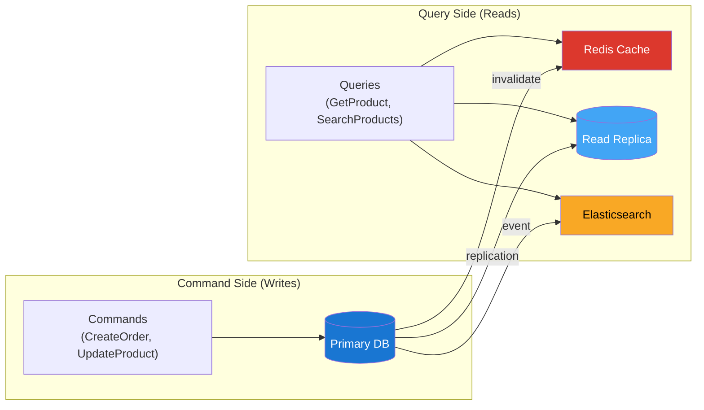

# 5. Read/Write Separation — CQRS & Replication

> At 100:1 read-to-write ratio, the database's #1 bottleneck is reads. Solve this with read replicas and careful query routing.

---

## 🎯 The Problem

```
Single MySQL instance:
  Total peak QPS: ~188 (after cache)
  Read QPS: ~170
  Write QPS: ~18

  This works fine for 10M MAU.
  But during flash sales (10x): 1,880 QPS after cache → still fine for one box.

  Where it BREAKS:
  - Complex seller analytics queries (JOIN 4 tables, GROUP BY, aggregate)
  - Running analytics on the same instance as checkout
  - Lock contention: seller report locks rows that checkout needs
  - Replica lag when read-after-write matters (order status)
```

> 💡 **The real reason for read replicas isn't QPS — it's query isolation**. You don't want a seller running `SELECT COUNT(*) FROM order_items WHERE shop_id = X GROUP BY DATE(created_at)` to slow down a buyer's checkout.

---

## 🏗 Replication Architecture

```mermaid
graph TB
    subgraph "Application Layer"
        WS["Write Service<br/>(Orders, Payments, Products)"]
        RS["Read Service<br/>(Browse, Search, Dashboard)"]
        AN["Analytics<br/>(Reports, Exports)"]
    end

    subgraph "MySQL Cluster"
        P[("🔵 Primary<br/>Writes Only<br/>8 vCPU, 32GB")]
        R1[("🔵 Replica 1<br/>Buyer Reads<br/>8 vCPU, 32GB")]
        R2[("🔵 Replica 2<br/>Seller Reads<br/>8 vCPU, 32GB")]
        R3[("🔵 Replica 3<br/>Analytics<br/>(Optional)<br/>4 vCPU, 16GB")]
    end

    WS -->|INSERT, UPDATE, DELETE| P
    RS -->|SELECT (buyers)| R1
    RS -->|SELECT (sellers)| R2
    AN -->|Heavy queries| R3

    P -->|async replication| R1
    P -->|async replication| R2
    P -->|async replication| R3

    style P fill:#1976d2,color:#fff
    style R1 fill:#42a5f5,color:#fff
    style R2 fill:#42a5f5,color:#fff
    style R3 fill:#90caf9,color:#000
```

### Role Assignment

| Replica | Purpose | Query Profile | Why Separate? |
|---------|---------|---------------|---------------|
| **Primary** | All writes | INSERT, UPDATE, DELETE | Single source of truth |
| **Replica 1** | Buyer reads | Product pages, search, cart validation | Highest traffic — 60% of reads |
| **Replica 2** | Seller reads | Dashboard, order management, analytics | Different query patterns — heavy JOINs |
| **Replica 3** | Analytics/Reports | Aggregations, exports | Long-running queries that would block others |

> **⚠️ Known Risk: Split-Brain During Failover**
>
> If health monitoring falsely detects the primary as dead and promotes a replica while the old primary is still alive, **two nodes accept writes simultaneously**, causing data divergence that is extremely difficult to recover from (especially for orders and payments).
>
> **Mitigation:** Use fencing (STONITH — Shoot The Other Node In The Head) to kill the old primary before promoting the replica. Tools like Orchestrator or ProxySQL with consensus-based failover reduce this risk. Never assume the old primary is truly dead without positive confirmation.

---

## 🔀 Query Routing

### Laravel Example (Connection-based routing)

```php
// config/database.php
'mysql' => [
    'read' => [
        'host' => [
            env('DB_READ_HOST_1'),  // Replica 1 (buyer reads)
            env('DB_READ_HOST_2'),  // Replica 2 (seller reads)
        ],
    ],
    'write' => [
        'host' => env('DB_WRITE_HOST'),  // Primary
    ],
    'sticky' => true,  // After a write, reads go to primary for that request
],
```

### Explicit Routing for Critical Paths

```php
// For checkout — always read from primary (need latest stock)
$stock = DB::connection('mysql_write')
    ->table('skus')
    ->where('id', $skuId)
    ->lockForUpdate()           // SELECT ... FOR UPDATE
    ->value('stock');

// For product browse — read from replica (staleness OK)
$products = DB::connection('mysql_read')
    ->table('products')
    ->where('category_id', $categoryId)
    ->where('status', 'active')
    ->paginate(20);

// For seller dashboard — read from seller-specific replica
$orders = DB::connection('mysql_seller_read')
    ->table('order_items')
    ->where('shop_id', $shopId)
    ->where('status', 'pending')
    ->get();
```

### Routing Decision Matrix

| Operation | Connection | Read From | Why |
|-----------|-----------|-----------|-----|
| Checkout (read stock) | `primary` | Primary | Must be latest — overselling prevention |
| Place order | `primary` | Primary | Write operation |
| Process payment | `primary` | Primary | Financial — no eventual consistency |
| Browse products | `replica` | Replica 1 | 3-minute stale data is fine |
| Product detail page | `cache → replica` | Redis → Replica 1 | Cache first, replica fallback |
| Search products | `elasticsearch` | ES | Completely separate data store |
| "My orders" list | `replica` | Replica 1 | Order list can be seconds behind |
| Order detail (just placed) | `primary` | Primary (`sticky`) | User just placed it — expect to see it |
| Seller order dashboard | `seller_replica` | Replica 2 | Isolate from buyer traffic |
| Revenue reports | `analytics_replica` | Replica 3 | Heavy queries isolated |

---

## ⏱ Replication Lag — The Critical Trade-off

### What Is Replication Lag?

```
Timeline:
  T+0ms:     Write hits primary → INSERT INTO orders ...
  T+1ms:     Primary writes to binlog
  T+2ms:     Replica receives binlog event (async)
  T+3-50ms:  Replica applies the write

  Typical lag: 1-50ms (normal load)
  Under load:  100-500ms
  Heavy writes: 1-5 seconds (during flash sale)
```

### Where Replication Lag Causes Problems

| Scenario | Problem | Solution |
|----------|---------|----------|
| User places order, refreshes page | Order not visible yet | **Sticky reads** — route to primary after write |
| Seller marks order shipped, checks | Status still "processing" | Sticky reads for seller |
| Payment confirmed, order status checked | Still shows "pending_payment" | Read from primary for 5s after payment |
| Stock decremented, product page shows old stock | "In stock" when actually sold out | **Don't cache stock** — always read critical stock from primary |

### ✅ Solution: Sticky Reads + Selective Primary Reads

```php
// Laravel's sticky connection handles most cases automatically:
// After any write in a request, subsequent reads go to primary
'sticky' => true,

// For cross-request scenarios (user places order, new page load):
// Option 1: Force primary read for 10 seconds after write
$lastWriteAt = Cache::get("user:{$userId}:last_write");
if ($lastWriteAt && now()->diffInSeconds($lastWriteAt) < 10) {
    $connection = 'mysql_write';  // Read from primary
} else {
    $connection = 'mysql_read';   // Read from replica
}

// Option 2: Include a "read_from_primary" flag in the response
// Client sends it back on next request
```

---

## 📊 CQRS Pattern (Light Version)

We don't need full Event Sourcing-style CQRS. A **lightweight CQRS** approach:



### The Key Insight

```
COMMAND SIDE:
  - Optimized for correctness (transactions, constraints, locks)
  - Uses normalized schema (3NF)
  - Single primary database
  - Slower is fine — correctness > speed

QUERY SIDE:
  - Optimized for speed (denormalized, cached, indexed)
  - Multiple read sources (replica, Redis, ES)
  - Pre-computed aggregations
  - Eventual consistency is acceptable
```

### Example: Product Detail Page (Query Side)

```json
// Redis cache: product:{id}
// This is a DENORMALIZED view — pre-joined from multiple tables
{
  "id": "prod_abc123",
  "title": "Wireless Bluetooth Headphones",
  "description": "...",
  "price": 2499,
  "currency": "EGP",
  "seller": {
    "id": "shop_xyz",
    "name": "TechStore Egypt",
    "rating": 4.7
  },
  "category": {
    "id": "cat_electronics",
    "name": "Electronics",
    "breadcrumb": ["Home", "Electronics", "Audio", "Headphones"]
  },
  "variants": [
    {"sku": "HP-BLK", "name": "Black", "price": 2499, "stock_status": "in_stock"},
    {"sku": "HP-WHT", "name": "White", "price": 2499, "stock_status": "low_stock"}
  ],
  "rating": {
    "average": 4.3,
    "count": 127,
    "distribution": {"5": 68, "4": 32, "3": 15, "2": 7, "1": 5}
  },
  "images": ["https://cdn.../1.webp", "https://cdn.../2.webp"]
}
```

> 💡 **This single cached object replaces 4 SQL JOINs** (product + shop + category + review aggregate). The client makes **one API call** instead of multiple.

---

## 📈 Monitoring Replication

| Metric | Target | Alert |
|--------|--------|-------|
| `Seconds_Behind_Master` | < 1s | > 5s |
| Replica SQL thread running | Yes | No |
| Replica IO thread running | Yes | No |
| Replication lag during flash sale | < 5s | > 30s |

```sql
-- Check replication status on replica
SHOW SLAVE STATUS\G

-- Key fields to monitor:
-- Seconds_Behind_Master: 0        ← good
-- Slave_IO_Running: Yes           ← good
-- Slave_SQL_Running: Yes          ← good
-- Last_Error:                     ← should be empty
```

---

## ⬅️ [← Caching Strategy](04-caching-strategy.md) · [Sharding Strategy →](06-sharding-strategy.md)
