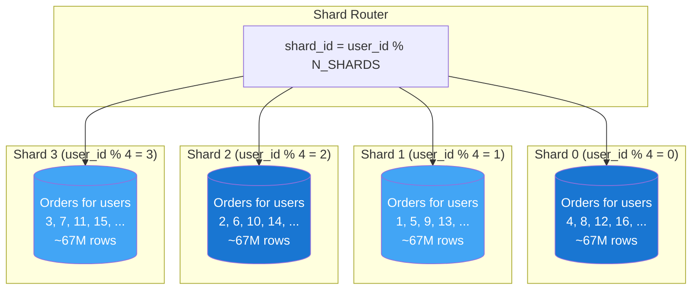
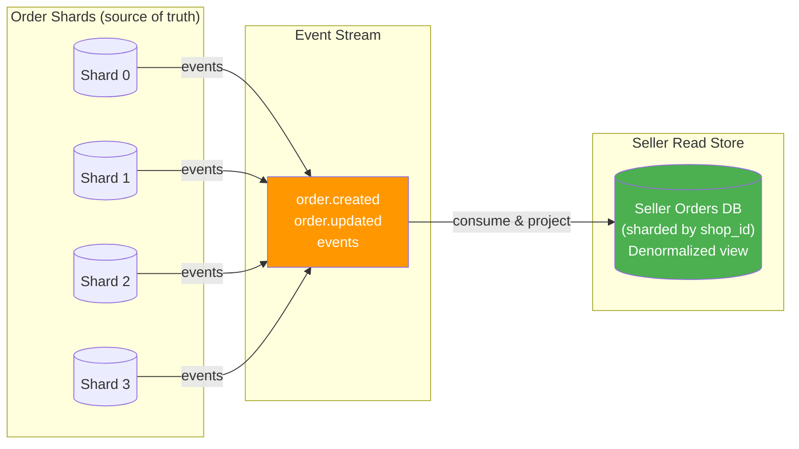

# 6. Sharding Strategy

> Sharding is the **last resort** for scaling writes. Don't shard until you have to — it introduces permanent operational complexity.

---

## 🎯 When Do We Need Sharding?

```
Current scale (10M MAU):
  DB size: ~500 GB (5 years)
  Write QPS: ~18 peak (after queue offloading)
  Single MySQL at 8 vCPU: handles ~3,000 write QPS

  Answer: We DON'T need sharding at 10M MAU.

When to shard:
  1. Table exceeds ~500M rows (query performance degrades)
  2. Write QPS exceeds single-instance capacity (~3,000 QPS)
  3. DB storage exceeds single-node practical limit (~5 TB)
  4. Replication lag becomes unacceptable under sustained write load

  For our marketplace: sharding likely needed at 50M-100M MAU
  (orders table: ~54M rows/year × 5 years = 270M rows at 10M MAU)
  (at 100M MAU: ~2.7B rows in 5 years → YES, shard)
```

> ⚠️ **Interview tip**: "We don't shard on Day 1. We shard when the data or write throughput exceeds single-node limits. Here's our plan for when that happens."

---

## 📊 Sharding Strategy by Table

### What to Shard (and What Not to)

| Table | Rows (5yr, 10M MAU) | Rows (5yr, 100M MAU) | Shard? | Why/Why Not |
|-------|---------------------|----------------------|--------|-------------|
| **orders** | 270M | 2.7B | ✅ Yes | Largest table, grows linearly with users |
| **order_items** | 675M | 6.75B | ✅ Yes | Follows orders (same shard key) |
| **payments** | 270M | 2.7B | ✅ Yes | Follows orders (same shard key) |
| **products** | 5M | 50M | ❌ No | Modest size, read-heavy (cache handles it) |
| **skus** | 15M | 150M | ❌ No | Still manageable in single instance |
| **users** | 10M | 100M | ❌ No | Small rows, fits in single instance |
| **reviews** | 50M | 500M | ⚠️ Maybe | Consider if exceeds 500M |

---

## 🔑 Shard Key Selection — The Most Critical Decision

### For Orders: Shard by `user_id`

```
Why user_id?

✅ Pros:
  - All of a user's orders are on the SAME shard
  - "My orders" query hits ONE shard (no scatter-gather)
  - Checkout operates on ONE shard (single transaction)
  - Natural distribution (users are roughly evenly distributed)

❌ Cons:
  - Seller queries span ALL shards (seller's orders come from many users)
  - "All orders today" requires scatter-gather across all shards
  - Power users (high-volume buyers) may create hot spots

Alternative considered: shard by order_id (hash)
  ✅ Even distribution guaranteed
  ❌ "My orders" requires scatter-gather across ALL shards
  ❌ No user-locality for checkout  →  REJECTED
```

### Shard Mapping



### Shard Sizing

```
Start with 4 shards:
  270M rows (5yr) / 4 = 67.5M rows per shard
  Each shard: ~125 GB data + indexes

  Single MySQL handles 500M rows comfortably
  → 4 shards is sufficient through 100M MAU

At 100M MAU, expand to 16 shards:
  2.7B rows / 16 = 168.75M rows per shard
  → Still comfortable for single MySQL instance
```

---

## 🔀 Solving Cross-Shard Queries

### Problem: Seller Dashboard

A seller's orders come from many different users → spread across all shards.

```
Seller wants: "Show me all pending orders for my shop"
  user_id 42 (shard 2) ordered from seller
  user_id 77 (shard 1) ordered from seller
  user_id 100 (shard 0) ordered from seller
  → Query must hit ALL shards → SCATTER-GATHER
```

### Solution: Denormalized Seller View



```
When order.created event fires:
  1. Write to user-sharded orders table (primary)
  2. Publish order.created event
  3. Consumer writes denormalized row to seller_orders table (sharded by shop_id)

Seller dashboard reads from seller_orders (hits one shard).
Delay: 1-5 seconds (eventual consistency — acceptable for dashboard).
```

### Cross-Shard Query Patterns

| Query | Strategy | Latency |
|-------|----------|---------|
| "My orders" (buyer) | Single shard by user_id | < 10ms |
| Checkout | Single shard by user_id | < 50ms |
| Seller's orders | Denormalized seller view | < 10ms |
| "All orders today" (admin) | Scatter-gather all shards | 100-500ms |
| "Order by order_number" | Hash ring lookup or global index | < 20ms |
| Analytics/reports | Dedicated analytics replica (all data) | seconds |

---

## ♻️ Rebalancing Strategy

When adding shards, we need to move data without downtime.

### Approach: Consistent Hashing

```
Instead of: shard = user_id % 4
Use: consistent hash ring

Benefits:
  - Adding a shard only moves ~1/N of the data (not all of it)
  - Removing a shard redistributes to neighbors
  - Virtual nodes ensure even distribution
```

### Migration Process (Zero Downtime)

```
Phase 1: DUAL WRITE
  - New shard is online
  - All writes go to BOTH old shard and new shard
  - Reads still from old shard
  - Duration: until new shard has all new data

Phase 2: BACKFILL
  - Copy historical data from old shard to new shard
  - Background process, rate-limited to avoid overload
  - Duration: hours to days depending on data size

Phase 3: VERIFY
  - Run consistency check (compare row counts, checksums)
  - Fix any discrepancies

Phase 4: CUT OVER
  - Switch reads to new shard mapping
  - Monitor for errors
  - Keep old shard as fallback for 48 hours

Phase 5: CLEANUP
  - Delete migrated data from old shard
  - Remove dual-write logic
```

---

## 🔥 Hot Spot Mitigation

### Problem: Power Users

```
If user #12345 places 10,000 orders/year:
  All 10,000 go to shard (12345 % 4 = 1)
  Shard 1 has disproportionate load

How bad is it?
  Normal user: 15 orders/year
  Power user: 10,000 orders/year
  If 0.1% of users are power users = 10,000 power users
  10,000 × 10,000 = 100M extra orders concentrated

  In practice: < 1% of total, usually not a real problem.
```

### Mitigation (If Needed)

1. **More shards**: 16 instead of 4 → better distribution
2. **Consistent hashing with virtual nodes**: 100 virtual nodes per physical shard
3. **Shard splitting**: If one shard gets too hot, split it into two

> ⚖️ **Trade-off**: Complexity of hot spot mitigation vs. the actual problem. For most marketplaces, simple modulo sharding with 16+ shards is sufficient. Don't over-engineer.

---

## 📋 Sharding Checklist (Before You Shard)

```
Before sharding, ask yourself:
  □ Have you optimized indexes?
  □ Have you added read replicas?
  □ Have you maximized cache hit ratio?
  □ Have you offloaded to queues?
  □ Have you archived old data?
  □ Is the write QPS actually exceeding single-node?
  □ Is the table actually exceeding 500M rows?

If all YES → time to shard.
If any NO → do that first.
```

---

## ⬅️ [← Read/Write Separation](05-read-write-separation.md) · [Queue Design →](07-queue-design.md)
