# 7. Queue Design — Async Processing

> If a user is waiting for it, it should be fast. If they're not, put it in a queue.

---

## 🎯 Why Queues?

```
Without queues — synchronous checkout:
  1. Validate cart          →  50ms
  2. Lock inventory         →  30ms
  3. Create order           →  20ms
  4. Process payment        → 500ms (Stripe/PayPal API call)
  5. Send confirmation email→ 200ms (SMTP)
  6. Notify seller          → 100ms (push notification)
  7. Update search index    → 150ms
  8. Update analytics       →  50ms
  Total: ~1,100ms ← User waits 1.1 seconds

With queues — async offloading:
  SYNC (user waits):
    1. Validate cart         →  50ms
    2. Lock inventory        →  30ms
    3. Create order          →  20ms
    4. Initiate payment      → 100ms (just the API call)
    Total: ~200ms ← User gets response in 200ms

  ASYNC (background):
    5. Confirm payment (webhook)
    6. Send confirmation email
    7. Notify seller
    8. Update search index
    9. Update analytics
    → All processed within seconds, user doesn't wait
```

---

## 🏗 Queue Architecture

```mermaid
graph LR
    subgraph "Producers"
        API["API Servers"]
        CRON["Scheduled Jobs"]
    end

    subgraph "Message Broker"
        RMQ["🐰 RabbitMQ"]
    end

    subgraph "Queues"
        Q1["orders.process<br/>Priority: HIGH"]
        Q2["notifications.send<br/>Priority: MEDIUM"]
        Q3["search.index<br/>Priority: LOW"]
        Q4["analytics.track<br/>Priority: LOW"]
        DLQ["🔴 Dead Letter Queue<br/>Failed messages"]
    end

    subgraph "Workers"
        W1["Order Workers<br/>(3 instances)"]
        W2["Notification Workers<br/>(2 instances)"]
        W3["Search Workers<br/>(1 instance)"]
        W4["Analytics Workers<br/>(1 instance)"]
        W5["DLQ Processor<br/>(1 instance)"]
    end

    API --> RMQ
    CRON --> RMQ
    RMQ --> Q1 & Q2 & Q3 & Q4
    Q1 --> W1
    Q2 --> W2
    Q3 --> W3
    Q4 --> W4
    Q1 & Q2 & Q3 & Q4 -->|failed 3x| DLQ
    DLQ --> W5

    style RMQ fill:#ff6f00,color:#fff
    style DLQ fill:#dc382d,color:#fff
```



### Why RabbitMQ (Not Kafka, Not SQS)?

| Criteria | RabbitMQ | Kafka | SQS |
|----------|----------|-------|-----|
| **Our QPS** | ~100 msg/s → plenty | Overkill (designed for millions/s) | Fine |
| **Message routing** | Advanced (exchanges, routing keys) | Topic-based only | Basic |
| **Delivery guarantees** | Per-message ack, requeue, DLQ | Consumer group offsets | At-least-once |
| **Operation complexity** | Medium | High (Zookeeper, partitions) | Zero (managed) |
| **Cost** | Self-hosted on $50/mo VM | Expensive clusters | Pay-per-message |
| **Retry/DLQ** | Built-in | Manual implementation | Built-in |

> 💡 **Decision**: RabbitMQ — best fit for our scale and routing needs. If on AWS, SQS is the pragmatic choice. Kafka when we hit 1M+ messages/second.

> **⚠️ Known Risk: RabbitMQ → Kafka Migration is a Replatform**
>
> The scaling strategy mentions switching to Kafka at 1M+ messages/second as if it's an upgrade. It's not — it's a **fundamental paradigm shift**: push vs pull, exchanges vs topics, per-message ack vs offset commits. Every producer and consumer must be rewritten. This is a multi-month engineering effort requiring a dual-running period with both systems.
>
> **Why we start with RabbitMQ anyway:** The operational simplicity at current volume (2,000 events/sec peak) saves 6-12 months of engineering time. The migration cost is real but is the price of not over-engineering on Day 1.

---

## 📋 Queue Definitions

### Queue 1: `orders.process` — Order Processing Pipeline

```
Exchange:   orders (direct)
Queue:      orders.process
Routing:    order.created, order.payment_confirmed, order.shipped
Consumers:  3 workers
Prefetch:   1 (one message at a time — order processing must be sequential per order)
TTL:        None (orders must be processed)
Max retry:  5
DLQ:        orders.process.dlq
```

**Message Flow:**


### Queue 2: `notifications.send` — Email, SMS, Push

```
Exchange:   notifications (topic)
Queue:      notifications.send
Routing:    notification.email.*, notification.sms.*, notification.push.*
Consumers:  2 workers
Prefetch:   10 (notifications are independent, can batch)
TTL:        24 hours (stale notifications are useless)
Max retry:  3
DLQ:        notifications.send.dlq
```

**Notification Types:**

| Event | Email | SMS | Push |
|-------|-------|-----|------|
| Order confirmed | ✅ | ✅ | ✅ |
| Order shipped | ✅ | ❌ | ✅ |
| Payment failed | ✅ | ❌ | ✅ |
| Seller: new order | ✅ | ❌ | ✅ |
| Review received | ✅ | ❌ | ❌ |
| Flash sale starting | ❌ | ❌ | ✅ |

### Queue 3: `search.index` — Elasticsearch Sync

```
Exchange:   search (fanout)
Queue:      search.index
Routing:    All product change events
Consumers:  1 worker (batch mode)
Prefetch:   50 (bulk index into ES)
TTL:        1 hour
Max retry:  3
DLQ:        search.index.dlq
```

### Queue 4: `analytics.track` — Event Tracking

```
Exchange:   analytics (fanout)
Queue:      analytics.track
Routing:    All events
Consumers:  1 worker
Prefetch:   100 (batch write to analytics store)
TTL:        6 hours
Max retry:  1 (analytics loss is acceptable)
DLQ:        None (drop if failed)
```

---

## 🔁 Retry & Dead Letter Strategy

### Retry with Exponential Backoff

```
Attempt 1: immediate
Attempt 2: wait 5 seconds
Attempt 3: wait 30 seconds
Attempt 4: wait 2 minutes
Attempt 5: wait 10 minutes
→ Still failing? → Dead Letter Queue

Implementation: RabbitMQ delayed message exchange
  - Set x-delay header on re-published message
  - Message arrives in queue after delay period
```

### Dead Letter Queue Processing

```
DLQ workflow:
  1. Message lands in DLQ after max retries
  2. DLQ processor logs full message details:
     - Original queue
     - Failure reason
     - Timestamp
     - Attempt count
     - Full payload
  3. Alert sent to on-call engineer (Slack/PagerDuty)
  4. Engineer can:
     a. Fix the bug → replay message from DLQ
     b. The data is bad → acknowledge and discard
     c. Partial failure → manually complete the operation
```

### DLQ Monitoring

| Metric | Normal | Alert |
|--------|--------|-------|
| DLQ depth (orders) | 0 | > 5 |
| DLQ depth (notifications) | < 10 | > 50 |
| DLQ depth (search) | < 5 | > 20 |
| DLQ oldest message age | < 1h | > 4h |

---

## ⚡ Backpressure Handling

### What Happens During Flash Sales?

```
Normal:     ~100 messages/second
Flash sale: ~3,000 messages/second (30x spike)

Without backpressure:
  - Queue fills up → memory exhausted → RabbitMQ crashes
  - Workers overloaded → DB connections exhausted → cascade failure
```

### Backpressure Strategy


| Layer | Mechanism | Configuration |
|-------|-----------|---------------|
| **API** | Rate limit order creation | 500/sec global, 5/sec per user |
| **Queue** | Memory high-watermark | 80% of allocated RAM |
| **Queue** | Max queue length | 100,000 messages |
| **Workers** | Prefetch limit | 1-10 per worker |
| **Workers** | Auto-scale | Scale workers based on queue depth |
| **DB** | Connection pool limit | Max 50 connections per worker |

---

## 🔢 Worker Scaling

| Queue | Normal Workers | Flash Sale Workers | Scale Trigger |
|-------|---------------|-------------------|---------------|
| orders.process | 3 | 10 | Queue depth > 1,000 |
| notifications.send | 2 | 5 | Queue depth > 5,000 |
| search.index | 1 | 3 | Queue depth > 10,000 |
| analytics.track | 1 | 2 | Queue depth > 50,000 |

```
Auto-scaling logic (simplified):
  If queue_depth > threshold for > 60 seconds:
    Add 1 worker (up to max)
  If queue_depth < threshold/10 for > 5 minutes:
    Remove 1 worker (down to min)
```

---

## 📊 Message Format Standard

```json
{
  "id": "msg_a1b2c3d4",
  "type": "order.created",
  "timestamp": "2026-02-23T14:30:00Z",
  "version": 1,
  "producer": "order-service",
  "correlation_id": "req_xyz789",
  "data": {
    "order_id": "ord_abc123",
    "user_id": "usr_42",
    "total": 5497,
    "items_count": 3
  },
  "metadata": {
    "attempt": 1,
    "max_retries": 5,
    "first_published_at": "2026-02-23T14:30:00Z"
  }
}
```

**Message Design Rules:**
1. Every message has a unique `id` (for idempotency)
2. `correlation_id` links to the original API request
3. `version` for schema evolution
4. `metadata.attempt` tracks retry count
5. Payload contains IDs, not full objects (worker fetches latest data)

---

## ⬅️ [← Sharding Strategy](06-sharding-strategy.md) · [Payment Flow →](08-payment-flow.md)
