# 8. Payment Flow

> Payment is the **most critical path** in any marketplace. A bug here means lost money, angry users, and regulatory problems.

---

## 🎯 Requirements

```
Functional:
  - Buyers pay for orders using card, wallet, or COD
  - Support multiple payment gateways (Stripe primary, PayPal secondary)
  - Split payments: marketplace takes commission, rest goes to seller
  - Refunds: full and partial
  - Payment must be idempotent (retry-safe)

Non-Functional:
  - Exactly-once processing (no double charges)
  - 99.99% payment success rate (for valid payments)
  - < 3 second payment processing time (p95)
  - Full audit trail for every payment state change
  - PCI DSS compliance (never store raw card data)
```

---

## 📊 Payment State Machine


### State Descriptions

| State | Meaning | Money Status | Next Actions |
|-------|---------|-------------|--------------|
| **Initiated** | Payment request created | No charge yet | Wait for gateway |
| **Processing** | Sent to payment gateway | Pending | Wait for response |
| **Authorized** | Funds reserved on buyer's card | Reserved (not charged) | Capture or void |
| **Captured** | Funds charged to buyer | Charged | Wait for settlement |
| **Settled** | Funds received by marketplace | In marketplace account | Payout to seller |
| **Failed** | Payment could not be processed | No charge | Retry or cancel |
| **Voided** | Authorization cancelled | Released back to buyer | Nothing |
| **RefundPending** | Refund in progress | Still with marketplace | Wait for gateway |
| **Refunded** | Full refund processed | Returned to buyer | Nothing |
| **PartialRefund** | Partial refund processed | Partially returned | Can refund more |

---

## 🔄 Checkout Payment Flow


---

## 🔑 Idempotency — The Most Important Pattern

### Why Idempotency?

```
Scenario: Network timeout during payment
  1. Client sends "charge $24.99"
  2. Stripe charges the card
  3. Network drops before response reaches us
  4. Client retries "charge $24.99"
  5. Without idempotency: Stripe charges AGAIN → $49.98 charged
  6. With idempotency: Stripe returns original response → $24.99 charged once
```

### Idempotency Key Design

```
Key format: idempotency_key = "order_{order_id}_payment_{attempt}"

Examples:
  First attempt:  "order_abc123_payment_1"
  Retry:          "order_abc123_payment_1"  (SAME key → same result)
  New attempt:    "order_abc123_payment_2"  (different key → new charge)
```

### Implementation

```php
class PaymentService
{
    public function initiatePayment(Order $order, string $paymentMethod): Payment
    {
        // Generate idempotency key
        $idempotencyKey = "order_{$order->id}_payment_{$order->payment_attempts}";

        // Check if we already have a payment with this key
        $existing = Payment::where('idempotency_key', $idempotencyKey)->first();
        if ($existing) {
            return $existing;  // Idempotent: return existing result
        }

        // Create local payment record FIRST
        $payment = Payment::create([
            'order_id'        => $order->id,
            'user_id'         => $order->user_id,
            'amount'          => $order->total_amount,
            'currency'        => 'EGP',
            'method'          => $paymentMethod,
            'idempotency_key' => $idempotencyKey,
            'status'          => 'initiated',
        ]);

        // Call Stripe with idempotency key
        $intent = Stripe::paymentIntents()->create([
            'amount'         => $order->total_amount,  // in smallest unit (piasters)
            'currency'       => 'egp',
            'payment_method' => $paymentMethod,
            'metadata'       => ['order_id' => $order->id],
        ], [
            'idempotency_key' => $idempotencyKey,  // Stripe's built-in idempotency
        ]);

        $payment->update([
            'gateway_transaction_id' => $intent->id,
            'gateway_response'       => json_encode($intent),
            'status'                 => 'processing',
        ]);

        return $payment;
    }
}
```

---

## 🔔 Webhook Handling

### Design Principles

1. **Verify signature** — never trust unverified webhooks
2. **Idempotent processing** — same webhook may arrive multiple times
3. **Async processing** — return 200 immediately, process in queue
4. **Record everything** — log raw webhook payload for debugging

### Webhook Flow

```php
class StripeWebhookController
{
    public function handle(Request $request)
    {
        // 1. Verify signature (reject forged webhooks)
        $payload = $request->getContent();
        $signature = $request->header('Stripe-Signature');

        try {
            $event = Webhook::constructEvent(
                $payload, $signature, config('stripe.webhook_secret')
            );
        } catch (SignatureVerificationException $e) {
            return response('Invalid signature', 400);
        }

        // 2. Check idempotency (already processed?)
        $processed = WebhookLog::where('event_id', $event->id)->exists();
        if ($processed) {
            return response('Already processed', 200);
        }

        // 3. Log the raw event
        WebhookLog::create([
            'event_id' => $event->id,
            'type'     => $event->type,
            'payload'  => $payload,
        ]);

        // 4. Return 200 immediately (process async)
        dispatch(new ProcessWebhookJob($event));

        return response('OK', 200);
    }
}
```

### Webhook Event Mapping

| Stripe Event | Our Action |
|-------------|------------|
| `payment_intent.succeeded` | Mark payment captured → confirm order → release inventory |
| `payment_intent.payment_failed` | Mark payment failed → release reserved inventory |
| `charge.refunded` | Mark payment refunded → update order status |
| `charge.dispute.created` | Flag order → alert ops team → freeze seller payout |

---

## 💰 Split Payment (Marketplace Commission)

### How Money Flows

```
Buyer pays: $100.00
  → Marketplace commission (15%):  $15.00
  → Seller receives:              $85.00
  → Payment gateway fee (~2.9%):   $2.90 (from marketplace's share)

Net distribution:
  Seller:      $85.00
  Marketplace: $12.10 ($15.00 - $2.90 gateway fee)
  Stripe:       $2.90
```

### Stripe Connect Implementation

```
Two approaches:

1. DIRECT CHARGES (Stripe charges seller's account, marketplace takes fee)
   → Complex, seller needs Stripe account

2. DESTINATION CHARGES (Stripe charges marketplace, we transfer to seller)
   → Simpler, marketplace controls the money flow
   → We use this approach ✅
```

```php
// Create payment with destination charge
$intent = Stripe::paymentIntents()->create([
    'amount'               => 10000,  // $100.00 in cents
    'currency'             => 'egp',
    'transfer_data'        => [
        'destination' => $seller->stripe_account_id,
        'amount'      => 8500,  // $85.00 to seller
    ],
]);

// Marketplace automatically keeps $15.00
// Stripe deducts ~$2.90 from marketplace's share
```

> **⚠️ Honest Trade-off: Stripe Destination Charges**
>
> **Why destination charges (not separate charges & transfers):** Destination charges keep the entire payment lifecycle in one API call — charge, platform fee deduction, and seller payout happen atomically. Separate charges & transfers give more control but require manual reconciliation between the charge and each transfer.
>
> **What could go wrong:**
> - **Vendor lock-in:** Deep integration with Stripe Connect makes PSP migration a multi-month effort (payment flows, seller onboarding, payout schedules all tied to Stripe)
> - **Seller onboarding friction:** Every seller needs a Stripe Connected Account with KYC verification — delays of 1-3 days, rejection rates of 5-10% in some regions
> - **Geographic limits:** Stripe Connect isn't available in every country. Sellers in unsupported regions can't be onboarded at all
> - **Fee structure:** Stripe charges 0.25% + $0.25 per payout on top of the standard 2.9% + $0.30 — this compounds for high-volume sellers
>
> **Why we accept this:** At our current scale (< $100M GMV), building a custom payment split system with manual bank transfers costs more in engineering time than Stripe's additional fees. Stripe handles seller tax reporting (1099-K), fraud liability shift, and international payouts — each of which would require dedicated engineering teams to replicate.
>
> **Mitigation:** Abstract the payment split behind a `PaymentSplitService` interface. If Stripe becomes too expensive or geographically limiting, the interface allows switching to Adyen for Platforms or building a custom ledger-based split with scheduled bank transfers — without changing the order or checkout flow.

---

## 🔄 Refund Flow

```mermaid
sequenceDiagram
    participant B as Buyer
    participant CS as Customer Support
    participant API as API Server
    participant PS as Payment Service
    participant GW as Stripe
    participant DB as Database

    B->>CS: "I want a refund for order #123"
    CS->>API: POST /orders/123/refund {reason, items}

    API->>DB: Validate: order is refundable?
    API->>DB: Calculate refund amount

    API->>PS: Process refund (idempotency_key)
    PS->>GW: Create refund (charge_id, amount)
    GW-->>PS: Refund created

    PS->>DB: Update payment (status: refunded / partial_refund)
    PS->>DB: Update order (status: refunded)
    PS->>DB: Restore inventory (stock += qty)

    Note over API,DB: Adjust seller payout

    PS->>DB: Deduct from seller's pending payout
    API-->>CS: Refund processed ✅
    CS-->>B: "Your refund has been processed"
```



### Refund Rules

| Condition | Can Refund? | Refund Type |
|-----------|-------------|-------------|
| Order confirmed, not shipped | ✅ | Full (auto-approved) |
| Order shipped, not delivered | ✅ | Full (needs approval) |
| Order delivered, < 14 days | ✅ | Full or partial (needs approval) |
| Order delivered, > 14 days | ❌ | No (return policy expired) |
| Partially consumed/used | ⚠️ | Partial only (based on policy) |
| Fraud/unauthorized charge | ✅ | Full (immediate, alert team) |

---

## 🕐 Payment Timeout Handling

```
Timeout scenario:
  T+0:      Order created, payment initiated, inventory locked
  T+15min:  No payment webhook received
  T+15min:  Timeout job runs:
              1. Check with Stripe API: was payment actually made?
              2. If YES → process normally (webhook was delayed)
              3. If NO → cancel order, release inventory
  T+30min:  Final timeout — unconditional release

Why 15 minutes?
  - 3DS authentication can take 5-10 minutes
  - User might step away briefly
  - Too short → frustrated users
  - Too long → inventory held hostage
```

```php
// Scheduled job: check for abandoned payments
class TimeoutAbandonedPayments
{
    public function handle()
    {
        $abandonedOrders = Order::query()
            ->where('status', 'pending_payment')
            ->where('created_at', '<', now()->subMinutes(15))
            ->get();

        foreach ($abandonedOrders as $order) {
            // Double-check with gateway
            $payment = $order->payment;
            $gatewayStatus = Stripe::paymentIntents()
                ->retrieve($payment->gateway_transaction_id);

            if ($gatewayStatus->status === 'succeeded') {
                // Webhook was delayed — process the payment
                $this->processSuccessfulPayment($order, $payment);
            } else {
                // Truly abandoned — cancel and release
                $this->cancelOrder($order);
                $this->releaseInventory($order);
            }
        }
    }
}
```

> **⚠️ Mitigation: Payment Timeout Inventory Recovery**
>
> When a payment times out after 15 minutes, reserved inventory must be released. A **timeout sweep job** runs every 5 minutes, querying orders in `payment_pending` state older than 15 minutes. For each expired order, it: (1) cancels the Stripe PaymentIntent, (2) releases inventory reservations, (3) moves the order to `cancelled_timeout` state. This prevents phantom inventory locks from accumulating during high-traffic periods where payment abandonment spikes.

---

## 📋 Payment Audit Trail

Every payment state change is logged:

```sql
CREATE TABLE payment_audit_log (
    id              BIGINT UNSIGNED AUTO_INCREMENT PRIMARY KEY,
    payment_id      BIGINT UNSIGNED NOT NULL,
    previous_status VARCHAR(30),
    new_status      VARCHAR(30) NOT NULL,
    amount          INT UNSIGNED,
    triggered_by    VARCHAR(50) NOT NULL,  -- 'webhook', 'api', 'timeout_job', 'manual'
    metadata        JSON,
    created_at      TIMESTAMP DEFAULT CURRENT_TIMESTAMP,

    INDEX idx_payment_id (payment_id),
    INDEX idx_created_at (created_at)
);
```

```
Example audit trail for a successful payment:
  | → initiated    | API: checkout request      | T+0s    |
  | → processing   | Sent to Stripe             | T+1s    |
  | → captured     | Webhook: succeeded         | T+3s    |
  | → settled      | Daily settlement job       | T+2days |

Example for a refunded order:
  | → initiated    | API: checkout request      | T+0s    |
  | → captured     | Webhook: succeeded         | T+3s    |
  | → refund_pending | CS: refund request       | T+5days |
  | → refunded     | Stripe refund confirmed    | T+5days |
```

---

## ⬅️ [← Queue Design](07-queue-design.md) · [Event-Driven Model →](09-event-driven-model.md)
