# 9. Event-Driven Model

> Instead of services calling each other directly, they broadcast events. Anyone who cares, listens.

---

## 🎯 Why Event-Driven?

```
Without events (direct service calls):
  OrderService.confirmOrder():
    → call InventoryService.decrementStock()
    → call NotificationService.sendEmail()
    → call SellerService.notifyNewOrder()
    → call SearchService.updateProduct()
    → call AnalyticsService.trackConversion()

  Problems:
    1. OrderService KNOWS about all downstream services (tight coupling)
    2. If NotificationService is down, order confirmation fails
    3. Adding a new consumer requires changing OrderService
    4. Performance: each call adds latency to the chain

With events (publish-subscribe):
  OrderService.confirmOrder():
    → emit "order.confirmed" event
    → DONE (OrderService doesn't know or care who listens)

  Listeners (independent):
    InventoryService: decrements stock
    NotificationService: sends email & push
    SellerService: updates dashboard
    SearchService: re-indexes product
    AnalyticsService: records conversion

  Benefits:
    1. OrderService knows NOTHING about consumers
    2. NotificationService down? Orders still work
    3. Add new consumer? Just subscribe — no code change in OrderService
    4. Parallel processing — all listeners work simultaneously
```

---

## 📋 Event Catalog

### Domain Events

| Event | Payload | Producers | Consumers |
|-------|---------|-----------|-----------|
| `order.created` | order_id, user_id, items[], total | Order Service | Inventory, Analytics |
| `order.confirmed` | order_id, user_id, shop_ids[] | Order Service | Notification, Seller, Search, Analytics |
| `order.cancelled` | order_id, user_id, reason | Order Service | Inventory (release), Notification, Analytics |
| `order.shipped` | order_id, tracking_number | Seller Service | Notification, Buyer Dashboard |
| `order.delivered` | order_id, delivered_at | Shipping Provider | Notification, Review Prompt |
| `payment.captured` | payment_id, order_id, amount | Payment Service | Order Service (confirm) |
| `payment.failed` | payment_id, order_id, error | Payment Service | Order Service (cancel), Notification |
| `payment.refunded` | payment_id, order_id, amount | Payment Service | Inventory, Notification, Seller |
| `product.created` | product_id, shop_id | Product Service | Search (index), Analytics |
| `product.updated` | product_id, changed_fields[] | Product Service | Search (re-index), Cache (invalidate) |
| `product.deleted` | product_id, shop_id | Product Service | Search (remove), Cache (invalidate) |
| `inventory.low` | sku_id, current_stock, threshold | Inventory Service | Seller Notification |
| `inventory.depleted` | sku_id, product_id | Inventory Service | Product Service (mark OOS), Search |
| `review.submitted` | review_id, product_id, rating | Review Service | Product (update avg rating), Search |
| `user.registered` | user_id, email | User Service | Notification (welcome), Analytics |

---

## 🏗 Event Architecture


### Exchange & Binding Configuration

```
Exchange: events (type: topic, durable: true)

Bindings:
  inventory.events   ← order.created, order.cancelled, payment.refunded
  notification.events ← order.*, payment.*, inventory.low
  search.events      ← product.*, review.submitted, inventory.depleted
  analytics.events   ← # (wildcard: receives ALL events)
  seller.events      ← order.confirmed, order.shipped, inventory.low
```

---

## 📐 Event Schema

### Standard Event Envelope

```json
{
  "event_id": "evt_a1b2c3d4e5f6",
  "event_type": "order.confirmed",
  "aggregate_type": "order",
  "aggregate_id": "ord_abc123",
  "version": 1,
  "timestamp": "2026-02-23T14:30:00.000Z",
  "producer": "order-service",
  "correlation_id": "req_xyz789",
  "causation_id": "evt_prev_event_id",
  "data": {
    "order_id": "ord_abc123",
    "user_id": "usr_42",
    "shop_ids": ["shop_001", "shop_002"],
    "total_amount": 5497,
    "items_count": 3
  },
  "metadata": {
    "user_agent": "Mozilla/5.0...",
    "ip": "192.168.1.x",
    "environment": "production"
  }
}
```

### Schema Design Rules

| Field | Required | Purpose |
|-------|----------|---------|
| `event_id` | ✅ | Unique ID for deduplication |
| `event_type` | ✅ | Routing key for consumers |
| `aggregate_type` | ✅ | Which entity this event is about |
| `aggregate_id` | ✅ | ID of the entity |
| `version` | ✅ | Schema version (for evolution) |
| `timestamp` | ✅ | When the event occurred |
| `producer` | ✅ | Which service produced it |
| `correlation_id` | ✅ | Links to original request |
| `causation_id` | ⚠️ | Which event caused this one |
| `data` | ✅ | Event-specific payload |
| `metadata` | ❌ | Optional context |

---

## 🔄 Saga Pattern — Checkout Orchestration

Checkout involves multiple services that must coordinate. We use a **choreography-based saga** (no central orchestrator).

### The Checkout Saga

```mermaid
sequenceDiagram
    participant OS as Order Service
    participant IS as Inventory Service
    participant PS as Payment Service
    participant NS as Notification Service

    Note over OS,NS: Happy Path

    OS->>OS: Create order (pending)
    OS-->>IS: → order.created

    IS->>IS: Reserve inventory
    IS-->>PS: → inventory.reserved

    PS->>PS: Charge payment
    PS-->>OS: → payment.captured

    OS->>OS: Confirm order
    OS-->>NS: → order.confirmed
    OS-->>IS: → order.confirmed

    IS->>IS: Decrement stock permanently
    NS->>NS: Send confirmation email/push

    Note over OS,NS: Failure Path: Payment Failed

    PS-->>OS: → payment.failed
    OS->>OS: Cancel order
    OS-->>IS: → order.cancelled
    IS->>IS: Release reserved inventory
    OS-->>NS: → order.cancelled
    NS->>NS: Send "payment failed" notification
```



### Saga Compensating Actions

| Step | Action | Compensation (on failure) |
|------|--------|--------------------------|
| 1. Create order | INSERT order (pending) | DELETE order or mark cancelled |
| 2. Reserve inventory | reserved_stock += qty | reserved_stock -= qty |
| 3. Charge payment | Stripe PaymentIntent | Stripe void/refund |
| 4. Confirm order | status = confirmed | status = cancelled |
| 5. Decrement stock | stock -= qty | stock += qty (compensate) |

### Why Choreography Over Orchestration?

| Approach | Pros | Cons |
|----------|------|------|
| **Choreography** (events) | No single point of failure, services are independent | Harder to visualize full flow, distributed debugging |
| **Orchestration** (central coordinator) | Easy to understand flow, centralized error handling | Single point of failure, orchestrator becomes bottleneck |

> **We choose choreography** because:
> - Services are already loosely coupled
> - Only 3-4 services in the saga (manageable complexity)
> - No single point of failure for the most critical flow

> **⚠️ Honest Trade-off: Choreography Debugging Complexity**
>
> "Harder to visualize full flow" significantly understates the operational cost. With choreography, there is **no single place to see the state of a checkout saga**. If an order is stuck in `pending`, you must trace events across 3-4 services' logs, check multiple queues, and correlate by `correlation_id`. This debugging cost grows linearly with team size.
>
> **Mitigation:** Build a saga status dashboard that aggregates events by `correlation_id` to reconstruct the full saga state. For the checkout path specifically, consider hybrid orchestration (Orchestrator for the critical path, choreography for side effects like notifications and analytics).

---

## 🛡 Event Processing Guarantees

### Exactly-Once Semantics (At Least Once + Idempotency)

```
True exactly-once is impossible in distributed systems.
We achieve EFFECTIVELY exactly-once through:
  At-least-once delivery (RabbitMQ acknowledgments)
  + Idempotent consumers (skip if already processed)
  = Effectively exactly-once processing
```

### Idempotent Consumer Implementation

```php
class OrderConfirmedHandler
{
    public function handle(OrderConfirmedEvent $event): void
    {
        // Deduplication: check if we already processed this event
        $processed = DB::table('processed_events')
            ->where('event_id', $event->event_id)
            ->exists();

        if ($processed) {
            Log::info("Skipping duplicate event", ['event_id' => $event->event_id]);
            return;  // Idempotent: skip
        }

        DB::transaction(function () use ($event) {
            // Process the event
            $this->decrementInventory($event->data['items']);

            // Mark as processed (inside the same transaction)
            DB::table('processed_events')->insert([
                'event_id'    => $event->event_id,
                'event_type'  => $event->event_type,
                'processed_at' => now(),
            ]);
        });
    }
}
```

### Event Ordering

```
Problem: Events may arrive out of order
  T+0ms: order.created (published)
  T+1ms: order.confirmed (published — but consumer gets this first!)

Solution for order-critical sequences:
  1. Include sequence number in event: order.status_sequence = 3
  2. Consumer checks: is this the NEXT expected sequence?
     If yes → process
     If no → hold in buffer, wait for missing events

For most consumers: ordering doesn't matter.
  - Notification: sending "confirmed" before "created" is fine
    (created email might just arrive after confirmed email)
  - Analytics: timestamps handle ordering in the analytics layer
  - Search: latest state wins (idempotent re-index)

Only critical for: Inventory (must reserve before decrement)
```

---

## 📈 Event Flow Monitoring

| Metric | Target | Alert |
|--------|--------|-------|
| Event publish latency (p99) | < 5ms | > 50ms |
| Consumer processing time (p99) | < 500ms | > 5s |
| Event queue depth | < 1,000 | > 10,000 |
| Failed event rate | < 0.01% | > 0.1% |
| Duplicate event rate | < 1% | > 5% |
| End-to-end saga completion (p95) | < 5s | > 30s |

---

## ⬅️ [← Payment Flow](08-payment-flow.md) · [Failure & Recovery →](10-failure-recovery.md)
