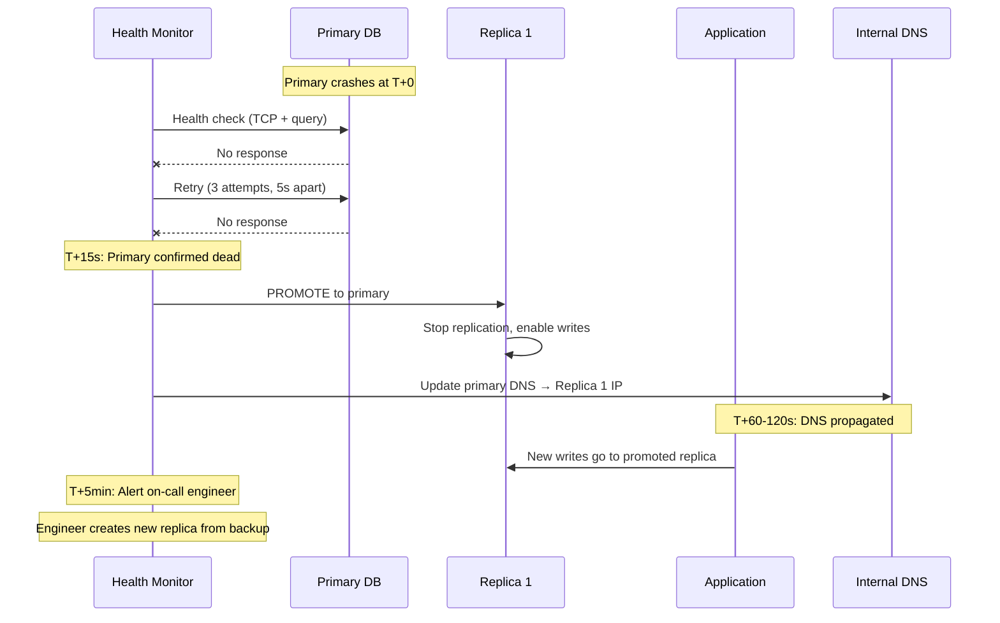
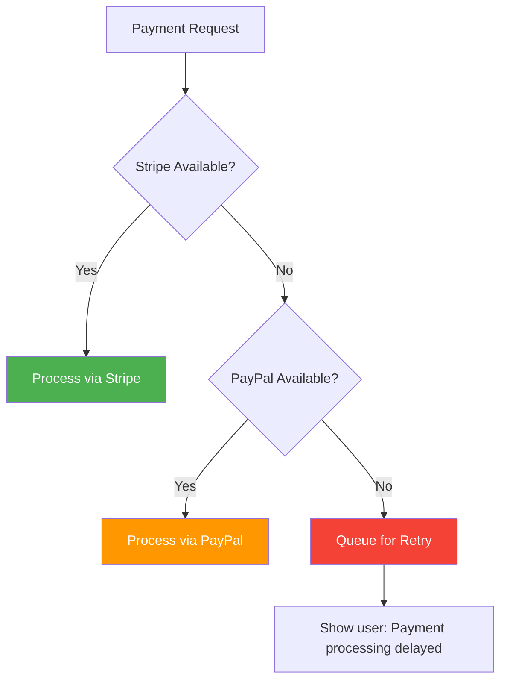
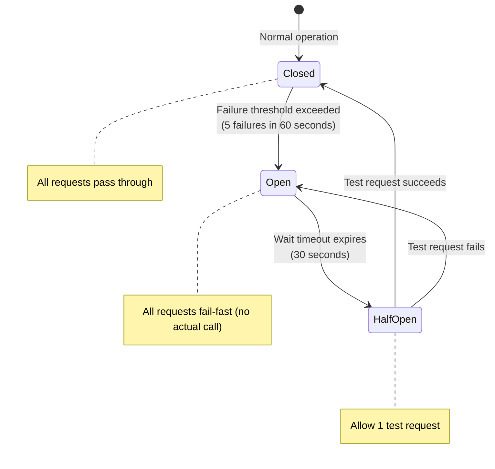

# 10. Failure Modes & Recovery

> Everything will fail. The question is: what's the **blast radius**, and how fast can we recover?

---

## 🎯 Failure Philosophy

```
Distributed system failures are INEVITABLE.
  - Networks partition
  - Disks fill up
  - Services crash
  - Deploys go wrong
  - Dependencies go down

Our job is NOT to prevent all failures.
Our job is to:
  1. DETECT failures within seconds
  2. CONTAIN the blast radius
  3. DEGRADE gracefully (keep checkout alive)
  4. RECOVER automatically when possible
  5. Have RUNBOOKS for manual recovery
```

---

## 📊 Failure Mode Catalog

### Critical Path Failures (Checkout Flow)

| Failure | Probability | Blast Radius | Detection | Auto-Recovery? |
|---------|-------------|-------------|-----------|----------------|
| **MySQL Primary down** | Low | 🔴 CRITICAL — no writes | Health check < 10s | Replica promotion (60-120s) |
| **Redis down** | Low | 🟡 HIGH — no cache, no carts | Health check < 10s | Restart + cache warming (5 min) |
| **Payment gateway down** | Medium | 🟡 HIGH — no checkouts | API error rate > 5% | Fallback to secondary gateway |
| **RabbitMQ down** | Low | 🟡 HIGH — no async processing | Health check < 10s | Restart + message replay |
| **API server crash** | Medium | 🟢 LOW — other servers handle traffic | Load balancer health check | Auto-restart, LB reroutes |
| **Worker crash** | Medium | 🟢 LOW — messages wait in queue | Process monitor | Auto-restart, messages reprocessed |

### Non-Critical Failures

| Failure | Blast Radius | User Impact | Response |
|---------|-------------|-------------|----------|
| **Elasticsearch down** | LOW | Search degraded | Fallback to MySQL LIKE search |
| **CDN down** | MEDIUM | Slow images | Serve from origin directly |
| **Email service down** | LOW | No email notifications | Queue retries, no user impact |
| **Analytics pipeline down** | NONE | No tracking | Events queue up, batch process later |

---

## 🔴 Failure Scenario 1: MySQL Primary Goes Down

### Impact

```
Without primary:
  ❌ Cannot create orders
  ❌ Cannot process payments
  ❌ Cannot update inventory
  ✅ Can still serve cached product pages (Redis)
  ✅ Can still browse (read replicas)
  ✅ Cart still works (Redis)

  Effective downtime: WRITE operations only
  User experience: "You can browse but not buy"
```

### Recovery: Automated Failover



### Recovery Timeline

| Time | Status | Action |
|------|--------|--------|
| T+0s | Primary crashes | Health check detects |
| T+15s | Confirmed dead | Promote replica |
| T+30-60s | Replica promoted | DNS update |
| T+60-120s | DNS propagated | Writes resume |
| T+5min | Alert sent | Engineer investigates |
| T+30min | New replica created | Full redundancy restored |

> ⏱ **Total write downtime: 60-120 seconds.** Read operations are unaffected throughout.

---

## 🟡 Failure Scenario 2: Redis Goes Down

### Impact

```
Without Redis:
  ❌ All cache misses → DB gets 20x more reads → possible cascade
  ❌ Carts lost (Redis is primary cart storage)
  ❌ Sessions lost → all users logged out
  ✅ Orders already placed continue processing
  ✅ Database has all critical data
```

### Recovery: Graceful Degradation + Restart

```
Phase 1: IMMEDIATE (0-30 seconds)
  - Circuit breaker trips → app stops trying Redis
  - All reads go to MySQL replicas
  - Cart operations fail gracefully: "Cart temporarily unavailable"
  - Sessions fall back to database-backed sessions

Phase 2: RESTART (30-120 seconds)
  - Redis restarts (with AOF persistence → carts partially recovered)
  - Health check detects Redis is back
  - Circuit breaker half-opens → allow test requests

Phase 3: WARM-UP (2-5 minutes)
  - Cache is cold → DB load temporarily high
  - Cache-aside pattern gradually repopulates cache
  - Pre-warm critical data (category tree, top products)

Phase 4: NORMAL (5+ minutes)
  - Cache hit ratio recovers to > 90%
  - Normal operations resume
```

### Redis HA Setup

```
Redis Sentinel (3 nodes):
  - 1 primary, 2 replicas
  - Sentinel monitors, auto-failovers in 30s
  - Application uses Sentinel-aware client

  Primary down → Sentinel promotes replica → 30s failover
  No data loss (with AOF persistence)
```

---

## 🟡 Failure Scenario 3: Payment Gateway Down

### Impact

```
Stripe is down:
  ❌ No new checkouts (can't charge cards)
  ✅ Existing orders continue processing
  ✅ Browse, search, cart all work
  ✅ Seller operations unaffected
```

### Recovery: Gateway Fallback



```php
class PaymentGateway
{
    private array $gateways = ['stripe', 'paypal'];

    public function charge(Payment $payment): PaymentResult
    {
        foreach ($this->gateways as $gateway) {
            try {
                $result = $this->processVia($gateway, $payment);
                if ($result->success) {
                    return $result;
                }
            } catch (GatewayUnavailableException $e) {
                Log::warning("Gateway {$gateway} unavailable", [
                    'error' => $e->getMessage(),
                ]);
                continue;  // Try next gateway
            }
        }

        // All gateways down — queue for retry
        dispatch(new RetryPaymentJob($payment))
            ->delay(now()->addMinutes(5));

        return PaymentResult::pending(
            'Payment is being processed. You will be notified.'
        );
    }
}
```

---

## 🛡 Circuit Breaker Pattern

### Implementation



### Circuit Breaker Configuration

| Service | Failure Threshold | Timeout | Half-Open Tests |
|---------|------------------|---------|-----------------|
| **Stripe API** | 5 in 60s | 30s | 1 request |
| **MySQL Primary** | 3 in 30s | 15s | 1 query |
| **Redis** | 5 in 30s | 10s | 1 GET |
| **Elasticsearch** | 10 in 60s | 60s | 1 search |
| **Email SMTP** | 5 in 60s | 120s | 1 test email |

---

## 🔄 Graceful Degradation Strategy

| Component Down | Degraded Behavior | User Sees |
|----------------|-------------------|-----------|
| **Redis** | DB-only reads, no cache | Slower pages (200ms → 500ms) |
| **Elasticsearch** | MySQL LIKE search (slow) | Search works, fewer results |
| **Payment Gateway** | Payment queued for retry | "Payment processing, we'll confirm soon" |
| **Email Service** | Skip emails, log for later | No confirmation email (order still works) |
| **CDN** | Serve images from origin | Slower image loads |
| **Read Replica** | All reads from primary | All reads on primary (monitor carefully) |
| **RabbitMQ** | Sync processing (slower) | Slightly slower checkout |

> 💡 **Key principle**: The checkout flow should work even with **half the system down**. Degrade features, never the core purchase path.

---

## 📋 Recovery Runbooks

### Runbook: MySQL Primary Fails

```
AUTOMATED:
  1. Sentinel detects primary down (15s)
  2. Promotes replica to primary (30s)
  3. Updates DNS / service discovery (60s)
  4. Alerts on-call engineer

MANUAL (engineer):
  1. Check promoted replica is healthy
     → SHOW SLAVE STATUS (should show no replication)
     → SHOW PROCESSLIST (check normal queries)
  2. Investigate old primary
     → Check disk space, memory, crash logs
  3. Create new replica from promoted primary
     → mysqldump or Percona XtraBackup
  4. Update monitoring dashboards
  5. Post-incident review within 24h
```

### Runbook: Data Inconsistency Detected

```
Scenario: order marked 'confirmed' but inventory not decremented

INVESTIGATION:
  1. Check RabbitMQ DLQ for failed inventory events
  2. Check processed_events table — was the event consumed?
  3. Check order service logs for the correlation_id

RESOLUTION:
  Option A: Replay the event from DLQ
  Option B: Manual inventory adjustment + audit log entry
  Option C: If payment captured but order stuck → manual order confirmation

PREVENTION:
  - Add reconciliation job (daily): compare order count vs inventory deltas
  - Alert if mismatch > 0.1%
```

---

## 📊 Failure Recovery SLAs

| Failure Type | Detection Time | Recovery Time | Data Loss |
|-------------|---------------|---------------|-----------|
| Single API server | < 10s | < 30s (LB reroute) | None |
| MySQL Primary | < 15s | < 120s (failover) | < 1s of writes |
| Redis | < 10s | < 30s (restart) | Cart data (AOF: minimal) |
| RabbitMQ | < 10s | < 60s (restart) | None (persistent queues) |
| Payment Gateway | < 5s | Fallback immediate | None |
| Full data center | < 30s | < 5 min (DNS failover) | < 5s of writes |

---

## ⬅️ [← Event-Driven Model](09-event-driven-model.md) · [Scaling Strategy →](11-scaling-strategy.md)
