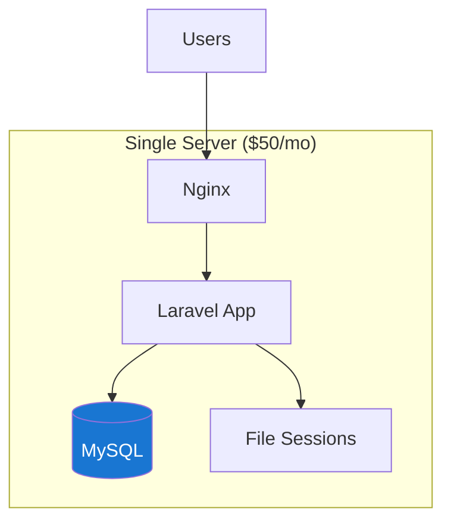
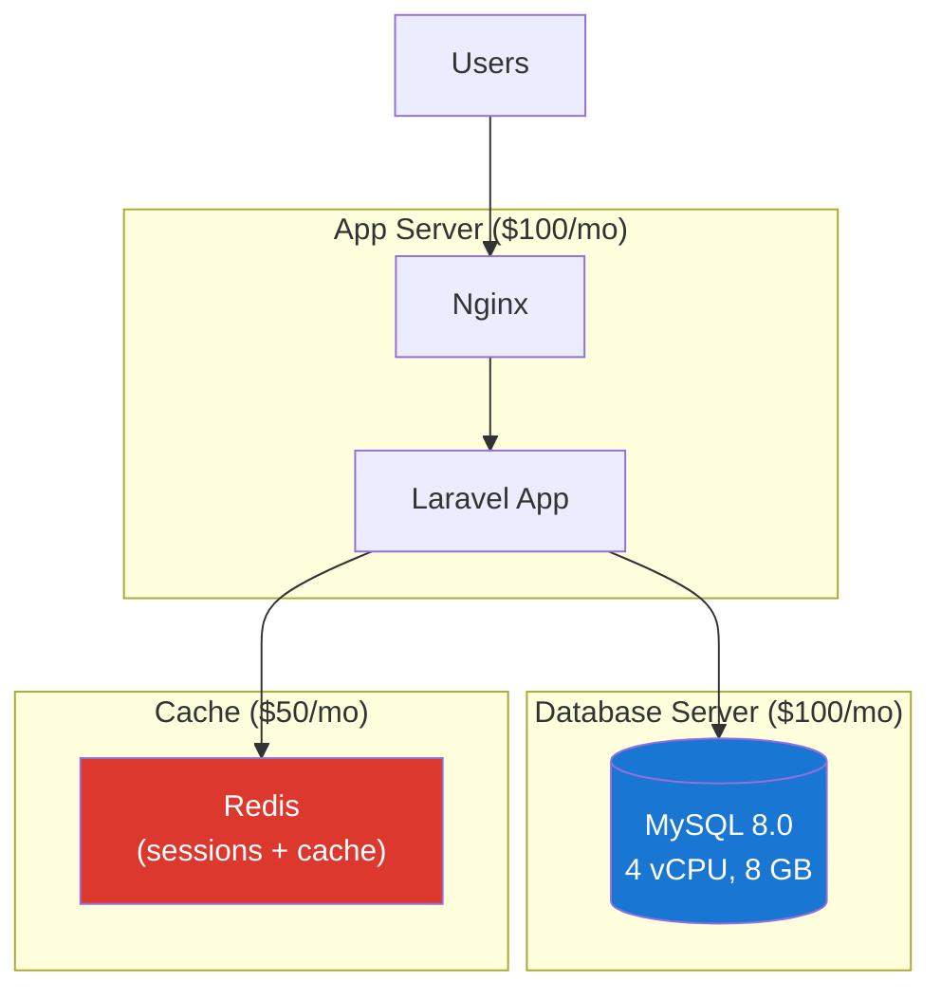
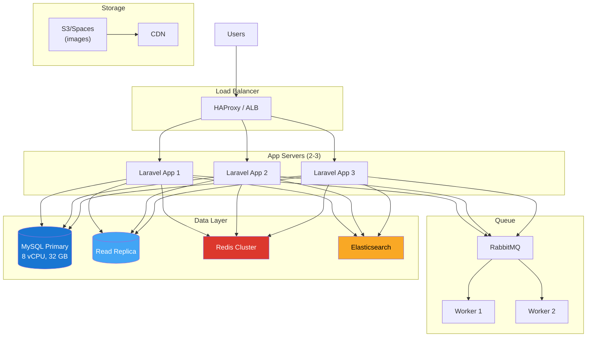
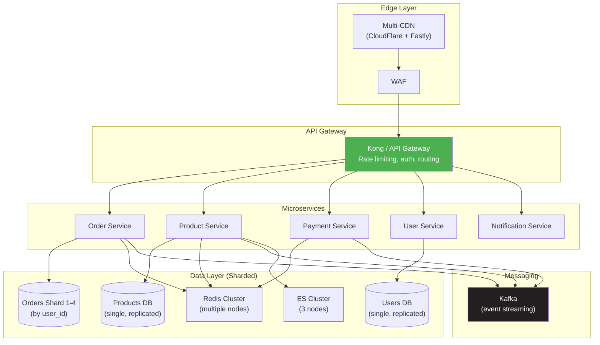

# 11. Scaling Strategy — Day 1 to 100M Users

> The best architecture for 100M users is NOT the right architecture for Day 1. Scale the system as the business scales.

---

## 🎯 Growth Stages Overview

```
Stage 1: Launch          → 0 - 10K MAU       → Single server is fine
Stage 2: Traction        → 10K - 500K MAU    → Separate concerns
Stage 3: Growth          → 500K - 5M MAU     → Cache everything, read replicas
Stage 4: Scale           → 5M - 10M MAU      → Current design (this case study)
Stage 5: Hyper-scale     → 10M - 50M MAU     → Sharding, microservices
Stage 6: Massive         → 50M - 100M+ MAU   → Multi-region, dedicated teams
```

---

## 📊 Stage-by-Stage Architecture

### Stage 1: Launch (0 - 10K MAU)

**Monthly cost: ~$50-150**



| Component | Setup | Why |
|-----------|-------|-----|
| **Server** | 1× 2 vCPU, 4 GB ($50/mo DigitalOcean) | Handles ~100 concurrent users easily |
| **Database** | MySQL on same server | Zero latency, simple backups |
| **Cache** | None | Not needed yet |
| **Queue** | None (sync processing) | < 50 orders/day — no bottleneck |
| **Search** | MySQL LIKE | Works fine for < 10K products |
| **Files** | Local disk | Simple, fast |

**What to focus on:** Product-market fit, not infrastructure.

> 💡 **The only scaling rule at this stage**: Take automated backups. Everything else can wait.

---

### Stage 2: Traction (10K - 500K MAU)

**Monthly cost: ~$200-500**



**Changes from Stage 1:**

| Change | Trigger | Cost |
|--------|---------|------|
| **Separate DB server** | DB CPU > 50% | +$100/mo |
| **Add Redis** | Session load + slow pages | +$50/mo |
| **Basic CDN** | Image bandwidth > 100 GB/mo | +$20/mo |
| **Automated deployments** | Deploy more than 2x/week | $0 (GitHub Actions) |
| **Database backups** | Daily automated snapshots | +$10/mo |

---

### Stage 3: Growth (500K - 5M MAU)

**Monthly cost: ~$1,000-3,000**



**Changes from Stage 2:**

| Change | Trigger | Impact |
|--------|---------|--------|
| **Load balancer + 2-3 app servers** | Single server at 80% CPU during peak | Horizontal scaling, zero-downtime deploys |
| **Read replica** | DB read queries > 60% of capacity | 50% less load on primary |
| **Queue system (RabbitMQ)** | Checkout latency > 1s | Async email, notifications, search indexing |
| **Elasticsearch** | MySQL LIKE too slow for 100K+ products | Instant search with relevance scoring |
| **Object storage (S3)** | Image storage > 100 GB | Infinite storage, CDN-served |
| **Redis Sentinel** | Redis downtime caused outage | Auto-failover for cache/sessions |

---

### Stage 4: Scale (5M - 10M MAU) — Our Current Design

**Monthly cost: ~$5,000-15,000**

This is the architecture described in this entire case study.

```
Key characteristics:
  ✅ 3+ app servers behind load balancer
  ✅ MySQL primary + 2-3 read replicas (purpose-specific)
  ✅ Redis Cluster (cache + sessions + carts)
  ✅ RabbitMQ with DLQ and retry logic
  ✅ Elasticsearch for search
  ✅ CDN for all static assets
  ✅ Circuit breakers + graceful degradation
  ✅ Comprehensive monitoring (Prometheus + Grafana)
  ✅ Modular monolith (ready to extract services)
```

**The architecture holds because:**

| Resource | Capacity | Usage at 10M MAU |
|----------|----------|-------------------|
| App servers (3×8 vCPU) | ~9,000 req/s | Peak ~3,750 req/s (42%) |
| MySQL Primary | ~3,000 write QPS | Peak ~18 QPS (0.6%) |
| Redis (16 GB) | ~100,000 ops/s | Peak ~3,500 ops/s (3.5%) |
| MySQL Replicas | ~3,000 QPS each | Peak ~60 QPS each (2%) |

> 📊 We have **massive headroom** at 10M MAU because of aggressive caching.

---

### Stage 5: Hyper-Scale (10M - 50M MAU)

**Monthly cost: ~$15,000-50,000**



**Changes from Stage 4:**

| Change | Trigger | Why |
|--------|---------|-----|
| **Microservices extraction** | Team size > 20, deploy conflicts | Independent deployment, team ownership |
| **Order sharding (4 shards)** | orders table > 500M rows | Write scaling, query performance |
| **API Gateway** | > 5 services, need centralized auth/rate-limit | Single entry point, cross-cutting concerns |
| **Kafka (replace RabbitMQ)** | Message volume > 10K/sec | Event replay, better throughput |
| **ES Cluster (3 nodes)** | Search QPS > 5,000 | HA + distributed search |
| **Multi-CDN** | Geographic diversity needed | Latency reduction for global users |

### Microservice Extraction Order

```
1. FIRST: Notification Service (least coupled, lowest risk)
2. SECOND: Payment Service (clear boundary, compliance isolation)
3. THIRD: Product/Search Service (high read load, independent scaling)
4. FOURTH: Order Service (most complex, extract last)
5. KEEP: User Service in monolith the longest (used by everything)
```

> 💡 **Extract services based on team boundaries, not technical convenience.** If one team owns orders and another owns payments, extract payments first.

---

### Stage 6: Massive Scale (50M - 100M+ MAU)

**Monthly cost: ~$50,000-200,000+**

**New challenges at this scale:**

| Challenge | Solution |
|-----------|----------|
| **Single region failure** | Multi-region active-active |
| **Database size (TB+)** | 16+ shards with consistent hashing |
| **Global latency** | Edge computing, regional API servers |
| **Team coordination** | Platform team, service mesh |
| **Deployment complexity** | Kubernetes, GitOps |
| **Data consistency** | CRDTs, conflict resolution |
| **Compliance** | Regional data residency (GDPR) |

```
Multi-Region Architecture:
  Region A (Primary):  US-East    → serves Americas
  Region B (Active):   EU-West    → serves Europe
  Region C (Active):   ME-South   → serves Middle East

  Each region: full service stack + local DB
  Cross-region: async replication with conflict resolution
  DNS: Route 53 latency-based routing
```

---

## 📊 Scaling Decision Cheat Sheet

| Signal | Action | Don't Do |
|--------|--------|----------|
| Response time > 500ms | Add caching layer | Add more servers (won't help) |
| CPU > 80% on app server | Add more app servers | Increase server size (hits ceiling) |
| DB CPU > 70% on reads | Add read replica | Shard (overkill) |
| DB CPU > 70% on writes | Optimize queries first, then shard | Add replicas (won't help writes) |
| Queue depth growing | Add more workers | Increase server size |
| Cache hit ratio < 80% | Review cache strategy, add more cache | Throw more DB at it |
| Deploy conflicts > 2/week | Extract microservice | Restructure monolith |
| Single table > 500M rows | Archive or shard | Add indexes (won't scale) |
| Third-party API too slow | Add circuit breaker + fallback | Retry aggressively (makes it worse) |

---

## 💰 Cost Progression

| Stage | MAU | Monthly Cost | QPS Capacity | Team Size |
|-------|-----|-------------|-------------|-----------|
| 1. Launch | 10K | $50-150 | 100 | 1-2 |
| 2. Traction | 500K | $200-500 | 500 | 2-4 |
| 3. Growth | 5M | $1K-3K | 3,000 | 4-8 |
| 4. Scale | 10M | $5K-15K | 10,000 | 8-15 |
| 5. Hyper | 50M | $15K-50K | 50,000 | 15-40 |
| 6. Massive | 100M+ | $50K-200K+ | 200,000+ | 40-100+ |

---

## ⚖️ Final Trade-offs Summary

| Decision | We Chose | Alternative | Why |
|----------|----------|-------------|-----|
| Monolith vs Microservices | Start monolith, extract later | Microservices from Day 1 | Reduces complexity at low scale |
| MySQL vs NoSQL | MySQL (with sharding plan) | DynamoDB/MongoDB | Relational integrity for marketplace |
| Redis cart vs DB cart | Redis (primary store) | MySQL cart | Speed + natural TTL for abandoned |
| RabbitMQ vs Kafka | RabbitMQ (switch at Stage 5) | Kafka from start | Simpler operations at our scale |
| Sharding vs Vertical | Delay sharding until needed | Pre-shard | 10M MAU fits in single MySQL easily |
| Multi-region vs Single | Single region (until Stage 6) | Multi-region from start | Complexity not justified until 50M+ |
| Cache TTL vs Consistency | TTL-based (accept staleness) | Write-through everywhere | 95% of data can be 3-5 min stale |
| Saga vs 2PC | Choreography saga | Two-phase commit | No distributed transaction coordinator needed |

---

## ⬅️ [← Failure & Recovery](10-failure-recovery.md) · [Back to Case Study Index](README.md)
