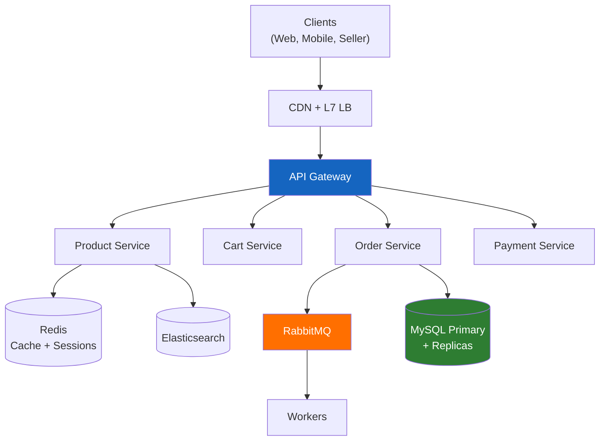

# Case Study 1: Design a High-Scale Marketplace

## 📋 Table of Contents

| # | Section | Focus |
|---|---------|-------|
| 0 | [Overview](00-overview.md) | Problem statement, functional & non-functional requirements |
| 1 | [Capacity Estimation](01-capacity-estimation.md) | QPS, storage, bandwidth — back-of-the-envelope math |
| 2 | [High-Level Architecture](02-high-level-architecture.md) | Component diagram, API design, service boundaries |
| 3 | [Data Model](03-data-model.md) | Schema design, indexes, database choice with reasoning |
| 4 | [Caching Strategy](04-caching-strategy.md) | Cache layers, invalidation patterns, hit ratio targets |
| 5 | [Read/Write Separation](05-read-write-separation.md) | CQRS, replication lag handling, consistency guarantees |
| 6 | [Sharding Strategy](06-sharding-strategy.md) | Partition key selection, rebalancing, hot spot mitigation |
| 7 | [Queue Design](07-queue-design.md) | Async processing, DLQ, backpressure, consumer scaling |
| 8 | [Payment Flow](08-payment-flow.md) | Payment lifecycle, idempotency, reconciliation |
| 9 | [Event-Driven Model](09-event-driven-model.md) | Event sourcing, saga pattern, eventual consistency |
| 10 | [Failure Recovery](10-failure-recovery.md) | Failure modes, blast radius, recovery playbooks |
| 11 | [Scaling Strategy](11-scaling-strategy.md) | Day 1 → 1M → 10M → 100M growth plan |

---

## 🎯 The Interview Prompt

> **"Design a marketplace like Amazon, Jumia, or Noon that handles 10 million active users. Sellers list products, buyers browse and purchase. The system must handle flash sales, peak traffic, and payment processing."**

This is one of the most comprehensive system design questions — it touches databases, caching, queues, payments, search, real-time updates, and scaling. If you can design this well, you can design almost anything.

---

## 🔑 Key Challenges

| Challenge | Why It's Hard |
|-----------|---------------|
| **Read-heavy traffic** | 100:1 read-to-write ratio, product pages must load in < 200ms |
| **Inventory consistency** | Flash sales: 10,000 users buy 100 items simultaneously |
| **Payment reliability** | Money can't be lost — exactly-once is a myth, idempotency is key |
| **Search performance** | Full-text search across millions of products with filters |
| **Multi-tenant data** | Sellers manage their own products, orders span multiple sellers |
| **Peak traffic** | 10x normal load during sales events (Black Friday, Ramadan) |
| **Global availability** | 99.95% uptime = max 4.38 hours downtime per year |

---

## 🏗 Architecture Overview



> Full architecture with all components: [02-high-level-architecture.md](02-high-level-architecture.md)

---

## 📖 How to Read This Case Study

Start with the **Overview** for requirements, then follow the numbered sections in order. Each section builds on the previous one:

```
Requirements → Capacity → Architecture → Data Model → Caching → CQRS → Sharding → Queues → Payment → Events → Failures → Scaling
```

Each section is self-contained but references related sections. Key decisions are marked with:

- ✅ **Decision** — what we chose
- ⚖️ **Trade-off** — what we gave up
- 🔢 **Numbers** — concrete calculations
- ⚠️ **Warning** — common pitfalls
- 💡 **Insight** — non-obvious engineering points

---

## 🏗 Technology Decisions Summary

| Component | Choice | Alternative Considered | Rationale |
|-----------|--------|----------------------|----------|
| **Database** | MySQL → shard at 10M+ | MongoDB, DynamoDB | Relational integrity for marketplace (orders, inventory, payments) |
| **Cache** | Redis (multi-layer) | Memcached | Sorted sets for rankings, pub/sub, natural TTL for carts |
| **Search** | Elasticsearch | MySQL FULLTEXT | Full-text + faceted filtering across millions of products |
| **Queue** | RabbitMQ → Kafka at 50M+ | Kafka from Day 1 | Simpler ops at early scale; switch when event volume justifies |
| **CQRS** | Read replicas + materialized views | Single DB for all | 100:1 read-to-write ratio demands read optimization |
| **Sharding** | Delay until needed (Stage 4+) | Pre-shard from Day 1 | 10M MAU fits in vertical MySQL; premature sharding = premature complexity |
| **Payments** | Choreography saga | Two-phase commit | No distributed transaction coordinator; events compensate on failure |
| **Session/Cart** | Redis (primary store) | MySQL cart table | Sub-ms reads, natural TTL for abandoned cart cleanup |

> Full trade-off analysis with reasoning: [11-scaling-strategy.md → Final Trade-offs Summary](11-scaling-strategy.md)

---

## ⬅️ [← Back to All Case Studies](../../README.md)
