# 2. High-Level Architecture

> The notification system is an event-driven pipeline: events come in, get enriched with user preferences, fan out to per-channel queues, and get delivered through channel-specific adapters.

---

## 🏗 System Architecture

```mermaid
graph TB
    subgraph "Event Sources"
        S1["Order Service"]
        S2["Social Service"]
        S3["Auth Service"]
        S4["Marketing Service"]
        S5["Admin Panel"]
    end

    subgraph "Ingestion Layer"
        API["Notification API<br/>(REST + gRPC)"]
        VAL["Validator &<br/>Deduplicator"]
    end

    subgraph "Processing Layer"
        KAFKA["Kafka Cluster<br/>(5 brokers)"]
        ROUTER["Channel Router<br/>(preferences + priority)"]
        TMPL["Template Engine<br/>(render content)"]
    end

    subgraph "Per-Channel Queues"
        Q1["📱 In-App Queue"]
        Q2["🔔 Push Queue"]
        Q3["📧 Email Queue"]
        Q4["📲 SMS Queue"]
    end

    subgraph "Delivery Layer"
        WS["WebSocket Servers<br/>(10-15 nodes)"]
        PUSH["Push Workers<br/>(APNs + FCM)"]
        EMAIL["Email Workers<br/>(Amazon SES)"]
        SMS["SMS Workers<br/>(Twilio)"]
    end

    subgraph "Feedback Loop"
        DLV["Delivery Tracker"]
        DLQ["🔴 Dead Letter Queue"]
        RETRY["Retry Scheduler"]
    end

    subgraph "Data Layer"
        CASS[("Cassandra<br/>Notification Store")]
        REDIS[("Redis<br/>Connections + Prefs")]
        MYSQL[("MySQL<br/>Templates + Users")]
    end

    S1 & S2 & S3 & S4 & S5 --> API
    API --> VAL --> KAFKA
    KAFKA --> ROUTER
    ROUTER --> TMPL
    TMPL --> Q1 & Q2 & Q3 & Q4
    Q1 --> WS
    Q2 --> PUSH
    Q3 --> EMAIL
    Q4 --> SMS
    WS & PUSH & EMAIL & SMS --> DLV
    DLV --> CASS
    DLV -->|failed| DLQ --> RETRY --> Q1 & Q2 & Q3 & Q4
    ROUTER --> REDIS
    TMPL --> MYSQL
    WS --> REDIS

    style KAFKA fill:#231f20,color:#fff
    style REDIS fill:#dc382d,color:#fff
    style CASS fill:#1a9ced,color:#fff
    style DLQ fill:#f44336,color:#fff
```



---

## 🔀 Request Flow — Single Notification


---

## 📡 API Design

### Send Notification

```
POST /api/v1/notifications
Authorization: Bearer {service_token}
Idempotency-Key: {unique_key}

{
  "type": "order_shipped",
  "priority": "high",
  "target": {
    "type": "user",
    "user_id": "usr_42"
  },
  "data": {
    "order_id": "ord_abc123",
    "tracking_number": "TR12345",
    "carrier": "FedEx"
  },
  "channels": ["in_app", "push", "email"],  // optional override
  "schedule_at": null                         // null = immediate
}

Response 202 Accepted:
{
  "notification_id": "notif_x1y2z3",
  "status": "accepted",
  "estimated_channels": ["in_app", "push", "email"]
}
```

### Broadcast Notification

```
POST /api/v1/notifications/broadcast
Authorization: Bearer {admin_token}

{
  "type": "platform_announcement",
  "priority": "normal",
  "target": {
    "type": "segment",
    "segment": "all_active_users"    // or custom segment
  },
  "data": {
    "title": "New Feature: Dark Mode!",
    "body": "Try our new dark mode in settings."
  },
  "throttle": {
    "rate": 50000,                    // max 50K/second
    "strategy": "round_robin"
  }
}

Response 202 Accepted:
{
  "broadcast_id": "bc_a1b2c3",
  "estimated_recipients": 30000000,
  "estimated_duration_minutes": 10
}
```

### Get User Notifications (Inbox)

```
GET /api/v1/users/{user_id}/notifications?limit=20&cursor={cursor}

Response 200:
{
  "notifications": [
    {
      "id": "notif_x1y2z3",
      "type": "order_shipped",
      "title": "Your order has shipped!",
      "body": "Order #ABC123 is on its way via FedEx.",
      "read": false,
      "created_at": "2026-02-23T14:30:00Z",
      "data": {
        "action_url": "/orders/abc123",
        "image": "https://cdn.../shipping.png"
      }
    }
  ],
  "unread_count": 7,
  "cursor": "notif_prev_id"
}
```

### Update Preferences

```
PUT /api/v1/users/{user_id}/preferences

{
  "preferences": [
    {"type": "order_updates", "channel": "push", "enabled": true},
    {"type": "promotions", "channel": "email", "enabled": false},
    {"type": "promotions", "channel": "push", "enabled": false}
  ]
}
```

---

## 🔲 Service Boundaries

| Service | Responsibility | Tech | Scaling Unit |
|---------|---------------|------|-------------|
| **Notification API** | Ingestion, validation, dedup | Go/Node.js | Stateless, auto-scale on QPS |
| **Channel Router** | Preference lookup, channel dispatch | Go | Stateless, scale with Kafka partitions |
| **Template Engine** | Render per-channel content | Node.js | Stateless, scale horizontally |
| **WebSocket Gateway** | Hold 5M connections, deliver real-time | Go / Rust | Scale by connection count (500K/server) |
| **Push Worker** | Batch send to APNs/FCM | Go | Scale by push queue depth |
| **Email Worker** | Send via SES | Go/PHP | Scale by email queue depth |
| **SMS Worker** | Send via Twilio | Go | Scale by SMS queue depth |
| **Delivery Tracker** | Track delivery status, update DB | Go | Scale by event volume |
| **Retry Scheduler** | Requeue failed deliveries | Go | 1-2 instances (cron-like) |

---

## 🔄 Sync vs Async Boundaries

```
SYNCHRONOUS (API request-response):
  ✅ Accept notification → return 202 (< 50ms)
  ✅ Get inbox → return notifications (< 100ms)
  ✅ Update preferences → return 200 (< 50ms)

ASYNCHRONOUS (Kafka consumers):
  ✅ Route to channels
  ✅ Render templates
  ✅ Deliver to WebSocket
  ✅ Send push/email/SMS
  ✅ Track delivery status
  ✅ Retry failed deliveries

Rule: The API never waits for delivery. It accepts and returns immediately.
```

---

## 📊 Topic Design (Kafka)

| Topic | Partitions | Producers | Consumers | Purpose |
|-------|-----------|-----------|-----------|---------|
| `notifications.raw` | 32 | Notification API | Channel Router | Raw events |
| `notifications.in_app` | 16 | Channel Router | WebSocket Gateway | In-app delivery |
| `notifications.push` | 16 | Channel Router | Push Workers | Push delivery |
| `notifications.email` | 8 | Channel Router | Email Workers | Email delivery |
| `notifications.sms` | 4 | Channel Router | SMS Workers | SMS delivery |
| `notifications.delivery` | 16 | All delivery workers | Delivery Tracker | Status updates |
| `notifications.dlq` | 8 | Delivery workers | Retry Scheduler | Failed deliveries |

### Why Kafka (Not RabbitMQ)?

| Criteria | Kafka | RabbitMQ |
|----------|-------|----------|
| **Throughput** | 100K+ msg/sec easily | Needs careful tuning above 50K |
| **Message replay** | ✅ Replay from any offset | ❌ Once consumed, gone |
| **Consumer groups** | ✅ Built-in parallelism | Manual scaling |
| **Ordering** | Per-partition ordering | Per-queue ordering |
| **Retention** | Keep messages for days/weeks | Messages deleted after consumption |
| **Our volume** | 200M messages/day | Possible but stressed |

> At 200M messages/day and the need for message replay (reprocess failed batches), Kafka is the right choice. RabbitMQ was fine for the marketplace at 100 msg/sec.

> **⚠️ Known Risk: Kafka Operational Complexity**
>
> Kafka's strengths (200M events/day throughput, built-in replication, consumer group rebalancing) come with real operational costs: ZooKeeper/KRaft dependency management, partition rebalancing storms during broker additions, careful disk capacity planning (Kafka stores all events for the retention period), and **topic/partition counts that are extremely difficult to change after creation**. The minimum viable Kafka cluster (3 brokers + ZooKeeper) is far heavier than a single RabbitMQ node.
>
> **Why we accept this:** At 200M events/day, there is no simpler alternative. RabbitMQ would require complex sharding at this volume. The operational investment is justified — but it requires dedicated Kafka expertise on the team (at least 1 engineer with production Kafka experience).

---

## ⬅️ [← Capacity Estimation](01-capacity-estimation.md) · [Data Model →](03-data-model.md)
