# 3. Data Model & Storage

> The notification system needs two very different storage patterns: **fast writes at massive scale** (notification events) and **fast point queries** (inbox lookup, preferences). One database can't do both well.

---

## 🗄 Database Choice

### Why Cassandra for Notification Store?

| Requirement | MySQL/PostgreSQL | MongoDB | Cassandra | DynamoDB |
|-------------|-----------------|---------|-----------|----------|
| 200M writes/day | ❌ Struggles at this write volume | ⚠️ Possible | ✅ Designed for write-heavy | ✅ Auto-scales |
| 90-day retention + TTL | Manual cleanup | Manual TTL | ✅ Built-in TTL | ✅ Built-in TTL |
| Query by user_id (inbox) | ✅ | ✅ | ✅ (partition key) | ✅ (partition key) |
| Query by notification_id | ✅ | ✅ | ✅ (clustering key) | ✅ (sort key) |
| Time-ordered results | ✅ ORDER BY | ✅ sort | ✅ Clustering order | ✅ Sort key |
| Multi-region replication | Complex | ⚠️ | ✅ Built-in | ✅ Global Tables |
| Cost at this scale | High (need sharding) | Medium | Low (commodity hardware) | Pay-per-operation ($$$) |
| Operational complexity | Low | Medium | Medium-High | Zero (managed) |

> **Decision**: Cassandra for notification storage — write-optimized, built-in TTL, natural partition by user_id. If on AWS, DynamoDB is the managed alternative.

### Storage Architecture

```mermaid
graph TB
    subgraph "Hot Path (Real-time)"
        REDIS[("🔴 Redis Cluster<br/>• WebSocket connection mapping<br/>• User preferences (cached)<br/>• Unread counts<br/>• Rate limit counters")]
    end

    subgraph "Warm Path (Inbox & Delivery)"
        CASS[("🔵 Cassandra Cluster<br/>• Notification inbox (90-day TTL)<br/>• Delivery log<br/>• Notification content")]
    end

    subgraph "Cold Path (Metadata)"
        MYSQL[("🟢 MySQL<br/>• Templates<br/>• User preferences (source of truth)<br/>• Device tokens<br/>• Notification types config")]
    end

    style REDIS fill:#dc382d,color:#fff
    style CASS fill:#1a9ced,color:#fff
    style MYSQL fill:#4caf50,color:#fff
```



---

## 📋 Cassandra Schema

### Table 1: `notifications_by_user` (Inbox)

```sql
-- Primary query: "Get user's notifications, newest first"
-- Partition key: user_id (all of a user's notifications on one node)
-- Clustering: created_at DESC (newest first, free ordering)

CREATE TABLE notifications_by_user (
    user_id       UUID,
    created_at    TIMEUUID,
    notification_id UUID,
    type          TEXT,          -- 'order_shipped', 'new_message', etc.
    priority      TINYINT,      -- 0=low, 1=normal, 2=high, 3=critical
    title         TEXT,
    body          TEXT,
    data          TEXT,          -- JSON (action_url, image, etc.)
    is_read       BOOLEAN,
    read_at       TIMESTAMP,

    PRIMARY KEY ((user_id), created_at, notification_id)
) WITH CLUSTERING ORDER BY (created_at DESC, notification_id ASC)
  AND default_time_to_live = 7776000    -- 90 days in seconds
  AND compaction = {'class': 'TimeWindowCompactionStrategy',
                    'compaction_window_size': 1,
                    'compaction_window_unit': 'DAYS'};
```

**Query patterns:**

```sql
-- Get inbox (newest first, paginated)
SELECT * FROM notifications_by_user
WHERE user_id = ?
LIMIT 20;

-- Get notifications after cursor (pagination)
SELECT * FROM notifications_by_user
WHERE user_id = ?
  AND created_at < ?
LIMIT 20;

-- Mark as read (lightweight update)
UPDATE notifications_by_user
SET is_read = true, read_at = toTimestamp(now())
WHERE user_id = ? AND created_at = ? AND notification_id = ?;
```

> **⚠️ Known Risk: Cassandra Tombstone Accumulation**
>
> The mark-as-read operation (`UPDATE ... SET is_read = true`) creates **tombstones** in Cassandra. Cassandra is notoriously bad at frequent updates — tombstones accumulate, increase read latency (Cassandra must scan past them), and create compaction pressure for active users. A power user marking hundreds of notifications as read generates hundreds of tombstones per partition.
>
> **Mitigations:**
> - Keep `is_read` state in Redis (fast, no tombstones) with periodic Cassandra sync
> - Use a separate `read_receipts` table with inserts instead of updates (Cassandra handles inserts well)
> - Set `gc_grace_seconds` appropriately for the notifications table (shorter than default 10 days, since this data isn't replicated cross-DC)
> - Monitor tombstone-per-read warnings in Cassandra logs

### Table 2: `notification_details` (Full notification lookup)

```sql
-- Lookup by notification_id (for delivery tracking, admin tools)
CREATE TABLE notification_details (
    notification_id  UUID,
    type             TEXT,
    priority         TINYINT,
    source_service   TEXT,
    template_id      TEXT,
    raw_data         TEXT,         -- original JSON payload
    target_type      TEXT,         -- 'user', 'segment', 'broadcast'
    target_id        TEXT,
    channels         SET<TEXT>,    -- {'in_app', 'push', 'email'}
    created_at       TIMESTAMP,
    scheduled_at     TIMESTAMP,
    idempotency_key  TEXT,

    PRIMARY KEY (notification_id)
) WITH default_time_to_live = 7776000;
```

### Table 3: `delivery_log` (Per-channel delivery tracking)

```sql
-- Track delivery status per user per channel
CREATE TABLE delivery_log (
    notification_id UUID,
    user_id         UUID,
    channel         TEXT,         -- 'in_app', 'push', 'email', 'sms'
    status          TEXT,         -- 'pending', 'sent', 'delivered', 'read', 'failed'
    attempt_count   INT,
    error_message   TEXT,
    sent_at         TIMESTAMP,
    delivered_at    TIMESTAMP,
    read_at         TIMESTAMP,
    last_attempt_at TIMESTAMP,

    PRIMARY KEY ((notification_id, user_id), channel)
) WITH default_time_to_live = 7776000;
```

---

## 📋 MySQL Schema (Metadata)

### Templates

```sql
CREATE TABLE notification_templates (
    id              VARCHAR(50) PRIMARY KEY,   -- 'order_shipped_v2'
    type            VARCHAR(50) NOT NULL,      -- 'order_shipped'
    channel         ENUM('in_app','push','email','sms') NOT NULL,
    subject         VARCHAR(200),              -- email subject / push title
    body_template   TEXT NOT NULL,             -- "Your order {{order_id}} has shipped"
    variables       JSON NOT NULL,             -- ["order_id", "tracking_number"]
    is_active       BOOLEAN DEFAULT TRUE,
    version         INT UNSIGNED DEFAULT 1,
    created_at      TIMESTAMP DEFAULT CURRENT_TIMESTAMP,
    updated_at      TIMESTAMP DEFAULT CURRENT_TIMESTAMP ON UPDATE CURRENT_TIMESTAMP,

    UNIQUE KEY uk_type_channel_version (type, channel, version)
);
```

### User Preferences (Source of Truth)

```sql
CREATE TABLE notification_preferences (
    user_id              BIGINT UNSIGNED NOT NULL,
    notification_type    VARCHAR(50) NOT NULL,     -- 'order_updates', 'promotions'
    channel              ENUM('in_app','push','email','sms') NOT NULL,
    enabled              BOOLEAN NOT NULL DEFAULT TRUE,
    updated_at           TIMESTAMP DEFAULT CURRENT_TIMESTAMP ON UPDATE CURRENT_TIMESTAMP,

    PRIMARY KEY (user_id, notification_type, channel),
    INDEX idx_type_channel (notification_type, channel)
);

-- Only store NON-DEFAULT preferences
-- Default: all enabled except SMS (opt-in)
-- If no row exists for a user+type+channel → use default
```

### Device Tokens

```sql
CREATE TABLE device_tokens (
    id               BIGINT UNSIGNED AUTO_INCREMENT PRIMARY KEY,
    user_id          BIGINT UNSIGNED NOT NULL,
    platform         ENUM('ios','android','web') NOT NULL,
    token            VARCHAR(512) NOT NULL,
    app_version      VARCHAR(20),
    is_active        BOOLEAN DEFAULT TRUE,
    last_used_at     TIMESTAMP,
    created_at       TIMESTAMP DEFAULT CURRENT_TIMESTAMP,

    UNIQUE KEY uk_token (token),
    INDEX idx_user_active (user_id, is_active),
    INDEX idx_last_used (last_used_at)
);
```

### Notification Type Config

```sql
CREATE TABLE notification_types (
    type            VARCHAR(50) PRIMARY KEY,     -- 'order_shipped'
    display_name    VARCHAR(100) NOT NULL,       -- 'Order Shipping Updates'
    category        VARCHAR(50) NOT NULL,        -- 'transactional', 'marketing'
    default_channels JSON NOT NULL,              -- ["in_app", "push", "email"]
    priority        TINYINT NOT NULL DEFAULT 1,  -- 0=low, 1=normal, 2=high, 3=critical
    rate_limit      JSON,                        -- {"per_user_per_hour": 5}
    user_can_disable BOOLEAN DEFAULT TRUE,
    is_active       BOOLEAN DEFAULT TRUE,

    INDEX idx_category (category)
);
```

---

## 🔴 Redis Data Structures

### Connection Mapping (Which server holds the user's WebSocket?)

```
Key:    conn:{user_id}
Value:  "ws-server-07:8080"
TTL:    Heartbeat-based (renewed every 30s, expires in 60s)

SETEX conn:usr_42 60 "ws-server-07:8080"
GET conn:usr_42  →  "ws-server-07:8080"
```

### Unread Count (Fast counter)

```
Key:    unread:{user_id}
Type:   String (integer)

INCR unread:usr_42            → New notification arrived
DECRBY unread:usr_42 5        → User read 5 notifications
GET unread:usr_42             → "7"
SET unread:usr_42 0           → Mark all as read
```

### User Preferences (Cache)

```
Key:    prefs:{user_id}
Type:   Hash
TTL:    1 hour (refresh from MySQL on miss)

HSET prefs:usr_42 order_updates:push 1
HSET prefs:usr_42 promotions:email 0
HGETALL prefs:usr_42 → all preference overrides
```

### Rate Limit Counters

```
Key:    rl:{user_id}:{type}:{window}
Type:   String (counter)
TTL:    Window duration

-- "Has user_42 received more than 5 order_updates this hour?"
INCR rl:usr_42:order_updates:2026022314
EXPIRE rl:usr_42:order_updates:2026022314 3600

GET rl:usr_42:order_updates:2026022314 → "3" (under limit)
```

### Device Token Cache

```
Key:    devices:{user_id}
Type:   Set
TTL:    24 hours

SADD devices:usr_42 '{"platform":"ios","token":"abc..."}'
SMEMBERS devices:usr_42 → all active device tokens
```

---

## 📊 Data Model Diagram


---

## ⬅️ [← High-Level Architecture](02-high-level-architecture.md) · [Connection Management →](04-connection-management.md)
