# 4. Connection Management — WebSocket at Scale

> Holding 5 million concurrent TCP connections is not a "just use WebSockets" problem. It's a **systems engineering challenge** involving kernel tuning, memory management, connection routing, and graceful degradation.

---

## 🎯 Protocol Choice: WebSocket vs SSE vs Long Polling

| Criteria | WebSocket | SSE (Server-Sent Events) | Long Polling |
|----------|-----------|-------------------------|-------------|
| **Direction** | Bidirectional | Server → Client only | Server → Client (simulated) |
| **Connection overhead** | 1 TCP connection | 1 HTTP connection | New HTTP request per poll |
| **Latency** | < 50ms | < 100ms | 1-30s (poll interval) |
| **Mobile battery** | Good (one persistent connection) | Good | Bad (repeated connections) |
| **Proxy/firewall compatibility** | Some issues (needs upgrade) | Good (standard HTTP) | Excellent |
| **Auto-reconnect** | Manual implementation | Built-in | Built-in (by nature) |
| **Binary data** | ✅ | ❌ (text only) | ❌ |
| **Browser support** | All modern browsers | All except old IE | Everything |
| **Scalability overhead** | Medium (file descriptors) | Medium | High (repeated connections) |

### Decision: **WebSocket** (Primary) + **SSE** (Fallback)

```
Why WebSocket:
  ✅ Client can send read receipts, typing indicators without new HTTP request
  ✅ Lower per-message overhead (2-6 bytes frame vs full HTTP headers)
  ✅ Better for mobile (single persistent connection)

Why SSE as fallback:
  ✅ Works through corporate proxies that block WebSocket upgrades
  ✅ Auto-reconnect built into the EventSource API
  ✅ We mainly need server→client anyway (95% of messages)
```

---

## 🏗 WebSocket Server Architecture

```mermaid
graph TB
    subgraph "Client Layer"
        C1["📱 Mobile App"]
        C2["🖥 Web Browser"]
        C3["📱 Mobile App"]
    end

    subgraph "Load Balancer (L4)"
        LB["TCP Load Balancer<br/>(HAProxy / NLB)<br/>Sticky sessions by IP"]
    end

    subgraph "WebSocket Servers"
        WS1["WS Server 1<br/>500K connections<br/>6 GB for connections"]
        WS2["WS Server 2<br/>500K connections"]
        WS3["WS Server 3<br/>500K connections"]
        WSN["... WS Server N"]
    end

    subgraph "Connection Registry"
        REDIS[("Redis Cluster<br/>conn:{user_id} → ws_server")]
    end

    subgraph "Message Delivery"
        KAFKA["Kafka<br/>notifications.in_app"]
    end

    C1 & C2 & C3 --> LB
    LB --> WS1 & WS2 & WS3 & WSN
    WS1 & WS2 & WS3 --> REDIS
    KAFKA --> WS1 & WS2 & WS3 & WSN

    style LB fill:#ff6f00,color:#fff
    style REDIS fill:#dc382d,color:#fff
    style KAFKA fill:#231f20,color:#fff
```



### Why L4 (TCP) Load Balancer?

```
L7 load balancer (e.g., Nginx, ALB):
  - Terminates HTTP, upgrades to WebSocket
  - Adds ~1ms latency per message
  - SSL termination at LB (simpler)
  - Connection limit: ~100K per LB instance
  - For 5M connections: need ~50 LB instances → expensive

L4 load balancer (e.g., HAProxy, NLB):
  - Passes TCP directly to WebSocket server
  - Sub-millisecond overhead
  - SSL termination at WS server (more CPU but fewer hops)
  - Connection limit: millions per instance
  - For 5M connections: 2-3 LB instances → efficient

Decision: L4 (TCP) → scales better for persistent connections.
SSL termination at WebSocket server using Go's native TLS.
```

---

## 🔌 Connection Lifecycle


### Authentication

```
Option 1: JWT in WebSocket URL (we use this)
  ws://ws.example.com/connect?token=eyJhbG...

  Pros: Simple, works with all WS libraries
  Cons: Token in URL (logged in some proxies)
  Mitigation: Short-lived tokens (5 min), server validates on connect

Option 2: Auth in first message
  1. Connect WebSocket (no auth)
  2. Client sends: {"type":"auth","token":"eyJhbG..."}
  3. Server validates, or disconnects if invalid

  Pros: Token not in URL
  Cons: More complex protocol, brief unauthenticated window
```

---

## 📡 Message Routing: Finding the User's Server

### The Problem

```
Notification arrives for user_42
user_42 is connected to WS Server 7

How does the system know WS Server 7 has user_42?
```

### Solution: Redis Connection Registry

```
On connect:
  WS Server 7 → Redis SET conn:usr_42 "ws-server-07" EX 60

On notification arrival:
  1. Consumer reads from Kafka: "notification for usr_42"
  2. Consumer → Redis GET conn:usr_42 → "ws-server-07"
  3. Consumer → sends to WS Server 7 via internal TCP/gRPC
  4. WS Server 7 → pushes to user_42's WebSocket

On disconnect:
  WS Server 7 → Redis DEL conn:usr_42
```

### Internal Communication Between Services

```mermaid
graph LR
    subgraph "Kafka Consumer (Notification Router)"
        NR["Notification<br/>Router"]
    end

    NR -->|"gRPC: Send(usr_42, payload)"| WS7
    NR -->|"gRPC: Send(usr_99, payload)"| WS3

    subgraph "WebSocket Servers"
        WS3["WS Server 3<br/>has usr_99"]
        WS7["WS Server 7<br/>has usr_42"]
    end

    style NR fill:#ff6f00,color:#fff
```



**Why gRPC for internal routing?**
- Binary protocol (fast, small overhead)
- Multiplexed streams (many messages over one connection)
- Server-to-server only (no browser compatibility needed)
- ~0.5ms per internal hop

---

## 🔧 Kernel & OS Tuning (Per WS Server)

```bash
# File descriptor limit (each connection = 1 fd)
# Default: 1024 → Need: 500,000+
ulimit -n 1000000

# /etc/sysctl.conf
net.core.somaxconn = 65535              # Max queued connections
net.ipv4.tcp_max_syn_backlog = 65535    # SYN queue size
net.core.netdev_max_backlog = 65535     # Network device backlog
net.ipv4.ip_local_port_range = 1024 65535  # Ephemeral port range
net.ipv4.tcp_tw_reuse = 1              # Reuse TIME_WAIT sockets
net.ipv4.tcp_fin_timeout = 15          # Faster cleanup of closed connections

# Memory for socket buffers
net.core.rmem_max = 16777216           # 16 MB receive buffer max
net.core.wmem_max = 16777216           # 16 MB send buffer max
net.ipv4.tcp_rmem = 4096 12288 16777216
net.ipv4.tcp_wmem = 4096 12288 16777216

# Connection tracking (if using conntrack)
net.netfilter.nf_conntrack_max = 2000000
```

### Memory Budget Per Server

```
Target: 500,000 connections per server

Memory breakdown:
  Kernel TCP buffers:  500K × 12 KB = 6 GB
  Application state:   500K × 2 KB  = 1 GB
  Go runtime overhead:              = 1 GB
  Message buffers:                  = 2 GB
  Headroom:                         = 6 GB
  ─────────────────────────────────────
  Total: ~16 GB per WS server

Server spec: 8 vCPU, 32 GB RAM
  → 50% for connections, 50% headroom
  → Comfortable at 500K connections
```

---

## 💓 Heartbeat & Reconnection Strategy

### Server-Side Heartbeat

```
Every 30 seconds:
  Server → Client: WebSocket PING frame
  Client → Server: WebSocket PONG frame (automatic in most libraries)

If no PONG received within 90 seconds:
  → Connection considered dead
  → Server closes socket, cleans up state
  → Redis entry expires (TTL was 60s, not renewed)
```

### Client-Side Reconnection

```
On disconnect:
  Attempt 1: immediate reconnect
  Attempt 2: wait 1 second
  Attempt 3: wait 2 seconds
  Attempt 4: wait 5 seconds
  Attempt 5: wait 10 seconds
  Attempt 6+: wait 30 seconds (cap)

  On reconnect:
    1. Authenticate (new JWT if old one expired)
    2. Server registers in Redis
    3. Client sends: {"type":"sync","last_seen":"notif_xyz_timestamp"}
    4. Server queries Cassandra for missed notifications
    5. Server pushes missed notifications (batch)
    6. Resume normal flow
```

### Why 30-Second Heartbeat?

```
Too frequent (5s):
  5M connections × (1 PING + 1 PONG) / 5s = 2M frames/sec
  → Significant bandwidth and CPU

Too infrequent (5 min):
  → Dead connections sit for 5+ minutes
  → Wasted server resources
  → Users appear "online" when they're not

30 seconds:
  5M × 2 / 30 = 333K frames/sec → manageable
  Dead connection detected in ~90s → acceptable
```

---

## 👥 Multi-Device Support

```
User has 3 devices:
  - iPhone (primary)
  - iPad (secondary)
  - Web browser (work)

Connection registry:
  conn:usr_42:device_iphone  → ws-server-03
  conn:usr_42:device_ipad    → ws-server-07
  conn:usr_42:device_web     → ws-server-01

On notification:
  1. Redis SCAN conn:usr_42:* → all 3 servers
  2. Send to ALL connected devices
  3. Any device marks as read → sync to others via same mechanism

Read sync:
  Device 1 reads notification → sends ack → server broadcasts
  "mark_read" event to all other connected devices
```

---

## 📊 Connection Metrics

| Metric | Target | Alert |
|--------|--------|-------|
| Connections per server | < 500K | > 600K |
| Connection establishment rate | < 5K/sec per server | > 10K/sec (thundering herd?) |
| Heartbeat failure rate | < 0.1% | > 1% |
| Message delivery latency (p99) | < 500ms | > 2s |
| Memory usage per server | < 70% | > 85% |
| File descriptors used | < 600K | > 800K |
| Average reconnection time | < 5s | > 30s |

---

## ⬅️ [← Data Model](03-data-model.md) · [Fan-Out Strategy →](05-fan-out-strategy.md)
