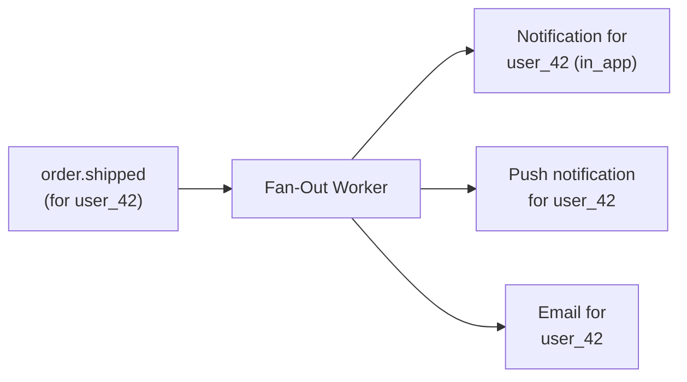
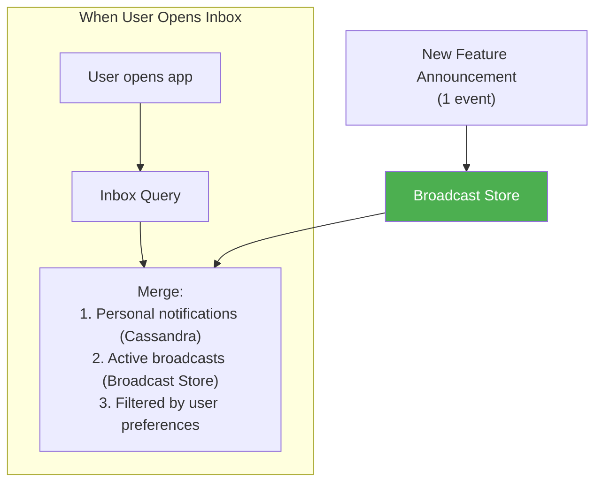
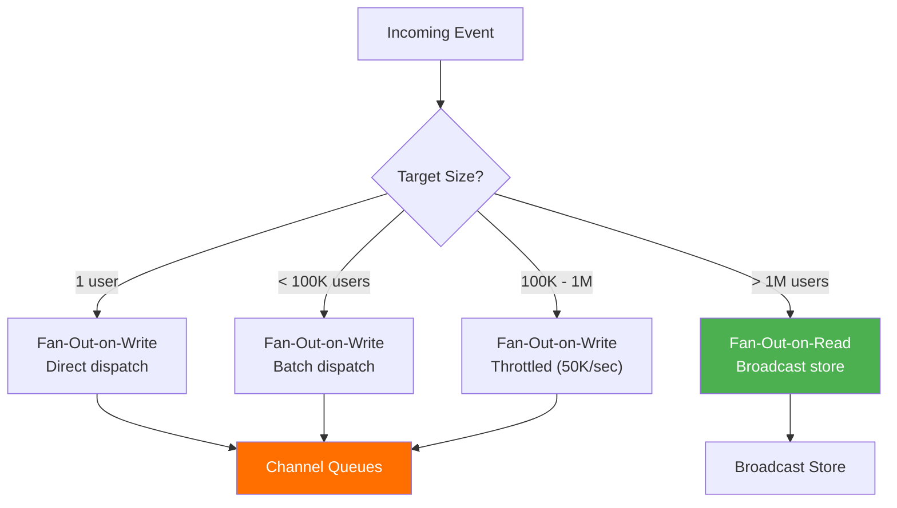

# 5. Fan-Out Strategy

> The hardest problem in notifications: one event happens, and you need to tell 50 million people about it. In under 30 minutes. Without melting your infrastructure.

---

## 🎯 Fan-Out Patterns

### What Is Fan-Out?

```
Event: "New feature: Dark Mode is here!"
Target: All 50M registered users

Fan-out = turning 1 event into 50,000,000 notifications

Types:
  1. Targeted (1:1)    → "Your order shipped"     → 1 event → 1 notification
  2. Group (1:N)       → "New message in group"    → 1 event → 500 notifications
  3. Segment (1:many)  → "Flash sale for premium"  → 1 event → 2M notifications
  4. Broadcast (1:all) → "New feature"             → 1 event → 50M notifications
```

---

## 📊 Fan-Out-on-Write vs Fan-Out-on-Read

| Approach | How It Works | Best For |
|----------|-------------|----------|
| **Fan-out-on-write** | When event happens, immediately create a notification record per user | Small/medium audiences (< 100K) |
| **Fan-out-on-read** | Store event once, resolve recipients when each user checks inbox | Broadcast to millions |
| **Hybrid** | Fan-out-on-write for targeted, fan-out-on-read for broadcast | Our approach ✅ |

### Fan-Out-on-Write (Targeted Notifications)



```
Event arrives: order.shipped for user_42
Worker:
  1. Look up user_42's preferences → {in_app: ✅, push: ✅, email: ✅}
  2. Create notification record in Cassandra
  3. Dispatch to in_app queue, push queue, email queue

Total work: 3 messages created from 1 event
Time: < 100ms
```

### Fan-Out-on-Write (Group / Small Segment)

```
Event: new_message in group_chat with 500 members
Worker:
  1. Fetch all 500 member user_ids
  2. For each: check preferences, create notification, dispatch per channel
  3. Total: 500 users × 1.5 channels avg = 750 messages

Time: ~5 seconds (batched, parallel workers)
```

### Fan-Out-on-Read (Broadcast)



```
Broadcast event stored ONCE:
  {
    "broadcast_id": "bc_darkmode",
    "title": "New Feature: Dark Mode!",
    "body": "Try our new dark mode in settings.",
    "target_segment": "all_active",
    "created_at": "2026-02-23T10:00:00Z",
    "expires_at": "2026-02-26T10:00:00Z"
  }

When user_42 opens inbox:
  1. Query personal notifications from Cassandra (latest 20)
  2. Query active broadcasts from Redis/MySQL
  3. Filter: has user_42 dismissed this broadcast?
  4. Merge and return sorted by created_at

NO per-user storage for broadcast → 1 record serves 50M users
```

---

## 🔀 Hybrid Strategy (Our Approach)



### Decision Matrix

| Audience Size | Strategy | In-App | Push | Email | Latency |
|-------------|----------|--------|------|-------|---------|
| 1 user | Write: immediate | real-time WS | immediate | immediate | < 1s |
| 2-1,000 | Write: batch | real-time WS | batch (1s) | batch (5s) | < 5s |
| 1K-100K | Write: throttled | real-time WS | batched FCM | batched SES | < 1 min |
| 100K-1M | Write: heavy throttle | WS where online | background push | background email | < 10 min |
| 1M-50M | Read: broadcast store | on-demand merge | background (30 min) | batched (hours) | < 30 min |

---

## 🔧 Fan-Out-on-Write: Implementation Details

### Batch Processing for Medium Audiences (1K-100K)

```
Event: Flash sale starts (target: 100K premium users)

Step 1: Segment Resolution
  Query: SELECT user_id FROM users WHERE tier = 'premium'
  Result: 100,000 user_ids

Step 2: Partition into Batches
  100,000 / 1,000 = 100 batches of 1,000 users

Step 3: Distribute Batches to Kafka
  Produce 100 messages to "notifications.fan_out" topic
  Each message: { batch_id, user_ids[1000], notification_data }

Step 4: Fan-Out Workers (parallel)
  10 workers × 10 batches each
  Per batch:
    - Fetch preferences for 1,000 users (single Redis MGET)
    - Filter: skip users who opted out
    - Render per-channel content
    - Produce to channel-specific topics
  
  Throughput: ~10,000 users/second per worker
  Total time: 100K / (10 workers × 10K/sec) = ~1 second
```

### Throttling for Large Audiences (100K-1M)

```
Why throttle?
  1M users × 1.5 channels = 1.5M messages in channel queues
  Without throttling: 1.5M messages flood downstream in seconds
    → Push worker overwhelmed
    → FCM rate limits hit
    → Email SES throttled

Throttle strategy:
  Rate: 50,000 users/second
  1M users / 50K/sec = 20 seconds total

Implementation:
  Kafka producer with rate limiter:
    - Produce 50,000 fan-out batch messages per second
    - Sleep between batches
    - Monitor downstream queue depth
    - If queue depth > threshold, reduce rate
```

---

## 📢 Broadcast Store: Implementation Details

### Schema (Redis + MySQL)

```sql
-- MySQL: broadcast definitions
CREATE TABLE broadcasts (
    id              VARCHAR(50) PRIMARY KEY,
    title           VARCHAR(200) NOT NULL,
    body            TEXT NOT NULL,
    data            JSON,
    target_segment  VARCHAR(50) NOT NULL,     -- 'all', 'active_30d', 'premium'
    channels        JSON NOT NULL,            -- ["in_app", "push"]
    priority        TINYINT DEFAULT 1,
    starts_at       TIMESTAMP NOT NULL,
    expires_at      TIMESTAMP NOT NULL,
    created_by      BIGINT UNSIGNED,
    status          ENUM('draft','active','completed','cancelled') DEFAULT 'draft',
    created_at      TIMESTAMP DEFAULT CURRENT_TIMESTAMP,

    INDEX idx_status_dates (status, starts_at, expires_at)
);

-- MySQL: track which users dismissed which broadcasts
CREATE TABLE broadcast_dismissals (
    broadcast_id    VARCHAR(50) NOT NULL,
    user_id         BIGINT UNSIGNED NOT NULL,
    dismissed_at    TIMESTAMP DEFAULT CURRENT_TIMESTAMP,

    PRIMARY KEY (broadcast_id, user_id)
);
```

```
Redis: active broadcasts (fast lookup)
Key:    broadcasts:active
Type:   Sorted Set (score = starts_at timestamp)

ZADD broadcasts:active 1708686000 "bc_darkmode"
ZRANGEBYSCORE broadcasts:active -inf +inf → all active broadcasts

Per-broadcast data:
Key:    broadcast:{id}
Type:   Hash
HSET broadcast:bc_darkmode title "Dark Mode!" body "..." expires_at "..."
```

### Inbox Merge Algorithm

```
User opens inbox:

1. Personal notifications (Cassandra):
   SELECT * FROM notifications_by_user WHERE user_id = ? LIMIT 20

2. Active broadcasts (Redis):
   ZRANGEBYSCORE broadcasts:active 0 {now} → ["bc_darkmode", "bc_v2launch"]
   For each: check broadcast_dismissals → filter out dismissed

3. Merge:
   Combine personal + broadcasts
   Sort by created_at DESC
   Return top 20

Time complexity:
   Cassandra query: ~5ms
   Redis broadcasts: ~1ms (usually < 5 active)
   Merge: ~0.1ms
   Total: ~6ms
```

---

## ⚡ Push Notification Fan-Out (FCM/APNs)

### FCM Batch API

```
FCM supports batch sending:
  - Up to 500 tokens per batch request
  - HTTP/2 multiplexing

  80M push/day = ~925 pushes/sec average
  Peak: ~40,000 pushes/sec

  Strategy:
    Worker collects messages for 100ms (or 500 tokens, whichever first)
    Sends batch to FCM
    Processes response (handle invalid tokens)

  Workers needed: 40,000 / (500 tokens × 10 batches/sec) = ~8 workers
```

### Invalid Token Handling

```
FCM response for each token:
  ✅ success → delivered (or will be)
  ❌ InvalidRegistration → DELETE token from device_tokens table
  ❌ NotRegistered → DELETE token (app uninstalled)
  ⚠️ Unavailable → RETRY later (device offline)
  
  Clean up invalid tokens:
    - On every push response
    - Batch cleanup job: delete tokens not used in 90 days
```

---

## 📈 Fan-Out Performance Targets

| Audience Size | Target Completion Time | Strategy |
|-------------|----------------------|----------|
| 1 user | < 1 second | Direct write |
| 100 users | < 2 seconds | Parallel write |
| 10,000 users | < 10 seconds | Batched (10 batches) |
| 100,000 users | < 1 minute | Throttled (50K/sec) |
| 1,000,000 users | < 5 minutes | Throttled + background push/email |
| 50,000,000 users | < 30 minutes | Broadcast store + background channels |

---

## ⬅️ [← Connection Management](04-connection-management.md) · [Delivery Guarantees →](06-delivery-guarantees.md)
