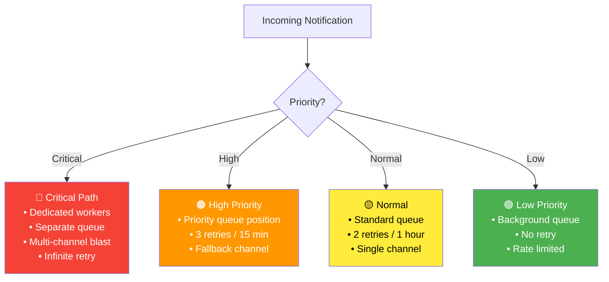
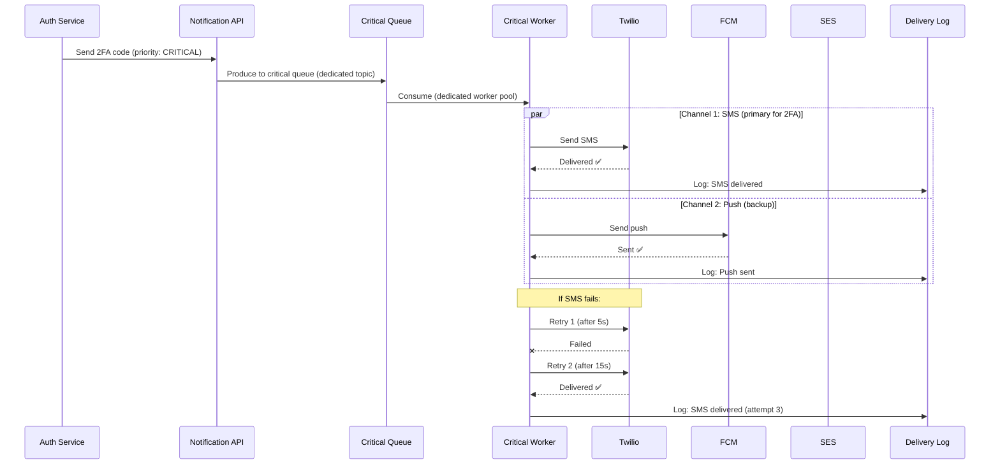
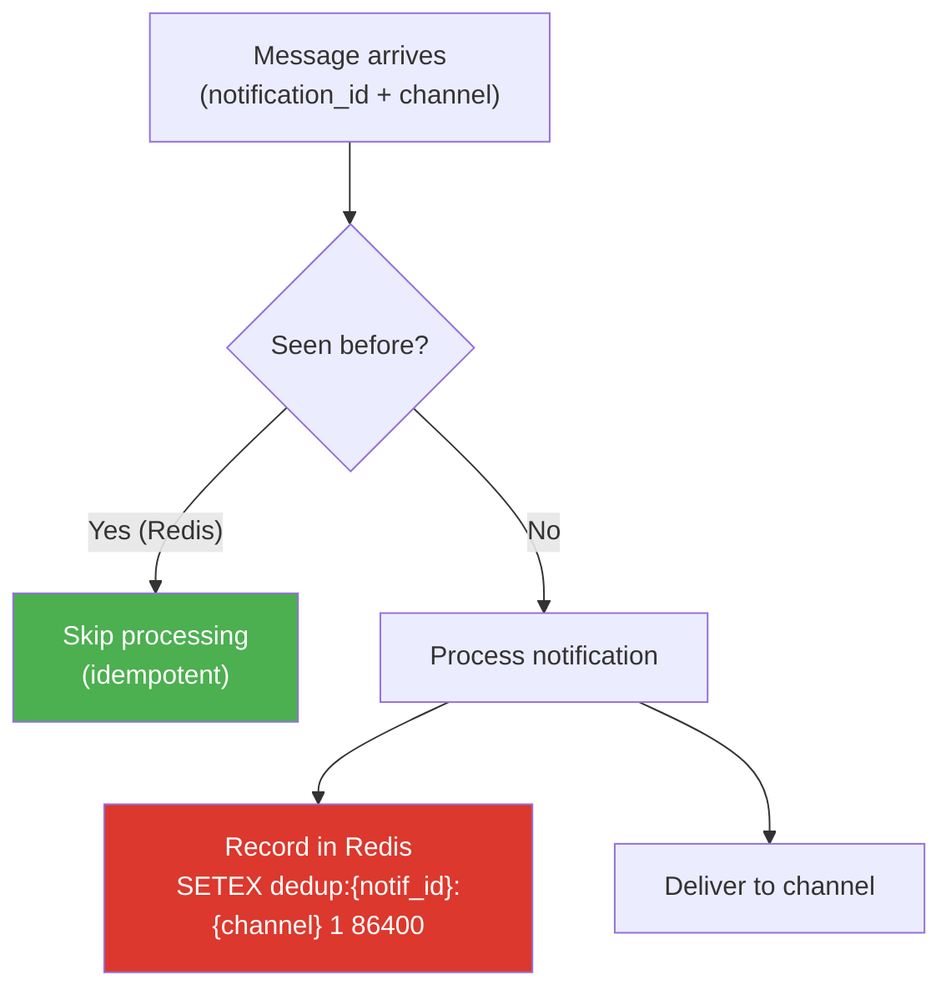

# 6. Delivery Guarantees

> "Best effort" is fine for "someone liked your post." It is NOT fine for "your 2FA code is 847291." Understanding the difference is what separates a notification service from a notification *system*.

---

## 🎯 Delivery Tiers

| Tier | Guarantee | Retry | Example | SLA |
|------|-----------|-------|---------|-----|
| **Critical** | Must deliver, all channels | Infinite retry + SMS fallback | 2FA code, payment alert | 99.99% delivered in 30s |
| **High** | Should deliver, primary channel + fallback | 3 retries over 15 min | Order confirmation, shipping update | 99.9% delivered in 5 min |
| **Normal** | Best effort with retry | 2 retries over 1 hour | New follower, message received | 99% delivered in 1 hour |
| **Low** | Best effort, no retry | No retry | Marketing promo, weekly digest | 95% delivered same day |

### Priority Routing



---

## 🔴 Critical Notification Path (2FA, Payment)



### Critical Path Isolation

```
Why separate everything for critical notifications?

1. Separate Kafka topic: notifications.critical
   → Not competing with 200M marketing/social notifications
   → Guaranteed partition availability

2. Dedicated worker pool: 3-5 workers (always running)
   → Not affected by flash sale traffic surge
   → Reserved capacity

3. Separate rate limit: No rate limiting for critical notifications
   → 2FA code ALWAYS gets through
   → Override any user/global throttle

4. Multi-channel blast: Send via ALL channels simultaneously
   → Don't wait for SMS to fail before trying push
   → Whichever arrives first wins

5. Aggressive retry: 
   → Retry every 5s, 15s, 30s, 60s, 120s, 300s
   → Alert ops if still failing after 5 minutes
   → Never give up on critical (manual escalation)
```

---

## 🔁 Retry Strategy

### Retry Configuration Per Priority

| Priority | Max Attempts | Backoff Schedule | DLQ After |
|----------|-------------|------------------|-----------|
| Critical | ∞ (alert at 10) | 5s, 15s, 30s, 60s, 120s, 300s, repeat | Never (manual) |
| High | 5 | 10s, 30s, 2min, 10min, 30min | 5th failure |
| Normal | 3 | 1min, 15min, 1h | 3rd failure |
| Low | 1 | No retry | Immediate |

### Retry Implementation (Kafka-based)

```
Retry queues using Kafka topics with delay:

notifications.in_app           ← main queue
notifications.in_app.retry_1   ← 10-second delay (consumer lag intentional)
notifications.in_app.retry_2   ← 2-minute delay
notifications.in_app.retry_3   ← 15-minute delay
notifications.in_app.dlq       ← dead letter

Flow:
  1. Consume from main queue → attempt delivery
  2. If failed → produce to retry_1 (with attempt count in header)
  3. Retry_1 consumer waits 10s → attempts delivery
  4. If failed → produce to retry_2
  5. After all retries exhausted → produce to DLQ
```

### Channel Fallback Strategy

```
For HIGH priority notifications:

Primary channel fails (e.g., push) → try fallback channel (e.g., email)

Fallback chain:
  In-App → Push → Email → SMS (last resort)

Example: Order shipped notification
  Attempt 1: In-App (WebSocket) → user offline →  MISS
  Attempt 2: Push (FCM)        → token invalid → FAIL
  Attempt 3: Email (SES)       → sent          → ✅ DELIVERED

Note: SMS is NEVER a fallback for non-critical. Too expensive.
```

---

## 🔑 Deduplication

### The Problem

```
Scenario: At-least-once delivery means duplicates are possible
  1. Worker sends push notification
  2. FCM returns 200 ✅
  3. Worker crashes BEFORE recording "delivered" in DB
  4. Worker restarts, reprocesses same message
  5. User gets the same notification twice

Also: Kafka consumer processes message, crashes before committing offset
  → Same message reprocessed
```

### Deduplication Strategy



```
Dedup key: dedup:{notification_id}:{channel}:{user_id}
TTL: 24 hours

Before processing:
  exists = Redis GET dedup:notif_xyz:push:usr_42
  if exists → skip (already processed)
  
After processing:
  Redis SETEX dedup:notif_xyz:push:usr_42 1 86400
```

> **⚠️ Known Risk: Redis Data Loss Breaks Deduplication**
>
> Dedup keys are stored in Redis with 24-hour TTL. If Redis loses data — through memory pressure eviction (if `maxmemory-policy` isn't `noeviction`), node restart, or failover with incomplete replication — **dedup keys are lost and duplicate notifications will be delivered**. This means a Redis failure doesn't just cause missed notifications; it can cause duplicate ones.
>
> **Mitigations:**
> - Use `maxmemory-policy: noeviction` for the dedup Redis instance (reject new writes rather than evict)
> - Enable AOF persistence with `appendfsync everysec` (lose at most 1 second of dedup keys on crash)
> - For critical notifications (payment confirmations, security alerts), store dedup keys in Cassandra as the source of truth, with Redis as a fast-path cache
> - Accept that non-critical notification duplicates (social, marketing) are annoying but not harmful

### Idempotency at API Level

```
POST /notifications
Idempotency-Key: "order_shipped_ord_abc123"

Server:
  1. Check: Redis GET idemp:order_shipped_ord_abc123
  2. If exists → return cached response (202 with same notification_id)
  3. If not → process, store response, return 202
  4. SETEX idemp:order_shipped_ord_abc123 {response} 86400

Prevents: duplicate notifications from retrying source services
```

---

## 🚦 Rate Limiting

### Per-User Rate Limits

```
Problem: Bug in social service sends 1000 "new follower" events in 1 second
  → User gets 1000 push notifications → uninstalls app

Per-user rate limits:
  ┌─────────────────────────┬────────────────┐
  │ Channel                 │ Limit          │
  ├─────────────────────────┼────────────────┤
  │ In-App                  │ 100/hour       │
  │ Push                    │ 20/hour        │
  │ Email (transactional)   │ 10/hour        │
  │ Email (marketing)       │ 2/day          │
  │ SMS                     │ 5/hour         │
  │ SMS (2FA)               │ 10/hour        │
  └─────────────────────────┴────────────────┘

  Exception: Critical notifications bypass ALL limits
```

### Implementation (Redis Sliding Window)

```
-- Check: can user_42 receive another push notification?

Key: rl:push:usr_42:{hour_bucket}
Limit: 20 per hour

INCR rl:push:usr_42:2026022314
EXPIRE rl:push:usr_42:2026022314 7200  -- 2 hours (overlap buffer)

current_count = GET rl:push:usr_42:2026022314
if current_count > 20:
    → SKIP this notification
    → Log: "rate limited, notification dropped"
```

### Global Rate Limits (Provider Throttling)

| Provider | Rate Limit | Our Limit (Safety Margin) |
|----------|-----------|--------------------------|
| FCM | ~1,000 msg/sec default (can request increase) | 800 msg/sec |
| APNs | ~5,000 msg/sec | 4,000 msg/sec |
| Amazon SES | 200 emails/sec (adjustable) | 150 emails/sec |
| Twilio SMS | 300 msg/sec per number | 250 msg/sec |

```
Global rate limiter (token bucket in Redis):
  Each worker acquires a "token" before sending
  If no tokens available → wait or queue

  Prevents: hitting provider rate limits → getting all traffic blocked
```

---

## 📊 Delivery Status Tracking

### Status Flow Per Channel

```
In-App:  pending → sent → delivered → read
Push:    pending → sent → delivered (FCM callback) → [opened]
Email:   pending → sent → delivered (SES webhook) → [opened] → [clicked]
SMS:     pending → sent → delivered (Twilio callback)
```

### Delivery Metrics

| Metric | In-App | Push | Email | SMS |
|--------|--------|------|-------|-----|
| Sent rate | 99.9% | 98% | 99% | 99.5% |
| Delivered rate | 99% (online users) | 85% | 95% | 97% |
| Read/Open rate | 40% | 8-12% | 20-25% | 90% |
| Avg delivery time | < 500ms | 1-5s | 5-30s | 3-10s |

---

## ⬅️ [← Fan-Out Strategy](05-fan-out-strategy.md) · [Failure & Recovery →](07-failure-recovery.md)
