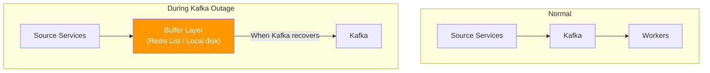
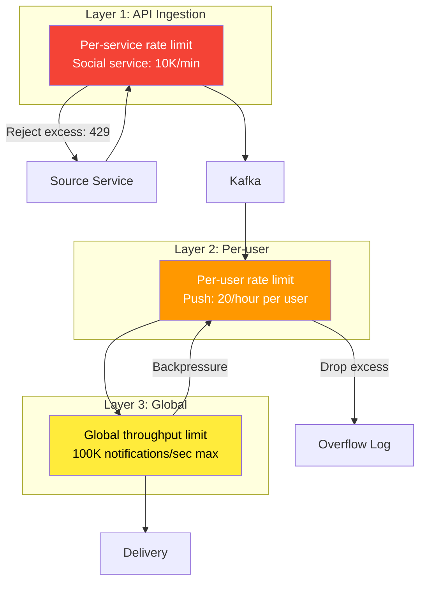
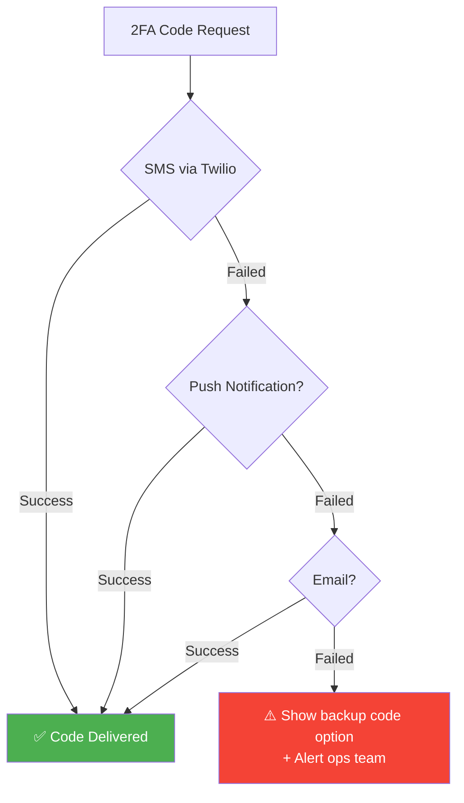

# 7. Failure Modes & Recovery

> A notification system has a unique failure property: **silent failure is worse than loud failure**. If an API returns 500, you know it's broken. If a notification never arrives, nobody notices until it's too late.

---

## 📊 Failure Mode Catalog

### Critical Failures

| Failure | Probability | Blast Radius | User Impact | Detection Time |
|---------|------------|-------------|-------------|---------------|
| **Kafka cluster down** | Very Low | 🔴 TOTAL — no message processing | No notifications at all | < 30s |
| **All WS servers down** | Very Low | 🔴 TOTAL — no real-time | No in-app notifications | < 10s |
| **Cassandra cluster down** | Low | 🟡 HIGH — no inbox, no writes | Inbox empty, notifications still deliver to push/email | < 30s |
| **Redis cluster down** | Low | 🟡 HIGH — no routing, no caching | WS routing fails, preferences unknown | < 10s |

### Partial Failures

| Failure | Blast Radius | User Impact | Auto-Recovery? |
|---------|-------------|-------------|----------------|
| **Single WS server crash** | LOW — 500K users lose connection | 10% of users reconnect in 5s | ✅ Reconnect to other server |
| **FCM/APNs outage** | MEDIUM — no push notifications | No push, in-app + email still work | ✅ Retry when service recovers |
| **SES outage** | MEDIUM — no email delivery | No email, other channels work | ✅ Queue + retry |
| **Twilio outage** | HIGH for 2FA — no SMS delivery | 2FA blocked, fallback to email/push | ⚠️ Fallback + manual alert |
| **Single Kafka broker** | LOW — partitions reassigned | < 60s processing delay | ✅ Automatic rebalance |
| **Network partition** | VARIES | Some users can't connect | ✅ Reconnect handles it |

---

## 🔴 Scenario 1: Kafka Cluster Down

### Impact

```
Without Kafka:
  ❌ No notification processing (all channels)
  ❌ Messages from source services have nowhere to go
  ✅ Existing WebSocket connections still alive
  ✅ Users can still query inbox (Cassandra)

  Duration impact: proportional to outage
  100K notifications/sec × 300 seconds = 30M notifications delayed
```

### Recovery Strategy



```
Phase 1: DETECT (0-30 seconds)
  - Kafka health check fails
  - Producer receives connection errors
  - Alert fired

Phase 2: BUFFER (30 seconds - recovery)
  - API switches to buffer mode
  - Critical notifications → Redis LIST (rpush)
    Key: buffer:notifications:critical
    Capacity: 1M messages in Redis (~500 MB)
  - Non-critical → written to local disk queue (per API server)
    Fallback: /var/lib/notification-buffer/

Phase 3: RECOVER (when Kafka is back)
  - Drain Redis buffer first (critical)
  - Then drain local disk queues
  - Rate-limit drain to avoid overwhelming recovered Kafka
  - Monitor lag: all buffered messages should process within 10 minutes

Phase 4: VERIFY
  - Compare buffer counts vs processed counts
  - Check for gaps in notification_id sequences
  - Alert if any messages lost
```

### Critical Path During Kafka Outage

```
2FA codes CANNOT wait for Kafka recovery.

Emergency path:
  API detects Kafka down
  → For CRITICAL notifications only:
    → Send directly via SMS/Push (bypass queue entirely)
    → Synchronous call to Twilio/FCM
    → Log to Redis for later reconciliation
  
  This is slower (200ms vs 50ms) but guarantees delivery.
```

---

## 🟡 Scenario 2: WebSocket Server Crash

### Impact

```
One WS server holds ~500K connections.
Server crashes → 500K users disconnected simultaneously.

Thundering herd risk:
  500K clients all try to reconnect at the same time
  → Other WS servers get connection storm
  → Could cascade and crash more servers
```

### Recovery: Staggered Reconnection

```
Client-side reconnection with jitter:

  reconnect_delay = base_delay × 2^attempt + random(0, 1000ms)

  Attempt 0: 0-1s    (immediate with jitter)
  Attempt 1: 1-2s
  Attempt 2: 2-4s
  Attempt 3: 4-8s
  Attempt 4: 8-16s
  Max: 30 seconds

  500K reconnections spread over ~30 seconds
  → ~17K connections/sec per remaining server
  → 9 remaining servers: ~1.8K connections/sec each → comfortable
```

### Server-Side Protection

```
Per-server connection limits:
  Hard limit: 600K connections per server
  Soft limit: 500K (start rejecting with "retry-after" header)

  If server at soft limit:
    New connection → 503 Service Unavailable
    Retry-After: {random 5-30 seconds}
    Client picks another server on retry

  Load balancer: least-connections algorithm
  → Automatically routes new connections to least-loaded server
```

---

## 🟡 Scenario 3: Notification Storm (Runaway Producer)

### The Problem

```
Bug in social service: generates 10M "new follower" events in 1 minute
  (instead of normal 1K/minute)

Without protection:
  → Kafka queue floods
  → Workers overwhelmed
  → All channels saturated
  → Legitimate notifications delayed
  → Users get 100 push notifications in 1 minute
```

### Protection: Multi-Layer Rate Limiting



```
Layer 1: API rejects requests above per-service quota
  → Social service gets 429 Too Many Requests
  → Prevents the flood from entering the system

Layer 2: Even if Layer 1 missed it, each user's notifications are capped
  → User won't receive more than 20 pushes/hour

Layer 3: Global circuit breaker on total throughput
  → If system-wide rate exceeds 150% of design capacity
  → Start dropping LOW priority notifications
  → Log dropped notifications for later review
```

---

## 🟡 Scenario 4: Twilio/SMS Outage During 2FA

### Impact

```
Users trying to log in with SMS 2FA
Twilio is down → SMS not delivered
→ Users locked out of their accounts

THIS IS A CRITICAL FAILURE for affected users.
```

### Recovery: Multi-Channel 2FA Fallback



```
Fallback order for 2FA:
  1. SMS (Twilio) — primary
  2. Push notification (FCM/APNs) — fast fallback
  3. Email (SES) — slower but reliable
  4. Voice call (Twilio voice or alternative) — last automated option
  5. Backup codes — pre-generated, shown during 2FA setup

Auto-detection:
  If Twilio returns errors for 5+ requests in 60 seconds:
    → Circuit breaker opens
    → All 2FA routes through push/email automatically
    → Alert on-call engineer
    → Retry Twilio every 60 seconds (half-open check)
```

---

## 🔄 Missed Notification Recovery

### Offline User Catches Up

```
User was offline for 3 days. Opens the app.

Recovery flow:
  1. Client connects WebSocket
  2. Client sends: {"type":"sync","last_seen_at":"2026-02-20T10:00:00Z"}
  3. Server queries Cassandra:
     SELECT * FROM notifications_by_user
     WHERE user_id = ? AND created_at > '2026-02-20T10:00:00Z'
     LIMIT 50
  4. Server pushes all missed notifications (batch)
  5. Client displays inbox

  Cassandra handles this well — it's the primary query pattern.
  50 notifications × 500 bytes = 25 KB → fast
```

---

## 📋 Recovery Runbooks

### Runbook: Kafka Lag Increasing

```
Symptom: Consumer group lag > 100K messages

Investigation:
  1. Check consumer group status:
     kafka-consumer-groups --describe --group notification-router
  2. Check if workers are running and healthy
  3. Check if downstream (Redis/Cassandra) is slow

Resolution:
  Option A: Workers healthy but slow → scale up workers
  Option B: Downstream slow → fix downstream first
  Option C: Burst traffic → wait for natural drain (if lag < 1M)
  Option D: Workers crashed → restart, messages auto-reprocess
```

### Runbook: WebSocket Connection Count Dropping

```
Symptom: Connected users dropped 20% in 5 minutes

Likely causes:
  1. WS server crashed → check server health
  2. Load balancer issue → check LB health
  3. Client-side bug (new app release) → check app version distribution
  4. Network issue → check ISP/region metrics

Resolution:
  1. If server crashed → verify auto-scaling launched replacement
  2. If LB → failover to secondary LB
  3. If client bug → push hotfix / enable SSE fallback
  4. If network → wait + post-incident review
```

---

## 📊 Failure Recovery SLAs

| Failure | Detection | Mitigation | Full Recovery |
|---------|-----------|------------|---------------|
| Single WS server | < 10s | < 30s (reconnect) | < 5 min |
| Kafka single broker | < 30s | < 60s (rebalance) | < 10 min |
| Kafka full cluster | < 30s | Immediate (buffer) | Depends on fix |
| Redis | < 10s | < 30s (restart) | < 5 min |
| FCM/APNs outage | < 60s | Queue + retry | When provider recovers |
| SMS outage | < 30s | Fallback channels | When provider recovers |
| Cassandra node | < 30s | Automatic (RF=3) | < 30 min (repair) |

---

## ⬅️ [← Delivery Guarantees](06-delivery-guarantees.md) · [Scaling Strategy →](08-scaling-strategy.md)
