# 8. Scaling Strategy — Day 1 to 200M Users

> The path from 0 to 200M users passes through fundamentally different architectures. What works at 10K users will break at 1M. What works at 1M will break at 50M. Plan for the transitions, not the end state.

---

## 📊 Growth Stages

```
Stage 1: MVP           → 0 - 100K users     → Third-party push + polling
Stage 2: Real-time     → 100K - 1M users    → WebSockets + Redis pub/sub
Stage 3: Scale         → 1M - 10M users     → Kafka + dedicated WS cluster
Stage 4: Production    → 10M - 50M users    → Current design (this case study)
Stage 5: Hyper-scale   → 50M - 200M+ users  → Multi-region, sharded everything
```

---

## 🏗 Stage-by-Stage Architecture

### Stage 1: MVP (0 - 100K Users)

**Monthly cost: ~$50-200**


| Component | Implementation | Why |
|-----------|---------------|-----|
| **In-app** | Client polls every 30s: `GET /notifications?since=` | Simple, no WebSockets needed |
| **Push** | Firebase Cloud Messaging (free) | Zero infrastructure |
| **Email** | Amazon SES ($0.10 per 1K emails) | Cheapest option |
| **SMS** | Twilio (pay per message) | Only for 2FA |
| **Storage** | Same app database | No separate infrastructure |
| **Queue** | None (sync send) | < 100 notifications/min — no bottleneck |

**What to focus on**: Product, not infrastructure. Polling at 30s interval handles 100K users with < 100 requests/sec.

---

### Stage 2: Real-Time (100K - 1M Users)

**Monthly cost: ~$500-2,000**


**Changes from Stage 1:**

| Change | Trigger | Impact |
|--------|---------|--------|
| **WebSockets** | Polling at 30s too slow, users complain | Real-time delivery < 1s |
| **Redis Pub/Sub** | 2+ app servers → need to broadcast across servers | Message reaches user regardless of which server they're on |
| **Background queue** | Sync email/push too slow (adds 500ms to API response) | Non-blocking notification dispatch |

```
Redis Pub/Sub for cross-server messaging:
  Server 1 receives notification for user_42
  user_42 is connected to Server 2

  Server 1 → Redis PUBLISH user:42 {notification}
  Server 2 → Redis SUBSCRIBE user:42 → push to WebSocket

  Problem: at 1M users, Redis Pub/Sub gets stressed
  (Redis is single-threaded, all pub/sub on one core)
```

---

### Stage 3: Scale (1M - 10M Users)

**Monthly cost: ~$3,000-10,000**

```mermaid
graph TB
    subgraph "API Layer"
        API1["Notification API 1"]
        API2["Notification API 2"]
    end

    subgraph "Message Broker"
        RMQ["RabbitMQ / Redis Streams"]
    end

    subgraph "WebSocket Cluster"
        WS1["WS Server 1<br/>100K connections"]
        WS2["WS Server 2<br/>100K connections"]
        WS3["WS Server 3<br/>100K connections"]
    end

    subgraph "Workers"
        PW["Push Worker × 3"]
        EW["Email Worker × 2"]
    end

    REDIS[("Redis Cluster<br/>Connection mapping")]
    DB[("MySQL<br/>Notifications")]

    API1 & API2 --> RMQ
    RMQ --> WS1 & WS2 & WS3
    RMQ --> PW & EW
    WS1 & WS2 & WS3 --> REDIS
    PW & EW --> DB

    style RMQ fill:#ff6f00,color:#fff
    style REDIS fill:#dc382d,color:#fff
```



**Changes from Stage 2:**

| Change | Trigger | Impact |
|--------|---------|--------|
| **Dedicated WS servers** | WS connections consuming app server memory | App servers free for API, WS servers optimized for connections |
| **Redis connection mapping** | Redis Pub/Sub too slow for 1M+ users | Direct routing: lookup server → send directly |
| **RabbitMQ/Redis Streams** | Redis Pub/Sub for queuing is fragile | Persistent queues with retry, DLQ |
| **Separate API and WS** | Different scaling profiles | Scale API on QPS, WS on connection count |

---

### Stage 4: Production (10M - 50M Users) — This Case Study

**Monthly cost: ~$30,000-50,000**

This is the full architecture described throughout this case study.

```
Key components:
  ✅ 10-15 WebSocket servers (500K connections each)
  ✅ Kafka cluster (5 brokers, 200M messages/day)
  ✅ Cassandra cluster (notification storage, 90-day TTL)
  ✅ Redis cluster (routing, caching, rate limits)
  ✅ Dedicated workers per channel (push, email, SMS)
  ✅ Priority-based routing (critical/high/normal/low)
  ✅ Fan-out-on-write + broadcast store hybrid
  ✅ Multi-channel delivery guarantees
  ✅ Comprehensive monitoring and alerting
```

### Why This Architecture Holds at 50M

| Resource | Capacity | Usage at 50M MAU |
|----------|----------|------------------|
| WebSocket servers (15 × 500K) | 7.5M connections | 5M peak (67%) |
| Kafka (5 brokers) | 500K msg/sec | 100K peak (20%) |
| Cassandra (6 nodes) | 200K writes/sec | ~4K writes/sec (2%) |
| Redis (3 nodes) | 300K ops/sec | ~50K ops/sec (17%) |

> ample headroom for traffic spikes and growth.

---

### Stage 5: Hyper-Scale (50M - 200M+ Users)

**Monthly cost: ~$100,000-300,000+**


**New challenges at this scale:**

| Challenge | Solution |
|-----------|----------|
| **20M concurrent WS connections** | Multi-region WS clusters (45+ servers total) |
| **Cross-region notification** | User in EU sends message to user in US: Kafka MirrorMaker replicates event |
| **Global broadcast** | Each region fans out independently (no cross-region fan-out traffic) |
| **Data sovereignty (GDPR)** | EU user notifications stored in EU Cassandra only |
| **Latency** | User connects to nearest region via GeoDNS |
| **Multi-region Cassandra** | NetworkTopologyStrategy, RF=3 per datacenter |

### Multi-Region WebSocket Routing

```
User in EU connected to EU WS cluster.
Notification generated in US.

Flow:
  1. US Kafka: notification.in_app for usr_eu_42
  2. Kafka MirrorMaker → EU Kafka (async, < 200ms)
  3. EU consumer: lookup conn:usr_eu_42 → ws-eu-07
  4. EU WS Server 7 → push to user

  Cross-region latency: 100-200ms additional
  Still within < 1s target for real-time notifications
```

---

## 💰 Cost Progression

| Stage | Users | Monthly Cost | WS Servers | Key Expense |
|-------|-------|-------------|-----------|-------------|
| 1. MVP | 100K | $50-200 | 0 (polling) | SES emails |
| 2. Real-time | 1M | $500-2K | 2 (shared) | Redis + servers |
| 3. Scale | 10M | $3-10K | 5 | Workers + queue |
| 4. Production | 50M | $30-50K | 15 | Kafka + Cassandra + SMS |
| 5. Hyper | 200M | $100-300K | 45+ | Multi-region + SMS |

> 📊 **SMS remains the dominant cost** at every stage. At 200M users with 5% SMS usage: 10M SMS/day × $0.0075 = **$75K/month** just for SMS. Minimize SMS aggressively.

---

## ⚖️ Key Trade-offs Summary

| Decision | Choice | Alternative | Why |
|----------|--------|-------------|-----|
| WebSocket vs SSE | WebSocket (SSE fallback) | SSE only | Bidirectional for acks, read receipts |
| Kafka vs RabbitMQ | Kafka | RabbitMQ | 200M msg/day + replay capability |
| Cassandra vs MySQL | Cassandra for notifications | MySQL for all | Write-heavy, TTL, partition-by-user |
| Fan-out approach | Hybrid (write + read) | Pure write | Broadcast to 50M can't write per-user |
| Redis for routing | Redis connection map | In-memory per-server | Multi-server routing, server crashes |
| L4 vs L7 LB | L4 (TCP) for WS | L7 (HTTP) | Lower overhead for persistent connections |
| Retry strategy | Tiered by priority | Same retry for all | 2FA can't wait 15 min to retry |
| Go for WS servers | Go | Node.js / Java | Goroutines perfect for many concurrent connections |
| Multi-region timing | Stage 5 (50M+) | From Day 1 | Complexity not justified until global scale |

---

## 📋 Migration Checklist (Stage Transitions)

### Stage 2 → 3 (Add Kafka, Separate WS)

```
□ Deploy dedicated WS servers (start with 3)
□ Implement Redis connection registry
□ Replace Redis Pub/Sub with RabbitMQ/Kafka
□ Implement internal gRPC for WS routing
□ Load test: 100K concurrent connections
□ Implement graceful WS server drain for deployments
```

### Stage 3 → 4 (Add Cassandra, Scale WS)

```
□ Deploy Cassandra cluster (3 nodes → 6 nodes)
□ Migrate notification storage from MySQL to Cassandra
□ Scale WS servers to 10-15
□ Implement broadcast store (fan-out-on-read)
□ Add priority-based queue routing
□ Implement per-user rate limiting
□ Load test: 5M concurrent connections, 100K msg/sec
```

### Stage 4 → 5 (Multi-region)

```
□ Deploy second region infrastructure
□ Set up Kafka MirrorMaker for cross-region replication
□ Configure Cassandra multi-datacenter replication
□ Implement GeoDNS routing
□ Handle cross-region notification routing
□ Test regional failover (drain one region entirely)
□ Verify GDPR data residency compliance
```

---

## ⬅️ [← Failure & Recovery](07-failure-recovery.md) · [Back to Case Study Index](README.md)
