# 0. Overview & Requirements

> Every payment system has one simple job: **move money from A to B, exactly once, and prove it happened.** Everything else — fraud detection, compliance, reconciliation — exists because that "simple" job is incredibly hard in a distributed world.

---

## 📋 Functional Requirements

### Core Features (P0 — Must Have)

| Feature | Description |
|---------|-------------|
| **Process payments** | Accept credit/debit card, digital wallet (Apple Pay, Google Pay) |
| **Authorize & capture** | Two-phase: hold funds → charge later (e-commerce standard) |
| **Refunds** | Full and partial refunds with ledger tracking |
| **Payment status tracking** | Real-time status: pending → authorized → captured → settled → refunded |
| **Multi-currency** | Accept payments in 15+ currencies, settle in USD/EUR |
| **Idempotency** | Same request sent twice → same result, money moves once |
| **Webhooks / callbacks** | Notify merchants of payment status changes |
| **Receipt generation** | Email receipts for completed payments |

### Important Features (P1)

| Feature | Description |
|---------|-------------|
| **Fraud detection** | Real-time risk scoring before authorization |
| **3D Secure (3DS)** | Support SCA (Strong Customer Authentication) for EU/PSD2 |
| **Retry with fallback PSP** | If primary PSP fails, route to backup |
| **Dispute management** | Handle chargebacks, provide evidence |
| **Saved payment methods** | Tokenized cards for returning customers |
| **Subscription billing** | Recurring charges with dunning (retry failed renewals) |

### Nice to Have (P2)

| Feature | Description |
|---------|-------------|
| **Installment payments** | Buy now, pay later integration |
| **Split payments** | Route portions to different merchants (marketplace) |
| **Multi-PSP smart routing** | Route to cheapest/highest-converting PSP per transaction |

---

## 📋 Non-Functional Requirements

| Requirement | Target | Rationale |
|-------------|--------|-----------|
| **Availability** | 99.99% (52 min downtime/year) | Every second of downtime = lost revenue |
| **Latency (authorize)** | p50 < 500ms, p99 < 2s | PSP round-trip is 200-800ms itself |
| **Latency (API response)** | p50 < 200ms, p99 < 500ms | Before PSP call (validation, fraud check) |
| **Consistency** | Strong consistency for balance/ledger | Money. Cannot. Be. Approximate. |
| **Durability** | Zero transaction loss | Every payment must be recoverable |
| **Throughput** | 500 TPS sustained, 2,000 TPS peak | ~$500M/year ÷ $50 avg = 10M transactions/year |
| **Compliance** | PCI DSS Level 1 | Processing > $6M/year requires Level 1 |
| **Data retention** | 7 years for financial records | Tax/audit/legal requirements |

---

## 💰 Transaction Types

### Payment Methods Supported

| Method | Share | Avg Transaction | Processing Fee |
|--------|-------|-----------------|---------------|
| **Credit Card** (Visa/MC) | 55% | $65 | 2.9% + $0.30 |
| **Debit Card** | 20% | $40 | 1.5% + $0.25 |
| **Apple Pay / Google Pay** | 15% | $55 | 2.9% + $0.30 (same as card) |
| **Bank Transfer (ACH)** | 8% | $120 | 0.8% capped at $5 |
| **Buy Now Pay Later** | 2% | $150 | 5-6% (BNPL provider takes margin) |

### Transaction States

```mermaid
stateDiagram-v2
    [*] --> created: Payment initiated

    created --> fraud_check: Submit for fraud scoring
    fraud_check --> rejected: Risk score too high (>85)
    fraud_check --> pending_3ds: Requires SCA (EU cards)
    fraud_check --> authorizing: Risk acceptable

    pending_3ds --> authorizing: 3DS verified ✅
    pending_3ds --> failed: 3DS failed/timeout

    authorizing --> authorized: PSP approved hold
    authorizing --> declined: PSP/bank declined

    authorized --> capturing: Merchant triggers capture
    authorized --> voided: Merchant cancels hold

    capturing --> captured: Funds charged
    captured --> settling: End-of-day batch

    settling --> settled: Funds transferred
    settled --> partially_refunded: Partial refund issued
    settled --> refunded: Full refund issued

    rejected --> [*]
    declined --> [*]
    failed --> [*]
    voided --> [*]
    refunded --> [*]
    partially_refunded --> [*]
```

---

## 🏢 Key Entities

| Entity | Description | Scale |
|--------|-------------|-------|
| **Payment** | A single payment attempt | 10M/year, ~30K/day |
| **Transaction** | Individual PSP call (auth, capture, refund) | 20M/year (2 per payment avg) |
| **Ledger Entry** | Double-entry accounting record | 40M/year (2 entries per transaction) |
| **Merchant** | Business receiving payments | 1,000 active |
| **Customer** | Person making payments | 2M unique/year |
| **Payment Method** | Tokenized card/wallet | 3M stored tokens |
| **Dispute** | Chargeback claim | ~10K/year (0.1% rate target) |

---

## 🏗 Key Assumptions

| Assumption | Value | Basis |
|------------|-------|-------|
| Annual volume | $500M | Mid-size payment platform |
| Average transaction | $50 | E-commerce weighted average |
| Daily transactions | ~30K | $500M ÷ $50 ÷ 365 |
| Peak TPS | 2,000 | Black Friday / flash sales (60× normal) |
| Fraud rate target | < 0.1% | Industry standard for card-not-present |
| Chargeback rate | < 0.5% | Visa/MC threshold before penalties |
| Authorization success | > 92% | Industry average: 85-95% |
| Primary PSP | Stripe | With Adyen as failover |
| Settlement cycle | T+1 to T+2 | Standard for card payments |
| Card data handling | Tokenization via PSP | We NEVER store raw PAN |

---

## ⬅️ [← Case Study Index](README.md) · [Capacity Estimation →](01-capacity-estimation.md)
