# 2. High-Level Architecture

> "A payment system has two sacred rules: never lose money, never charge twice. The architecture exists to enforce those rules even when everything else is on fire."

---

## 🏗 System Architecture


---

## 🔄 Payment Flow — End to End


---

## 📡 API Design

### Payment API

```
POST   /v1/payments                    Create payment (authorize)
POST   /v1/payments/{id}/capture       Capture authorized payment
POST   /v1/payments/{id}/void          Void authorization
POST   /v1/payments/{id}/refund        Refund captured payment
GET    /v1/payments/{id}               Get payment details
GET    /v1/payments                    List payments (filtered)

POST   /v1/tokens                      Tokenize card (client-side, PCI scope)
DELETE /v1/tokens/{token}              Remove saved payment method

POST   /v1/webhooks                    Register webhook endpoint
GET    /v1/webhooks/{id}/deliveries    Webhook delivery log

GET    /v1/settlements                 Settlement reports
GET    /v1/disputes                    Dispute/chargeback list
```

### Key API Conventions

| Convention | Implementation | Why |
|------------|---------------|-----|
| **Idempotency** | `Idempotency-Key` header (required for POST) | Prevent double charges |
| **Versioning** | URL-based (`/v1/`) | PSP integration contracts are fragile |
| **Auth** | API key (secret) + request signing (HMAC) | Prevent tampering |
| **Pagination** | Cursor-based (not offset) | Consistent during concurrent inserts |
| **Amounts** | Integer cents (not float) | `$10.50` → `1050` — no floating point errors |

```
CRITICAL: Amounts are ALWAYS integers in the smallest currency unit.

  $10.50 USD → 1050 (cents)
  ¥1000 JPY → 1000 (yen, no decimal)
  €99.99 EUR → 9999 (cents)
  $0.50 → 50

NEVER use float/double for money. 
  0.1 + 0.2 = 0.30000000000000004 in IEEE 754
  That's how you lose $0.01 per transaction × 10M = $100K/year
```

---

## 🧩 Service Boundaries

| Service | Responsibility | Sync/Async | SLA |
|---------|---------------|------------|-----|
| **Payment Service** | Orchestrates payment lifecycle (state machine) | Sync | 99.99% availability |
| **Fraud Service** | Risk scoring, velocity checks, rule engine | Sync (< 100ms) | 99.9% (fallback: approve) |
| **Token Service** | Manage PCI tokens, card vault | Sync | 99.99% |
| **Ledger Service** | Double-entry bookkeeping, balance tracking | Sync (writes), Async (reporting) | 99.99% |
| **PSP Router** | Route to correct PSP, handle PSP responses | Sync | 99.99% |
| **Webhook Worker** | Deliver payment events to merchants | Async | Best effort + retry |
| **Settlement Worker** | End-of-day settlement processing | Async (batch) | Once daily |
| **Reconciliation Worker** | Compare our records vs PSP records | Async (batch) | Once daily |

---

## 🏛 Service Communication

```
Synchronous (in payment critical path):
  Client → Payment Service → Fraud Service → Token Service → PSP Router → PSP
  
  Why sync? User is at checkout page. They're WAITING.
  Total latency budget: 2 seconds max
    - Fraud check:     50-100ms
    - Token lookup:     10-20ms
    - PSP call:         200-800ms
    - DB operations:    20-50ms
    - Overhead:         50-100ms
    ──────────────────────────
    Total:              330ms - 1.1s ✅

Asynchronous (after authorization):
  Payment Service → RabbitMQ → [Webhook, Settlement, Reconciliation, Analytics]
  
  Why async? User doesn't need to wait for merchant webhook.
  Capture can happen hours later (ship then charge).
```

### Why RabbitMQ (Not Kafka)?

| Factor | RabbitMQ ✅ | Kafka |
|--------|------------|-------|
| Volume | 55K events/day → trivial | Overkill for this volume |
| Routing | Built-in exchange routing (topic, direct) | Topic-based, less flexible |
| DLQ | Native DLQ support | Requires custom implementation |
| Acknowledgment | Per-message ack → exactly what we need | Offset-based, more complex |
| Priority queues | Native support | Not supported |
| Operational complexity | Simple, single node handles this | Zookeeper/KRaft, multi-broker |
| When to switch | > 100K events/sec | If we hit that scale |

```
At 55K events/day, even a single RabbitMQ instance has 1000× headroom.
Kafka shines at 200M events/day (Case Study 2). Here it's unnecessary complexity.
```

---

## 🔐 PCI DSS Scope Minimization

```mermaid
graph TB
    subgraph "OUT of PCI Scope ✅"
        PS2["Payment Service"]
        FS2["Fraud Service"]
        LS2["Ledger Service"]
        DB2["PostgreSQL"]
    end

    subgraph "IN PCI Scope 🔒"
        TS2["Token Service<br/>(Card Vault)"]
        SDK["Client-side SDK<br/>(Stripe.js / Elements)"]
    end

    subgraph "PSP (Their PCI Scope)"
        PSP2["Stripe / Adyen"]
    end

    SDK -->|"Raw card number"| PSP2
    PSP2 -->|"Returns token"| SDK
    SDK -->|"token only"| PS2
    PS2 -->|"token"| TS2
    TS2 -->|"PSP token"| PS2

    style TS2 fill:#f44336,color:#fff
    style SDK fill:#f44336,color:#fff
```



```
PCI DSS Scope Strategy: NEVER touch raw card numbers

  1. Client-side tokenization (Stripe.js):
     - Card number entered in Stripe's iframe (NOT our HTML)
     - Stripe returns a token (tok_xxx)
     - Our server only sees the token

  2. Our PCI scope:
     - Token Service (stores mapping: our_token → PSP_token)
     - That's it. Isolated service, separate network segment.

  3. Impact:
     - PCI SAQ A-EP (not full SAQ D)
     - Audit scope: 1 service instead of entire infrastructure
     - Cost: ~$10K/year instead of ~$100K/year
```

---

## ⬅️ [← Capacity Estimation](01-capacity-estimation.md) · [Data Model →](03-data-model.md)
