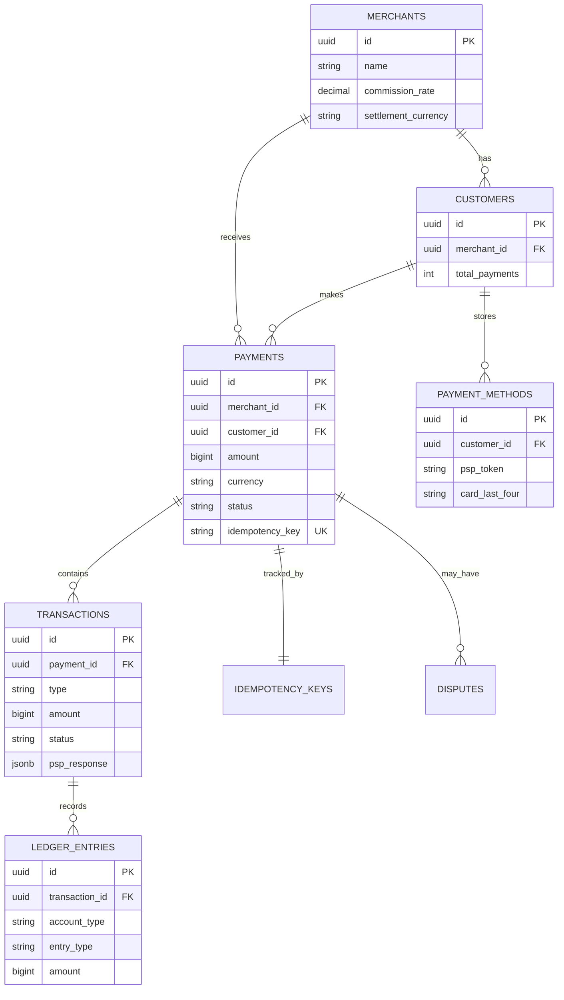

# 3. Data Model

> "In payment systems, the database schema IS the business logic. A double-entry ledger that doesn't balance is not a bug — it's a financial crime."

---

## 🗄 Database Choice: PostgreSQL

| Requirement | PostgreSQL | Why |
|-------------|------------|-----|
| ACID transactions | ✅ Full ACID | Money movements MUST be atomic |
| Strong consistency | ✅ Synchronous replication | Balance must be exact, never eventual |
| JSON support | ✅ JSONB | PSP responses vary wildly in structure |
| Row-level locking | ✅ SELECT FOR UPDATE | Prevent double-capture race conditions |
| 7-year retention | ✅ Partitioning by date | Archive old data without table bloat |
| 350 GB total | ✅ Single instance handles this | No sharding needed |
| Audit trail | ✅ Triggers + WAL | Every change is traceable |

---

## 📊 Core Schema

### payments

```sql
CREATE TABLE payments (
    id              UUID PRIMARY KEY DEFAULT gen_random_uuid(),
    idempotency_key VARCHAR(255) UNIQUE NOT NULL,
    merchant_id     UUID NOT NULL REFERENCES merchants(id),
    customer_id     UUID REFERENCES customers(id),
    
    -- Money
    amount          BIGINT NOT NULL,               -- In smallest currency unit (cents)
    currency        CHAR(3) NOT NULL,               -- ISO 4217 (USD, EUR, GBP)
    
    -- State machine
    status          VARCHAR(30) NOT NULL DEFAULT 'created',
    -- created → fraud_check → authorized → captured → settled → refunded
    
    -- PSP data
    psp_name        VARCHAR(50),                    -- 'stripe', 'adyen'
    psp_payment_id  VARCHAR(255),                   -- External PSP reference
    auth_code       VARCHAR(100),
    
    -- Risk
    risk_score      SMALLINT,                       -- 0-100 from fraud service
    risk_decision   VARCHAR(20),                    -- approve, review, reject
    
    -- Metadata
    description     VARCHAR(500),
    metadata        JSONB DEFAULT '{}',             -- Merchant-defined key-value pairs
    
    -- Timestamps
    created_at      TIMESTAMPTZ NOT NULL DEFAULT NOW(),
    authorized_at   TIMESTAMPTZ,
    captured_at     TIMESTAMPTZ,
    settled_at      TIMESTAMPTZ,
    updated_at      TIMESTAMPTZ NOT NULL DEFAULT NOW(),
    
    -- Constraints
    CONSTRAINT valid_amount CHECK (amount > 0),
    CONSTRAINT valid_currency CHECK (currency ~ '^[A-Z]{3}$'),
    CONSTRAINT valid_status CHECK (status IN (
        'created', 'fraud_check', 'pending_3ds', 'authorizing',
        'authorized', 'declined', 'captured', 'settling',
        'settled', 'voided', 'refunded', 'partially_refunded', 'failed'
    ))
);

-- Primary query: merchant views their payments
CREATE INDEX idx_payments_merchant_created 
    ON payments (merchant_id, created_at DESC);

-- Status-based processing queues
CREATE INDEX idx_payments_status 
    ON payments (status) WHERE status IN ('authorized', 'captured', 'settling');

-- PSP reference lookup (for webhook processing)
CREATE INDEX idx_payments_psp_reference 
    ON payments (psp_name, psp_payment_id);

-- Customer payment history
CREATE INDEX idx_payments_customer 
    ON payments (customer_id, created_at DESC);
```

### transactions (PSP interactions)

```sql
CREATE TABLE transactions (
    id              UUID PRIMARY KEY DEFAULT gen_random_uuid(),
    payment_id      UUID NOT NULL REFERENCES payments(id),
    
    -- Type: authorize, capture, void, refund
    type            VARCHAR(20) NOT NULL,
    
    -- Money
    amount          BIGINT NOT NULL,                -- Can differ from payment amount (partial refund)
    currency        CHAR(3) NOT NULL,
    
    -- PSP interaction
    psp_name        VARCHAR(50) NOT NULL,
    psp_transaction_id VARCHAR(255),
    
    -- Result
    status          VARCHAR(20) NOT NULL,           -- success, failed, pending
    failure_code    VARCHAR(100),                   -- 'insufficient_funds', 'card_expired', etc.
    failure_message TEXT,
    
    -- Raw PSP response (for debugging + reconciliation)
    psp_response    JSONB,
    
    -- Timing
    requested_at    TIMESTAMPTZ NOT NULL DEFAULT NOW(),
    responded_at    TIMESTAMPTZ,
    latency_ms      INTEGER,                        -- PSP round-trip time
    
    CONSTRAINT valid_type CHECK (type IN ('authorize', 'capture', 'void', 'refund'))
);

-- Payment's transaction history
CREATE INDEX idx_transactions_payment 
    ON transactions (payment_id, requested_at);

-- Failed transactions for retry processing
CREATE INDEX idx_transactions_failed 
    ON transactions (status, type) WHERE status = 'failed';
```

---

## 📒 Double-Entry Ledger

### Why Double-Entry?

```
Every financial transaction records TWO entries:
  Debit  (money leaves an account)
  Credit (money enters an account)

Total debits ALWAYS equals total credits. Always.
If they don't balance → something is wrong → STOP EVERYTHING.

Example: Customer pays $50:
  DEBIT:  customer_receivable    +$50 (customer owes us $50)
  CREDIT: pending_settlement     +$50 (PSP will settle $50 to us)
```

### ledger_entries

```sql
CREATE TABLE ledger_entries (
    id              UUID PRIMARY KEY DEFAULT gen_random_uuid(),
    transaction_id  UUID NOT NULL REFERENCES transactions(id),
    
    -- Account
    account_type    VARCHAR(50) NOT NULL,
    -- 'customer_receivable', 'merchant_payable', 'pending_settlement',
    -- 'platform_revenue', 'refund_liability', 'processing_fees'
    account_id      UUID,                           -- Merchant or customer ID
    
    -- Entry
    entry_type      VARCHAR(10) NOT NULL,           -- 'debit' or 'credit'
    amount          BIGINT NOT NULL,                -- Always positive
    currency        CHAR(3) NOT NULL,
    
    -- Metadata
    description     VARCHAR(255),
    created_at      TIMESTAMPTZ NOT NULL DEFAULT NOW(),
    
    CONSTRAINT valid_entry_type CHECK (entry_type IN ('debit', 'credit'))
);

-- Balance calculation per account
CREATE INDEX idx_ledger_account 
    ON ledger_entries (account_type, account_id, created_at);

-- Transaction's ledger entries
CREATE INDEX idx_ledger_transaction 
    ON ledger_entries (transaction_id);
```

### Ledger Entry Examples

```
1. AUTHORIZATION ($50 payment):
   DEBIT:  customer_receivable    $50   (customer owes us)
   CREDIT: pending_authorization  $50   (hold placed)

2. CAPTURE (ship the order):
   DEBIT:  pending_authorization  $50   (release hold)
   CREDIT: pending_settlement     $50   (PSP will settle)

3. SETTLEMENT (PSP sends money):
   DEBIT:  pending_settlement     $50   (PSP obligation fulfilled)
   CREDIT: merchant_payable       $48.55 (merchant's share)
   CREDIT: platform_revenue       $1.45  (our commission)

4. REFUND ($50 full refund):
   DEBIT:  refund_liability       $50   (we owe the refund)
   CREDIT: customer_receivable    $50   (customer no longer owes)
   
   DEBIT:  merchant_payable       $48.55 (claw back from merchant)
   CREDIT: refund_liability       $48.55 (partially cover refund)
   DEBIT:  platform_revenue       $1.45  (we eat our commission)
   CREDIT: refund_liability       $1.45  (fully cover refund)
```

### Balance Verification Query

```sql
-- This MUST return 0 for every currency. Always. Non-negotiable.
SELECT 
    currency,
    SUM(CASE WHEN entry_type = 'debit' THEN amount ELSE 0 END) AS total_debits,
    SUM(CASE WHEN entry_type = 'credit' THEN amount ELSE 0 END) AS total_credits,
    SUM(CASE WHEN entry_type = 'debit' THEN amount ELSE -amount END) AS balance
FROM ledger_entries
GROUP BY currency;

-- If balance ≠ 0 → ALERT. STOP. INVESTIGATE.
-- Run this check: every transaction, every hour, every settlement.
```

---

## 🔑 Idempotency Store

```sql
CREATE TABLE idempotency_keys (
    key             VARCHAR(255) PRIMARY KEY,
    payment_id      UUID REFERENCES payments(id),
    request_hash    VARCHAR(64) NOT NULL,           -- SHA-256 of request body
    response_code   INTEGER,
    response_body   JSONB,
    created_at      TIMESTAMPTZ NOT NULL DEFAULT NOW(),
    expires_at      TIMESTAMPTZ NOT NULL DEFAULT NOW() + INTERVAL '24 hours'
);

-- Auto-cleanup expired keys
CREATE INDEX idx_idempotency_expires 
    ON idempotency_keys (expires_at);
```

```
Idempotency key flow:
  1. Client sends: POST /payments with Idempotency-Key: "ord_abc123"
  2. Payment service: SELECT * FROM idempotency_keys WHERE key = 'ord_abc123'
  3. If exists → return cached response (200, same body)
  4. If not → process payment, store response, return to client
  5. Key expires after 24 hours

Also stored in Redis for fast lookup:
  Redis GET idemp:ord_abc123
  Redis SETEX idemp:ord_abc123 86400 {response}
```

---

## 📊 Supporting Tables

### merchants

```sql
CREATE TABLE merchants (
    id              UUID PRIMARY KEY DEFAULT gen_random_uuid(),
    name            VARCHAR(255) NOT NULL,
    email           VARCHAR(255) NOT NULL,
    
    -- Settlement
    settlement_currency CHAR(3) NOT NULL DEFAULT 'USD',
    settlement_schedule VARCHAR(20) DEFAULT 'T+2',  -- T+1, T+2, weekly
    commission_rate     DECIMAL(5,4) NOT NULL,       -- 0.0290 = 2.90%
    
    -- Risk
    risk_tier       VARCHAR(10) DEFAULT 'standard',  -- low, standard, high
    monthly_limit   BIGINT,                          -- Max monthly volume (cents)
    
    -- Status
    status          VARCHAR(20) NOT NULL DEFAULT 'active',
    created_at      TIMESTAMPTZ NOT NULL DEFAULT NOW()
);
```

### customers

```sql
CREATE TABLE customers (
    id              UUID PRIMARY KEY DEFAULT gen_random_uuid(),
    merchant_id     UUID NOT NULL REFERENCES merchants(id),
    email           VARCHAR(255),
    
    -- Fraud signals
    first_seen_at   TIMESTAMPTZ NOT NULL DEFAULT NOW(),
    total_payments  INTEGER DEFAULT 0,
    total_amount    BIGINT DEFAULT 0,
    last_payment_at TIMESTAMPTZ,
    risk_flags      JSONB DEFAULT '[]',
    
    created_at      TIMESTAMPTZ NOT NULL DEFAULT NOW()
);
```

### payment_methods (tokenized)

```sql
CREATE TABLE payment_methods (
    id              UUID PRIMARY KEY DEFAULT gen_random_uuid(),
    customer_id     UUID NOT NULL REFERENCES customers(id),
    
    -- Token (NEVER store raw card number)
    psp_token       VARCHAR(255) NOT NULL,           -- tok_xxx from Stripe
    psp_name        VARCHAR(50) NOT NULL,
    
    -- Card metadata (safe to store — not PCI sensitive)
    card_brand      VARCHAR(20),                     -- visa, mastercard, amex
    card_last_four  CHAR(4),                         -- 4242
    card_exp_month  SMALLINT,
    card_exp_year   SMALLINT,
    card_fingerprint VARCHAR(255),                   -- For detecting duplicate cards
    
    -- Status
    is_default      BOOLEAN DEFAULT FALSE,
    is_active       BOOLEAN DEFAULT TRUE,
    created_at      TIMESTAMPTZ NOT NULL DEFAULT NOW()
);

CREATE INDEX idx_payment_methods_customer 
    ON payment_methods (customer_id) WHERE is_active = TRUE;

-- Detect same card used across customers (fraud signal)
CREATE INDEX idx_payment_methods_fingerprint 
    ON payment_methods (card_fingerprint);
```

---

## 🗄 Entity Relationship Diagram



---

## 🗂 Partitioning Strategy

```sql
-- Partition payments by month (for 7-year retention)
CREATE TABLE payments (
    -- ... columns as above ...
) PARTITION BY RANGE (created_at);

-- Create monthly partitions
CREATE TABLE payments_2026_01 PARTITION OF payments
    FOR VALUES FROM ('2026-01-01') TO ('2026-02-01');
CREATE TABLE payments_2026_02 PARTITION OF payments
    FOR VALUES FROM ('2026-02-01') TO ('2026-03-01');
-- ... auto-create future partitions via cron job

-- Benefits:
--   1. DROP old partitions instead of DELETE (instant, no bloat)
--   2. Queries with date filter scan only relevant partitions
--   3. Each partition has its own indexes (smaller, faster)
--   4. Can move old partitions to cheaper storage (tablespace)
```

---

## ⬅️ [← Architecture](02-high-level-architecture.md) · [Payment Flow →](04-payment-flow.md)
