# 4. Payment Flow — The Complete Lifecycle

> "Authorization is a promise. Capture is a charge. Settlement is real money. Understanding the difference separates developers who build checkout forms from engineers who build payment systems."

---

## 🔄 Two-Phase Payment (Authorize → Capture)

### Why Two Phases?

```
E-commerce scenario:
  1. Customer clicks "Pay" → AUTHORIZE (hold $50 on their card)
  2. Warehouse ships the order (could be hours or days later)
  3. Merchant triggers CAPTURE → actually charge the $50

Why not charge immediately?
  • Law: In many jurisdictions, you can only charge when goods ship
  • Refunds are expensive: capture then refund costs fees twice
  • Partial fulfillment: order has 3 items, only 2 in stock
    → Capture $35, void remaining $15 authorization
```


---

## 🔐 3D Secure Flow (EU/PSD2 Compliance)


```
3DS decision logic:
  Amount < $30 (SCA exemption)     → Skip 3DS
  Low-risk transaction (TRA)       → Request exemption from bank
  EU card + amount > $30           → 3DS required
  Non-EU card                      → 3DS optional (reduces chargebacks)
  Recurring payment (MIT)          → First payment: 3DS. Subsequent: skip.

Trade-off:
  3DS adds 10-15 seconds of friction → ~10-15% checkout abandonment
  But: reduces fraud chargebacks by 80%+
  And: EU law requires it (PSD2/SCA)
```

---

## 💸 Refund Flow

### Full Refund


### Partial Refund

```
Payment: $50.00 (5000 cents)

Refund 1: $20.00 → refunded_amount = 2000
  Status: partially_refunded
  Remaining: $30.00

Refund 2: $15.00 → refunded_amount = 3500
  Status: partially_refunded 
  Remaining: $15.00

Refund 3: $15.00 → refunded_amount = 5000
  Status: refunded (fully)
  Remaining: $0.00

Validation:
  requested_refund + total_refunded <= original_amount
  If violated → 400 Bad Request: "Refund exceeds remaining amount"
```

---

## ⛔ Void vs Refund

| | Void | Refund |
|---|------|--------|
| **When** | Before capture (authorization phase) | After capture |
| **Money moved?** | No — releases the hold | Yes — returns funds |
| **PSP fee** | Usually $0 | May charge refund fee |
| **Customer sees** | Pending charge disappears | Refund line item |
| **Use case** | Order cancelled before shipping | Return after delivery |
| **Timing** | Must void within auth window (7-30 days) | Up to 120 days |

```
ALWAYS void instead of refund when possible.
  • Void = free
  • Refund = you've already paid 2.9% fee and may not get it back
  • Example: $50 payment → $1.45 PSP fee paid
    Void → $1.45 returned (some PSPs)
    Refund → $1.45 lost (most PSPs) + potential refund fee
```

---

## 📅 Settlement Flow

```mermaid
graph TB
    subgraph "End of Day (11 PM UTC)"
        A["Settlement Worker runs"] --> B["Query: all captured,<br/>not-yet-settled payments"]
        B --> C["Group by merchant"]
        C --> D["Calculate net:<br/>gross - fees - refunds"]
    end

    subgraph "PSP Settlement"
        D --> E["PSP batches payments"]
        E --> F["PSP initiates bank transfer"]
        F --> G["Funds arrive T+1 or T+2"]
    end

    subgraph "Reconciliation"
        G --> H["Compare PSP report<br/>vs our records"]
        H --> I{"Match?"}
        I -->|Yes| J["✅ Mark settled"]
        I -->|No| K["🚨 Discrepancy alert"]
    end

    style K fill:#f44336,color:#fff
```



### Settlement Calculation

```
Merchant "ShopXYZ" daily settlement:

  Gross captured:    $12,500.00 (250 orders × $50 avg)
  - PSP fees:        -$362.50   (2.9%)
  - Fixed fees:      -$75.00    (250 × $0.30)
  - Refunds:         -$150.00   (3 refunds)
  - Chargebacks:     -$50.00    (1 chargeback)
  - Chargeback fee:  -$15.00    (per-dispute fee)
  ─────────────────────────────
  Net settlement:    $11,847.50

  Merchant receives $11,847.50 via bank transfer on T+2
```

> **⚠️ Honest Risk: Eventual Consistency Between Capture and Settlement**
>
> Between the moment a payment is **captured** and the moment it's **settled** (T+1 to T+2), the system is in an **eventually consistent state**:
>
> - Our ledger shows `status: captured` and the merchant's dashboard displays revenue
> - But the actual money **hasn't moved yet** — it's still in the PSP's settlement pipeline
> - If the PSP experiences financial distress or goes bankrupt in this window, the merchant could lose those funds
> - At $50 average order × 2 TPS, that's up to **$8.6M in in-flight funds** at any given time
>
> **Mitigations:**
> - Merchant dashboard clearly labels revenue as "Captured (Pending Settlement)" vs "Settled"
> - Multi-PSP strategy means no single PSP holds 100% of in-flight funds
> - Reconciliation worker detects settlement delays — if T+3 passes without settlement confirmation, an alert fires
> - PSP selection criteria includes financial stability and regulatory compliance (PCI Level 1, SOC 2)
>
> **What we cannot fix:** This is inherent to all card payment systems — the delay between capture and bank settlement is a fundamental property of the card network (Visa/Mastercard) settlement cycle, not something we can architect away.

---

## 🔁 Subscription / Recurring Payment Flow

```
First payment (Customer-Initiated Transaction - CIT):
  → Full checkout flow with 3DS
  → Store card token for future use
  → Flag as "recurring series start"

Subsequent payments (Merchant-Initiated Transaction - MIT):
  → Use stored token
  → Skip 3DS (exemption: recurring MIT)
  → If declined → enter "dunning" cycle

Dunning strategy (retry failed recurring):
  Day 0:  Charge fails (insufficient funds)
  Day 1:  Retry #1 (10 AM — payday patterns)
  Day 3:  Retry #2
  Day 5:  Retry #3 (try different time of day)
  Day 7:  Retry #4 + Email: "Update payment method"
  Day 14: Final retry + Email: "Subscription expiring"
  Day 15: Cancel subscription

  Smart dunning: ML model picks optimal retry time
    → 10-15% recovery improvement over fixed schedule
```

---

## ⬅️ [← Data Model](03-data-model.md) · [Idempotency →](05-idempotency.md)
