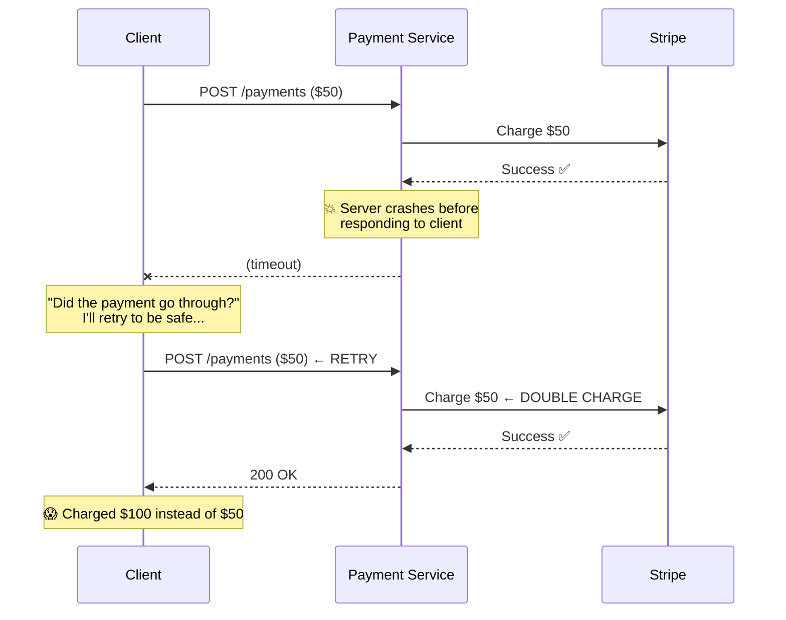
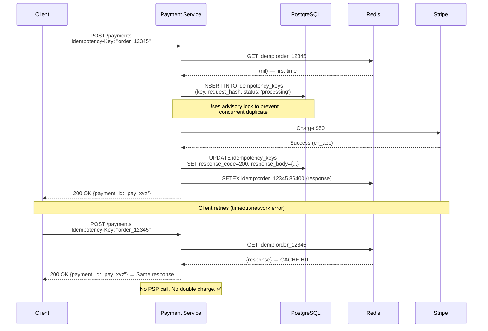

# 5. Idempotency & The "Exactly-Once" Myth

> "There is no such thing as exactly-once delivery in a distributed system. There is: at-most-once (may lose), at-least-once (may duplicate), and the clever illusion of exactly-once (at-least-once delivery + idempotent processing)."

---

## 🧨 The Problem

```
What goes wrong without idempotency:

  1. Client sends: POST /payments {amount: $50, card: tok_xxx}
  2. Payment Service → Stripe → $50 charged ✅
  3. Payment Service crashes BEFORE responding to client
  4. Client sees timeout → retries: POST /payments {amount: $50, card: tok_xxx}
  5. Payment Service → Stripe → $50 charged AGAIN ✅
  
  Customer charged $100 instead of $50.
  Congratulations, you've doubled your revenue. And your lawsuits.
```



---

## 🔑 Idempotency Key Pattern

### How It Works



### Implementation Details

```
Client generates idempotency key:
  - Easiest: use the order ID → "order_12345"
  - General: UUID v4 → "550e8400-e29b-41d4-a716-446655440000"
  - Rule: same key + same request body = same result

Key validation on server:
  1. Check Redis (fast path): GET idemp:{key}
     → Hit: return cached response immediately
     → Miss: continue to DB

  2. Check DB + acquire lock:
     INSERT INTO idempotency_keys (key, request_hash, status)
     VALUES ('order_12345', sha256(body), 'processing')
     ON CONFLICT (key) DO NOTHING;
     
     If INSERT succeeded → we got the lock, process payment
     If INSERT failed → someone else is processing or already processed

  3. Handle concurrent duplicates:
     SELECT * FROM idempotency_keys WHERE key = 'order_12345';
     
     If status = 'processing' → someone else is processing NOW
       → Return 409 Conflict ("Payment is being processed, retry in 5s")
     
     If status = 'completed' → already done
       → Return cached response (200 with original body)

  4. After processing:
     UPDATE idempotency_keys 
     SET status = 'completed', response_code = 200, response_body = {...}
     WHERE key = 'order_12345';
     
     SETEX idemp:order_12345 86400 {response}  -- Cache in Redis 24h
```

---

## 🏗 Request Hash Validation

```
What if the client sends the SAME idempotency key 
but DIFFERENT request body?

  Request 1: key="abc", amount=$50, card=tok_xxx
  Request 2: key="abc", amount=$100, card=tok_yyy  ← Different body!

Our response: 422 Unprocessable Entity
  "Idempotency key 'abc' was used with a different request body.
   Original hash: sha256_aaa, Current hash: sha256_bbb"

We compute SHA-256 of the canonical request body and store it.
Same key + different hash = error (not silent acceptance).
```

---

## 🔄 PSP-Level Idempotency

```
We implement idempotency at our layer. But what about the PSP?

Stripe:
  POST /v1/charges
  Idempotency-Key: "our_pay_xyz_auth"
  → Stripe deduplicates on their side too

  Our idempotency key for PSP calls:
    Authorize: "{payment_id}_auth"
    Capture:   "{payment_id}_capture"
    Refund:    "{payment_id}_refund_{refund_id}"

  Double protection:
    1. Our idempotency layer prevents duplicate PSP calls
    2. PSP's idempotency prevents duplicate charges even if #1 fails

Adyen:
  Uses "reference" field for idempotency
  reference: "pay_xyz" → same reference = same payment

  Each PSP has different idempotency mechanisms.
  The PSP Router abstracts this difference.
```

---

## ⚠️ Edge Cases

### Edge Case 1: Partial Failure

```
Scenario:
  1. Client sends payment request
  2. We call Stripe → "authorized"
  3. We try to write to DB → DB is down 💥
  4. Client retries with same idempotency key
  5. We check DB → no record (DB was down when we tried to write)
  6. We call Stripe again → idempotency protects us ✅
  
  But now we have an authorized payment in Stripe with no DB record!

Solution: "write-ahead" pattern
  1. Write idempotency key + "pending" to DB FIRST
  2. Then call PSP
  3. Update status after PSP response

  If DB write in step 1 fails → we never called PSP → safe
  If PSP call fails → we have a "pending" record → recovery worker picks it up
  If update in step 3 fails → recovery worker checks PSP for actual status
```

### Edge Case 2: Idempotency Key Reuse After Expiry

```
Scenario:
  Day 1: Client uses key "order_123" → payment succeeds
  Day 3: Key expires (24h TTL)
  Day 5: Client retries with key "order_123"
  → Treated as NEW payment → double charge!

Mitigation:
  1. 24h TTL is generous (most retries happen within minutes)
  2. Client should generate NEW idempotency key for genuinely new orders
  3. Additional check: if payment_id for this order already exists → reject
  4. Use order_id as natural idempotency key (orders have unique IDs)
```

### Edge Case 3: Network Ambiguity

```
The scariest scenario in payments:

  1. We send charge request to Stripe
  2. Stripe processes it and charges the card
  3. Network drops before we receive the response
  
  We don't know if the charge succeeded!
  
  Resolution:
    1. We stored the PSP idempotency key before calling
    2. Recovery worker runs:
       GET /v1/charges?idempotency_key=pay_xyz_auth
       → Stripe returns: "yes, this charge exists, status: succeeded"
    3. We update our records to match
    
    This is called "reconciliation" — it runs every few minutes.
```

---

## 📊 Idempotency Decision Matrix

| Endpoint | Idempotency Key Required? | Natural Key | TTL |
|----------|--------------------------|-------------|-----|
| POST /payments | ✅ YES | order_id | 24h |
| POST /payments/{id}/capture | ✅ YES | payment_id + "capture" | 24h |
| POST /payments/{id}/void | ✅ YES | payment_id + "void" | 24h |
| POST /payments/{id}/refund | ✅ YES | payment_id + refund_reason + amount | 24h |
| GET /payments/{id} | ❌ NO | N/A (read-only, naturally idempotent) | - |
| GET /payments | ❌ NO | N/A (read-only) | - |

---

## ⬅️ [← Payment Flow](04-payment-flow.md) · [Fraud Detection →](06-fraud-detection.md)
