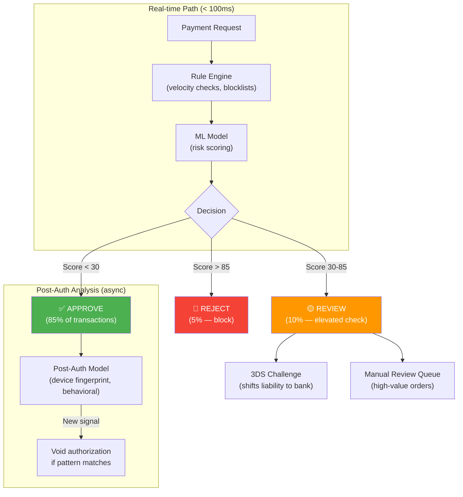

# 6. Fraud Detection

> "The goal of fraud detection is NOT to block all fraud. It's to block fraud while letting legitimate customers pay. Block too aggressively and you kill revenue. Block too loosely and chargebacks kill you."

---

## 📊 Fraud Economics

```
Annual volume:     $500M
Fraud rate target: < 0.1% ($500K max fraud losses)
Chargeback rate:   < 0.5% (Visa/MC penalty threshold)

Cost of fraud:
  Fraudulent $50 charge:
    - $50 goods shipped (lost)
    - $50 chargeback to merchant
    - $15 chargeback fee
    - $1.45 original processing fee (non-refundable)
    ────────────────────
    Total loss: $116.45 per $50 fraud transaction

  To recover from ONE $50 fraud, you need ~2.3 legitimate $50 sales
  (at 2.9% commission = $1.45 revenue per sale)

Cost of false decline:
  Legitimate customer blocked:
    - $50 lost sale
    - Customer lifetime value ($500+) at risk
    - Trust damage (they may never come back)
    
  Industry average: 2.5% of legitimate transactions are falsely declined
  At $500M volume: $12.5M in lost revenue from false declines
```

---

## 🏗 Fraud Detection Architecture



---

## 📋 Rule Engine (Layer 1 — Deterministic)

### Velocity Checks

| Rule | Threshold | Action | Rationale |
|------|-----------|--------|-----------|
| Same card, multiple merchants | > 3 merchants in 1 hour | REJECT | Stolen card being tested |
| Same IP, different cards | > 5 cards from 1 IP in 1 hour | REJECT | Card testing attack |
| Same card, rapid attempts | > 3 charges in 5 minutes | REVIEW | Could be legitimate retry or fraud |
| High-value first transaction | > $500 on first-ever purchase | REVIEW | New customer, high risk |
| Country mismatch | Card country ≠ IP country | REVIEW | Travel or proxy/VPN |
| BIN country mismatch | Card BIN country ≠ shipping country | REVIEW | Cross-border fraud |
| Unusual amount | > 3σ from merchant's average | REVIEW | Outlier detection |
| Blocklisted BIN range | Known-fraud BIN ranges | REJECT | Industry intelligence |

### Implementation (Redis-based Velocity)

```
Check: has this card been used at > 3 merchants in the last hour?

Key: vel:card:{card_fingerprint}:merchants:{hour_bucket}
Type: Redis SET (unique merchant IDs)

  SADD vel:card:fp_abc:merchants:2026022314 "merch_123"
  EXPIRE vel:card:fp_abc:merchants:2026022314 7200
  SCARD vel:card:fp_abc:merchants:2026022314 → 4 → REJECT

Check: > 5 different cards from same IP in 1 hour?

Key: vel:ip:{ip_hash}:cards:{hour_bucket}
Type: Redis SET

  SADD vel:ip:ip_hash:cards:2026022314 "fp_abc"
  SCARD → 6 → REJECT

Total Redis operations per payment: ~5-8 (all < 1ms each)
Total rule engine time: < 10ms
```

---

## 🧠 ML Model (Layer 2 — Probabilistic)

### Features

| Feature Category | Examples | Weight |
|-----------------|----------|--------|
| **Transaction** | Amount, currency, payment method, time of day | Medium |
| **Customer history** | Total payments, avg amount, days since first payment | High |
| **Device** | Device fingerprint, browser, OS, screen resolution | High |
| **Location** | IP geolocation, distance from billing address | Medium |
| **Behavioral** | Time on checkout page, mouse movements, typing speed | Medium |
| **Network** | VPN/proxy detection, Tor exit node, datacenter IP | High |
| **Card** | BIN risk level, issuing bank, card age, 3DS capability | Medium |

### Model Output

```
Input: 50+ features
Output: risk_score (0-100) + risk_factors[]

Example:
{
  "risk_score": 67,
  "risk_factors": [
    "new_customer",
    "vpn_detected", 
    "amount_above_merchant_avg",
    "card_country_mismatch"
  ],
  "recommendation": "review",
  "confidence": 0.82
}
```

### Scoring Thresholds

| Score Range | Action | Volume | False Positive Rate |
|-------------|--------|--------|-------------------|
| 0-29 | Auto-approve | 85% of txns | 0.01% (miss rate) |
| 30-59 | Approve + 3DS | 8% | Payment shifted to bank liability |
| 60-84 | Manual review (< $200) or 3DS (> $200) | 5% | ~15% are actually fraud |
| 85-100 | Auto-reject | 2% | ~60% are actually fraud |

---

## 🔍 Manual Review Queue

### When to Manual Review

```
Auto-review triggers:
  - ML score 60-84 AND amount > $200
  - Customer flagged by previous chargeback
  - New merchant's first 100 transactions (training period)
  - VIP merchant requests manual review for all orders > $1000

Review queue SLA:
  - Orders in review must be approved/rejected within 2 hours
  - After 2 hours: auto-approve if score < 75, auto-reject if > 75
```

### Reviewer Dashboard

```
Order: #12345
Amount: $450 USD
Customer: john@gmail.com (first purchase)
Card: Visa ****4242 (US)
IP: 103.21.x.x (Singapore) ← MISMATCH
Device: iPhone 14, Safari
ML Score: 72 (REVIEW)

Risk Factors:
  ⚠️ Card country (US) ≠ IP country (Singapore)
  ⚠️ First-ever purchase
  ⚠️ Amount > merchant average ($65)
  ✅ Valid email domain
  ✅ Card not in blocklist
  ✅ No velocity violations

Reviewer options:
  [APPROVE] [REJECT] [REQUEST 3DS] [CONTACT CUSTOMER]
```

---

## 🛡 3D Secure as Fraud Tool

```
3DS is not just compliance — it's a fraud TOOL.

When ML score is 30-84 → request 3DS:
  • If customer passes 3DS → APPROVE
    - Liability shifts to issuing bank
    - If this turns out to be fraud → bank eats the chargeback, not us
  
  • If customer fails/abandons 3DS → INVESTIGATE
    - Legitimate customer: might just not have OTP set up
    - Fraudster: can't complete authentication

Strategy by risk level:
  Low risk (0-29):      No 3DS → frictionless checkout
  Medium risk (30-59):  Frictionless 3DS (bank decides if challenge needed)
  High risk (60-84):    Challenge 3DS (force OTP/biometric)
  Very high (85+):      Reject outright (don't even try 3DS)
```

---

## 📊 Fraud Metrics Dashboard

### Key Metrics

| Metric | Target | Alert Threshold |
|--------|--------|-----------------|
| Fraud rate ($ basis) | < 0.1% | > 0.08% |
| Chargeback rate (count) | < 0.5% | > 0.3% |
| False decline rate | < 3% | > 5% |
| Manual review rate | < 5% | > 10% |
| Auto-approve rate | > 85% | < 80% |
| 3DS challenge rate | < 10% | > 15% |
| Review queue time (p50) | < 30 min | > 1 hour |
| ML model latency (p99) | < 50ms | > 100ms |

### Feedback Loop

```
ML model improves from:
  1. Chargeback data (confirmed fraud — labeled training data)
  2. Manual review decisions (human expert labels)
  3. 3DS results (passed = likely legit, failed = likely fraud)
  4. Customer disputes (not all chargebacks are fraud)

Retraining schedule:
  - Weekly: update feature weights with new chargebacks
  - Monthly: full model retrain with expanded dataset
  - Quarterly: evaluate new features, architecture changes

Cold start problem:
  New merchant → no historical data → use industry-wide model
  After 1000 transactions → blend with merchant-specific patterns
  After 10,000 transactions → merchant-specific model dominates
```

---

## ⬅️ [← Idempotency](05-idempotency.md) · [Failure & Recovery →](07-failure-recovery.md)
