# 7. Failure Modes & Recovery

> "Payment failures are unique: you can't just retry and hope for the best. Retrying a charge might double-charge. Not retrying might lose the sale. And in between, there's a $50 Schrödinger's payment that may or may not have been charged."

---

## 📊 Failure Mode Catalog

### Critical Failures (Money at Risk)

| Failure | Frequency | Impact | Recovery |
|---------|-----------|--------|----------|
| **Double charge** | Rare (prevented by idempotency) | Customer charged twice | Auto-detect + instant refund |
| **Orphaned authorization** | Uncommon | $$ held on customer's card forever | Auth sweeper (void after 7 days) |
| **Charge succeeded, DB write failed** | Uncommon | PSP charged but no record | Reconciliation worker detects |
| **Partial capture failure** | Rare | Some items charged, some not | Saga rollback or manual fix |
| **Refund failed silently** | Uncommon | Customer waiting for money back | Refund retry worker |
| **Settlement discrepancy** | Common (daily) | Our records ≠ PSP records | Daily reconciliation report |

### Infrastructure Failures

| Failure | Blast Radius | Impact | Auto-Recovery? |
|---------|-------------|--------|----------------|
| **PostgreSQL primary down** | 🔴 TOTAL | No payment processing | Promote replica (< 30s) |
| **Redis down** | 🟡 PARTIAL | Idempotency checks hit DB (slower) | DB fallback, Redis restart |
| **RabbitMQ down** | 🟡 PARTIAL | Webhooks delayed, settlements delayed | Retry on recovery |
| **Payment API server down** | 🟢 LOW | Other servers handle traffic | Load balancer re-routes |
| **PSP (Stripe) down** | 🟡 PARTIAL | All new payments fail | Route to backup PSP (Adyen) |

---

## 🔴 Scenario 1: Double Charge

### How It Happens (Despite Idempotency)

```
Edge case where idempotency fails:

  1. Client sends payment with Idempotency-Key: "abc"
  2. Server processes, Stripe charges $50
  3. Server crashes before writing to idempotency store
  4. Client retries with same key
  5. Idempotency store: no record → treated as new
  6. Stripe charges again (different Stripe idempotency key because
     our system generated a new internal transaction ID)

  Result: $50 charged twice

  Why? Because OUR idempotency key and STRIPE's idempotency key 
  are decoupled if we generate the Stripe key at processing time.
```

### Prevention: Deterministic PSP Keys

```
Fix: PSP idempotency key MUST be derived from our idempotency key

  Our key: "order_12345"
  Stripe key: "order_12345_auth"  (deterministic)

  Now if we retry:
    Our system → may or may not see it as duplicate
    Stripe → ALWAYS sees it as duplicate (same key)
    
  Belt AND suspenders.
```

### Detection & Auto-Recovery

```
Double charge detector (runs every 5 minutes):

  SELECT customer_id, amount, currency, card_fingerprint,
         COUNT(*) as charge_count,
         array_agg(id) as payment_ids
  FROM payments
  WHERE status IN ('authorized', 'captured')
    AND created_at > NOW() - INTERVAL '24 hours'
  GROUP BY customer_id, amount, currency, card_fingerprint
  HAVING COUNT(*) > 1;

  If found:
    1. Alert ops team immediately (Slack + PagerDuty)
    2. Auto-void/refund the duplicate (most recent one)
    3. Send apology email to customer
    4. Log incident for post-mortem
```

---

## 🟡 Scenario 2: Orphaned Authorizations

### The Problem

```
Customer's experience:
  "I cancelled my order but my bank still shows a $200 pending charge!"

What happened:
  1. Authorization: $200 held on card ✅
  2. Order cancelled → our system marks payment as "cancelled"
  3. BUT we forgot to void the authorization with the PSP
  4. Bank holds $200 for 7-30 days until auth expires

  Not a charge, but customer thinks they've been charged.
  → Support tickets, negative reviews, trust damage.
```

### Prevention: Auth Sweeper Job

```
Auth sweeper (runs every hour):

  SELECT id, psp_payment_id, authorized_at
  FROM payments
  WHERE status = 'authorized'
    AND authorized_at < NOW() - INTERVAL '24 hours';

  For each orphaned auth:
    1. Check: does the merchant intend to capture?
       (flag: merchant.auto_capture_after_hours = 48)
    2. If past capture deadline → VOID the authorization
    3. Log: "Voided orphaned auth {payment_id}, held for {hours}h"

  Also void:
    - Authorization where order was cancelled
    - Authorization where fraud review resulted in rejection
    - Authorization where customer cart was abandoned

  Safety: NEVER auto-void within first 4 hours
  (merchant might be processing the order)
```

---

## 🟡 Scenario 3: PSP Outage (Stripe Down)

### Impact

```
Stripe is down:
  ❌ No new authorizations
  ❌ No captures
  ❌ No refunds
  ✅ Existing payment records accessible
  ✅ Settlement of already-captured payments continues
```

### Multi-PSP Failover


```
PSP Router circuit breaker:

  Normal state: Route 95% to Stripe, 5% to Adyen
  (Adyen gets baseline traffic to stay warm)

  Stripe failure detection:
    - 5 consecutive 5xx errors in 60 seconds → OPEN circuit
    - OR: p99 latency > 5 seconds → OPEN circuit

  Circuit open:
    - Route 100% to Adyen
    - Every 30 seconds: send 1 test request to Stripe
    - If Stripe responds successfully 3 times → CLOSE circuit
    - Gradually shift traffic back: 10% → 30% → 50% → 95%

  Challenges of multi-PSP:
    - Different APIs (abstraction layer needed)
    - Different token formats (must tokenize with both)
    - Different decline codes (normalize to common set)
    - Settlement happens separately
    - Pricing differences (route cost-optimally when both healthy)
```

### Token Portability Problem

```
Customer's card is tokenized with Stripe: tok_stripe_xxx
Stripe is down.
Can we use this token with Adyen? NO!

Solutions:
  1. Network tokens (Visa/MC):
     Raw PAN → Visa Token Service → network_token_xxx
     → Works with any PSP (but not all cards support it)

  2. Dual tokenization:
     At card save time: tokenize with Stripe AND Adyen
     Store both: stripe_token + adyen_token
     → Works always, doubles storage (trivial)

  3. Accept the gap:
     New customers during Stripe outage → use Adyen
     Returning customers with Stripe-only tokens → can't charge
     → Show "Try again later" (acceptable for brief outages)

  Recommendation: Dual tokenization for all saved cards.
  Cost: one extra API call at card save time (async, non-blocking).
```

---

## 🟡 Scenario 4: DB Write After PSP Call Fails

```
The "phantom payment" problem:

  1. We send charge to Stripe → $50 charged
  2. We try to INSERT into payments table → DB timeout 💥
  3. Stripe charged the customer
  4. We have no record of it
  
  Customer: "I was charged but no order confirmation!"
  Our DB: "What payment?"
```

### Recovery: Reconciliation Worker

```
Reconciliation worker (runs every 5 minutes):

  1. Fetch recent Stripe charges (last 10 minutes):
     GET /v1/charges?created[gte]={5_min_ago}

  2. For each Stripe charge:
     SELECT * FROM payments WHERE psp_payment_id = 'ch_xxx';
     
     If found → ✅ records match
     If NOT found → 🚨 phantom payment detected

  3. For phantom payments:
     a. Create payment record from Stripe data
     b. Create ledger entries
     c. Notify merchant
     d. Log incident

  4. Reverse check (our records with no PSP match):
     SELECT * FROM payments 
     WHERE status = 'authorizing' 
       AND created_at < NOW() - INTERVAL '10 minutes';
     
     For each: check with PSP if it actually went through
     → If yes: update our records
     → If no: mark as failed
```

---

## 📋 Daily Reconciliation

### Why Reconcile?

```
Even with perfect code, records will drift:
  - Network issues cause missed webhooks
  - PSP applies fees differently than expected
  - Currency conversion rates differ slightly
  - Timing: payment captured at 11:59 PM, PSP records it next day
  - Chargebacks: PSP reverses payment we didn't know about

Reconciliation answers: "Does the money we think we have 
match the money we actually have?"
```

### Reconciliation Process

```mermaid
graph TB
    subgraph "Step 1: Gather Data"
        OUR["Our PostgreSQL<br/>(payments + ledger)"]
        PSP_R["PSP Settlement Report<br/>(Stripe dashboard CSV)"]
        BANK["Bank Statement<br/>(actual money received)"]
    end

    subgraph "Step 2: Match"
        OUR --> MATCH["Transaction Matcher<br/>(payment_id ↔ psp_ref)"]
        PSP_R --> MATCH
    end

    subgraph "Step 3: Classify Differences"
        MATCH --> OK["✅ Matched<br/>(99.5% of txns)"]
        MATCH --> TIME["⏰ Timing<br/>(will match tomorrow)"]
        MATCH --> FEE["💰 Fee Difference<br/>(small, log it)"]
        MATCH --> MISS["🚨 Missing<br/>(investigate!)"]
    end

    MISS --> ALERT["Alert team<br/>Create incident"]

    style MISS fill:#f44336,color:#fff
```



```
Daily reconciliation output (example):

  Date: 2026-02-23
  Total payments (our records):    843
  Total payments (Stripe report):  845

  Matched:          840 (99.6%)
  Timing difference:  2 (will match tomorrow)
  Fee adjustment:     1 (Stripe FX rate differed by $0.03)
  Missing from us:    2 → INVESTIGATE (phantom payments?)
  Missing from Stripe: 0

  Total $ (our records):    $42,150.00
  Total $ (Stripe):         $42,153.00
  Difference:               $3.00 (timing + FX)

  Status: ✅ HEALTHY (< 0.1% discrepancy)
```

---

## 📊 Recovery SLAs

| Failure | Detection | Auto-Recovery | Human Escalation |
|---------|-----------|--------------|------------------|
| Double charge | < 5 min | Auto-refund duplicate | Immediate alert |
| Orphaned auth | < 1 hour | Auto-void (hourly sweeper) | Daily report |
| PSP outage | < 30 sec | Route to backup PSP | If > 10 min |
| DB failure | < 10 sec | Promote replica | If replica fails |
| Phantom payment | < 5 min | Recon worker creates record | If > $500 |
| Settlement gap | Next day | Timing adj. auto-resolved | If > $100 |

---

## ⬅️ [← Fraud Detection](06-fraud-detection.md) · [Scaling & Compliance →](08-scaling-compliance.md)
