# 8. Scaling & Compliance

> "Payment systems scale differently than most systems. You don't need 100K TPS — you need 99.99% uptime, zero data loss, and a compliance framework that survives a PCI audit."

---

## 📈 Scaling Strategy

### Why This System Doesn't Need Traditional Scaling

```
Let's be honest about our numbers:

  TPS: 0.3 average, 200 peak, 2,000 design target
  Storage: 53 GB/year, 350 GB over 7 years
  Bandwidth: 300 MB/day

A single PostgreSQL instance with 32 GB RAM handles this.
A raspberry pi could almost handle the query load.

The scaling challenge in payments is NOT throughput.
It's:
  1. Availability (99.99% = 52 min downtime/year)
  2. Correctness (zero duplicate charges, balanced ledger)
  3. Compliance (PCI DSS, SOC 2, data residency)
  4. Multi-region for DR (not for performance)
```

### Day 1 Architecture

**$500/month**

```
Single region, simple setup:

  1× Payment API (4 vCPU, 16 GB)
  1× PostgreSQL primary (8 vCPU, 32 GB, 500 GB SSD)
  1× PostgreSQL replica (hot standby)
  1× Redis (4 GB — idempotency + cache)
  1× RabbitMQ (2 GB — async webhooks)
  
  Total capacity: ~500 TPS (250× average load)
  Availability: 99.9% (single region)
```

### Production Architecture (Current Design)

**$9,500/month**

```
High availability, single region:

  3× Payment API (behind ALB, health checks)
  1× PostgreSQL primary + 1× replica (synchronous)
  1× PostgreSQL read replica (analytics/reporting)
  3× Redis cluster (idempotency, cache, rate limits)
  2× RabbitMQ (mirrored queues)
  2× Fraud engine
  2× Webhook workers
  
  Total capacity: ~2,000 TPS
  Availability: 99.99% (component redundancy)
```

### Multi-Region (If Required)

**$25,000-40,000/month**

```mermaid
graph TB
    subgraph "US-East (Primary)"
        API_US["API × 3"]
        PG_US[("PostgreSQL<br/>Primary")]
        R_US[("Redis")]
    end

    subgraph "EU-West (DR + EU Data)"
        API_EU["API × 2"]
        PG_EU[("PostgreSQL<br/>Replica")]
        R_EU[("Redis")]
    end

    LB["Global Load Balancer"] --> API_US
    LB -->|"EU traffic"| API_EU

    PG_US -->|"Async replication"| PG_EU

    style PG_US fill:#1565c0,color:#fff
    style PG_EU fill:#e65100,color:#fff
```



```
Multi-region is needed when:
  ✅ EU data residency laws require EU processing (GDPR)
  ✅ DR requirement: survive full region outage
  ❌ NOT for performance (latency is dominated by PSP call)

EU data strategy:
  - EU cardholder data stored in EU PostgreSQL
  - US-originated payments stored in US
  - Ledger reconciliation happens in primary (US)
  - Failover: EU → US if EU goes down (with compliance waiver)
```

---

## 🔒 PCI DSS Compliance

### Scope Assessment

| Component | In PCI Scope? | Why |
|-----------|--------------|-----|
| Client SDK (Stripe.js) | ✅ Yes (minimal) | Renders card input iframe |
| API Gateway | ❌ No | Never sees card data (only tokens) |
| Payment Service | ❌ No | Only handles tokens |
| Token Service | ✅ Yes | Maps internal tokens ↔ PSP tokens |
| Fraud Service | ❌ No | Only sees card metadata (BIN, last4) |
| Ledger Service | ❌ No | Only amounts, no card data |
| PostgreSQL | ⚠️ Partial | Token Service database is in scope |
| Redis | ❌ No | No card data stored |

### PCI DSS Requirements Summary

| Requirement | How We Meet It |
|-------------|---------------|
| **1. Firewall** | Token Service in isolated VPC subnet, no direct internet access |
| **2. Default passwords** | Automated provisioning with unique credentials (Vault) |
| **3. Protect cardholder data** | We don't store it — PSP tokenization |
| **4. Encrypt transmission** | TLS 1.3 everywhere, mTLS between services |
| **5. Anti-virus** | Container scanning (Trivy), no traditional AV needed |
| **6. Secure systems** | Automated patching, hardened base images |
| **7. Restrict access** | RBAC, principle of least privilege, MFA for all admin |
| **8. Unique IDs** | Individual accounts, no shared credentials |
| **9. Physical access** | Cloud provider handles (AWS PCI compliance) |
| **10. Logging & monitoring** | All access logged, 1-year retention, tamper-evident |
| **11. Regular testing** | Quarterly ASV scans, annual pentest |
| **12. Security policy** | Documented, reviewed annually |

### PCI Compliance Cost Comparison

| Approach | Annual Cost | Audit Scope | Time |
|----------|------------|-------------|------|
| **Full PCI DSS Level 1** (handle raw PANs) | $100K-300K | Entire infrastructure | 3-6 months |
| **SAQ A-EP** (tokenization, our approach) | $10K-30K | Token Service only | 2-4 weeks |
| **SAQ A** (fully hosted by PSP) | $1K-5K | Almost nothing | 1 week |

```
Our choice: SAQ A-EP (tokenization)
  - We control the checkout UI (custom, branded)
  - Card data goes directly to Stripe (client-side)
  - We only handle tokens server-side
  - PCI scope: Token Service + its database only
  - Annual cost: ~$15K (scan + audit + remediation)
```

---

## 🛡 Data Security

### Encryption Strategy

```
Data at rest:
  - PostgreSQL: AES-256 transparent data encryption (TDE)
  - Backups: AES-256 encrypted before upload to S3
  - Redis: not encrypted at rest (ephemeral cache, no card data)

Data in transit:
  - External: TLS 1.3 (minimum TLS 1.2)
  - Internal: mTLS between all services (mutual certificate auth)
  - PSP calls: TLS 1.3 + API key in header

Secrets management:
  - HashiCorp Vault for API keys, DB passwords, PSP credentials
  - Auto-rotation: DB passwords every 30 days
  - PSP keys: rotated quarterly
  - No secrets in code, env vars, or config files
```

### Data Retention & Deletion

| Data Type | Retention | Deletion Method |
|-----------|-----------|----------------|
| Payment records | 7 years | Partition drop |
| Ledger entries | 7 years (legal) | Archive → cold storage |
| Audit logs | 7 years | Immutable (append-only) |
| PSP tokens | Until customer deletes | Cascade delete |
| Fraud signals | 2 years | Auto-purge |
| Idempotency keys | 24 hours | TTL expiry |
| Session data | 15 minutes | TTL expiry |

---

## 🌐 Multi-PSP Smart Routing

### Route Optimization

```
When both PSPs are healthy, route based on cost:

  Visa US card → Stripe: 2.9% + $0.30
  Visa US card → Adyen:  2.7% + $0.25  ← CHEAPER

  Visa EU card → Stripe: 1.5% + $0.30 (interchange+ pricing)
  Visa EU card → Adyen:  1.4% + $0.25  ← CHEAPER

  Amex → Stripe: 3.4% + $0.30
  Amex → Adyen:  3.5% + $0.30  ← Stripe cheaper

Routing rules:
  1. If only one PSP has the customer's token → use that PSP
  2. If both have tokens → route to cheaper for this card type
  3. Apply success rate weighting (PSP with higher auth rate for this BIN)
  4. Max 10% of traffic for testing new PSP routing rules
```

### Authorization Rate Optimization

```
Authorization rate = % of charges that banks approve

  Industry average: 85-90%
  Our target: > 92%

Techniques:
  1. Network tokens (Visa/MC):
     Card number changes (reissued) but network token stays valid
     → 2-4% improvement in auth rate

  2. Account updater:
     Automatically update expired/reissued cards
     → 1-2% improvement

  3. Retry logic:
     Soft decline (insufficient funds, try again) → retry after 4 hours
     Hard decline (stolen card) → don't retry
     
  4. Smart retry timing:
     Retry 2 days before payday patterns (1st and 15th of month)
     → 5-10% improvement for subscription renewals

  Impact at $500M volume:
    Each 1% auth rate improvement = $5M additional revenue captured
```

---

## 📊 Key Trade-offs Summary

| Decision | Choice | Alternative | Why |
|----------|--------|-------------|-----|
| **Database** | PostgreSQL | MySQL, distributed DB | ACID, partitioning, JSONB, 350 GB fits easily |
| **Message queue** | RabbitMQ | Kafka | 55K events/day, native DLQ/priority, simple ops |
| **Ledger** | Double-entry in PostgreSQL | Separate ledger service/DB | Volume doesn't justify, same ACID guarantees |
| **Tokenization** | PSP-side (Stripe.js) | PCI vault (own encryption) | 10× cheaper compliance, less risk |
| **Multi-PSP** | Active-passive (5% warm traffic) | Active-active 50/50 | Simplifies reconciliation + token management |
| **Fraud ML** | Managed service (Stripe Radar) + custom rules | Build own ML pipeline | 10M txn/year doesn't justify ML infra cost |
| **Multi-region** | DR only (async replication) | Active-active writes | Complexity: distributed transactions for money |
| **Amounts** | Integer cents (BIGINT) | DECIMAL | No floating point risk, simpler arithmetic |

---

## 📋 Production Readiness Checklist

```
Pre-launch:
  □ PCI SAQ A-EP completed and validated
  □ Penetration test passed (no critical/high findings)
  □ Load test: 2,000 TPS sustained for 30 minutes
  □ Failover test: kill primary DB, verify promotion < 30s
  □ PSP failover test: block Stripe, verify Adyen routing
  □ Double-charge detection verified with synthetic test
  □ Reconciliation worker tested with injected discrepancies
  □ Idempotency verified: same key returns same response
  □ Ledger balance check: debits = credits after 10K test transactions
  □ Webhook delivery: retry verified (kill consumer, verify retry)
  □ 7-year retention: partition creation automated
  □ Monitoring: alerts for all critical metrics configured
  □ Runbooks: documented for top 10 failure scenarios
  □ On-call: rotation established, escalation policy defined
```

---

## ⬅️ [← Failure & Recovery](07-failure-recovery.md) · [Back to Case Study Index](README.md)
