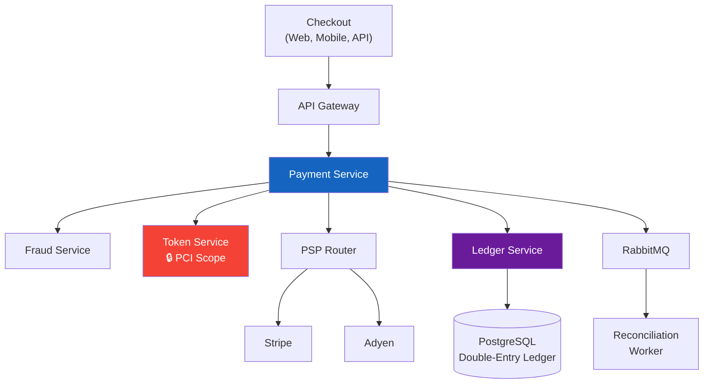

# 💳 Case Study 3: Payment Processing System

> **Interview Prompt:** "Design a payment processing system that handles $500M in annual transaction volume, supports multiple payment methods, guarantees exactly-once semantics for money movement, and meets PCI DSS compliance requirements."

---

## 📑 Table of Contents

| # | Section | Key Topics |
|---|---------|------------|
| 0 | [Overview & Requirements](00-overview.md) | Functional/NFR, transaction types, compliance, key assumptions |
| 1 | [Capacity Estimation](01-capacity-estimation.md) | TPS, storage, peak patterns, infrastructure costs |
| 2 | [High-Level Architecture](02-high-level-architecture.md) | Service boundaries, sync vs async paths, API design |
| 3 | [Data Model](03-data-model.md) | Ledger schema, double-entry bookkeeping, index strategy |
| 4 | [Payment Flow](04-payment-flow.md) | Authorize → capture → settle lifecycle, 3DS, refunds |
| 5 | [Idempotency & Exactly-Once](05-idempotency.md) | Idempotency keys, dedup, the "exactly-once" myth |
| 6 | [Fraud Detection](06-fraud-detection.md) | Rule engine, ML scoring, velocity checks, manual review |
| 7 | [Failure & Recovery](07-failure-recovery.md) | PSP failures, double charge, orphaned auth, reconciliation |
| 8 | [Scaling & Compliance](08-scaling-compliance.md) | PCI DSS, tokenization, multi-PSP, global expansion |

---

## 🔑 Key Challenges

| Challenge | Why It's Hard |
|-----------|---------------|
| **Exactly-once money movement** | Network failures between you and PSP — payment may have succeeded but you don't know |
| **Idempotency** | Retry a charge and user gets charged twice → lawsuits |
| **Double-entry ledger** | Every money movement must balance. Assets = Liabilities + Equity. Always. |
| **PCI DSS compliance** | Touch raw card numbers → 12 months of audits, $100K+ compliance costs |
| **Reconciliation** | Your records say $1M settled. PSP says $999,850. Where's the $150? |
| **Multi-PSP routing** | Stripe is down → route to Adyen → different API, different response codes |
| **Fraud vs conversion** | Block too much → lose revenue. Block too little → chargebacks eat profit |

---

## 🏗 Architecture Overview

> Full architecture with all components: [02-high-level-architecture.md](02-high-level-architecture.md)

---

## 📖 Reading Guide

**If you have 15 minutes:** Read [00-overview](00-overview.md) + [04-payment-flow](04-payment-flow.md) + [05-idempotency](05-idempotency.md)  
**If you have 30 minutes:** Add [03-data-model](03-data-model.md) + [06-fraud-detection](06-fraud-detection.md)  
**For full depth:** Read all sections in order (0 → 8)

---

## 🏗 Technology Decisions Summary

| Component | Choice | Alternative Considered | Rationale |
|-----------|--------|----------------------|----------|
| **Database** | PostgreSQL (partitioned monthly) | MySQL, CockroachDB | ACID for money, JSONB for metadata, 350 GB fits single instance |
| **Ledger** | Double-entry in PostgreSQL | Separate ledger service | Volume (10M txn/yr) doesn't justify separate infra; same ACID guarantees |
| **Message queue** | RabbitMQ | Kafka | 55K events/day; native DLQ + priority queues; simpler ops |
| **Tokenization** | PSP-side (Stripe.js) | Own PCI vault | SAQ A-EP ($15K/yr) vs full PCI ($300K/yr) = 20× cheaper |
| **Multi-PSP** | Active-passive (Stripe + Adyen) | Active-active 50/50 | Simplifies reconciliation; 5% warm traffic to Adyen for failover |
| **Fraud detection** | Stripe Radar + custom rules | Build own ML pipeline | 10M txn/yr doesn't justify ML infra cost |
| **Amount storage** | Integer cents (BIGINT) | DECIMAL, float | No floating point risk, simpler arithmetic across currencies |
| **Multi-region** | DR only (async replication) | Active-active writes | Distributed transactions for money = unacceptable complexity |

> Full trade-off analysis with reasoning: [08-scaling-compliance.md → Key Trade-offs Summary](08-scaling-compliance.md)

---

## ⬅️ [← Back to All Case Studies](../../README.md)
