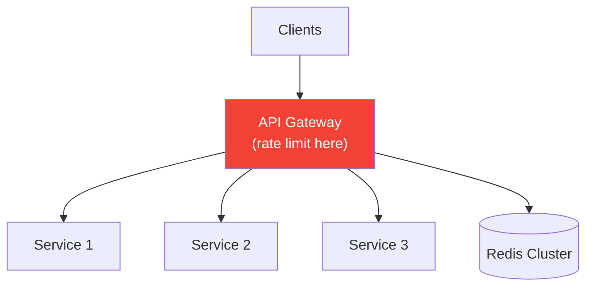
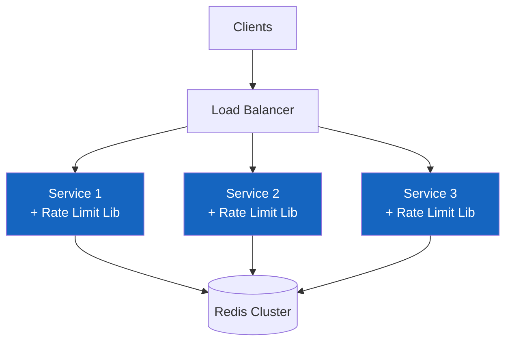
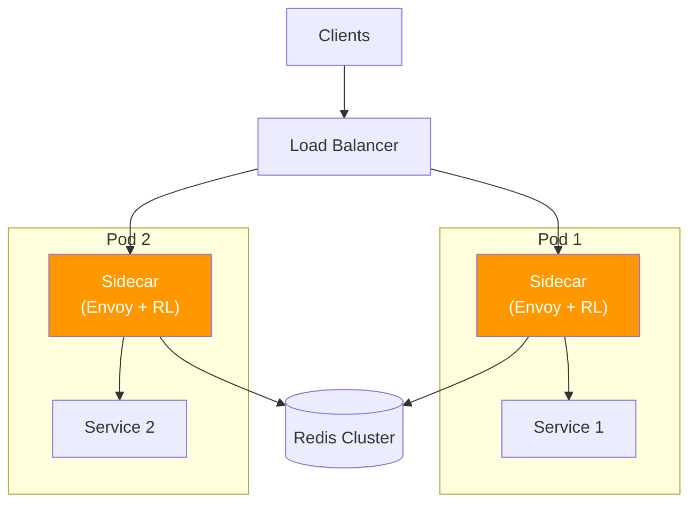
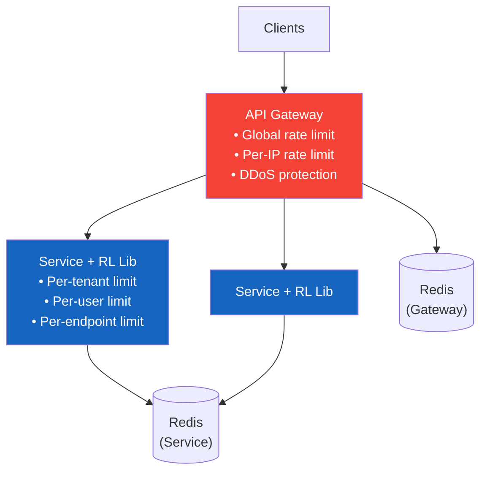
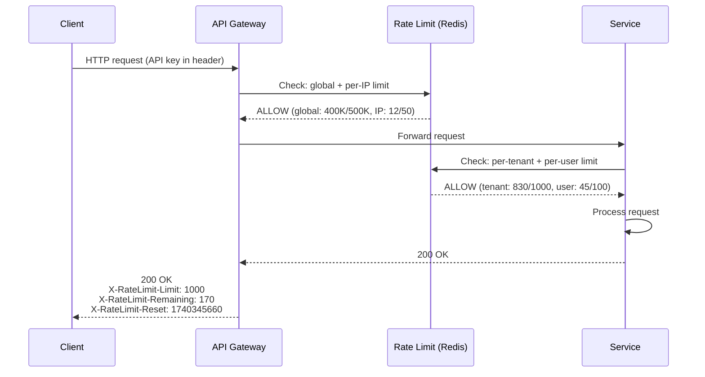

# 2. High-Level Architecture

> "The most important architectural decision for a rate limiter isn't which algorithm to use — it's WHERE to put it. In the gateway? In the service? As a sidecar? Each choice has fundamentally different implications for latency, accuracy, and failure modes."

---

## 🏗 Architecture Options

### Option 1: API Gateway (Centralized)



| Pro | Con |
|-----|-----|
| Single enforcement point | Single point of failure |
| Consistent behavior | Gateway becomes bottleneck |
| No code changes in services | Limited to L7 info (headers, path) |
| Easy to manage rules | Adds latency to ALL requests |

### Option 2: Service-Side Library (Distributed)



| Pro | Con |
|-----|-----|
| No extra hop (direct Redis) | Library in every service (multi-language?) |
| Service has full request context | Inconsistent if libraries diverge |
| No single point of failure | Harder to manage centrally |
| Lowest latency | Each team must integrate |

### Option 3: Sidecar (Service Mesh)



| Pro | Con |
|-----|-----|
| Language-agnostic | Sidecar overhead (memory, CPU) |
| Consistent enforcement | Complex to debug |
| Service code unchanged | Over-engineering for most cases |

### Our Choice: Hybrid (Gateway + Library)



```
Why hybrid?

Gateway handles:
  • Global rate limit (platform protection)
  • Per-IP rate limit (unauthenticated DDoS)
  • Basic per-API-key limit (coarse)
  → Cheap to check, filters most abuse before it reaches services

Service library handles:
  • Per-user rate limit (needs auth context)
  • Per-endpoint rate limit (needs route info)
  • Business-specific limits (e.g., 10 logins/hour)
  → Has full context, fine-grained control
```

---

## 🔄 Request Flow



### Rate Limit Response Headers

```
Successful request (within limits):
  HTTP/1.1 200 OK
  X-RateLimit-Limit: 1000          ← Your limit per minute
  X-RateLimit-Remaining: 170       ← Requests remaining
  X-RateLimit-Reset: 1740345660    ← Unix timestamp when window resets

Rate limited request:
  HTTP/1.1 429 Too Many Requests
  X-RateLimit-Limit: 1000
  X-RateLimit-Remaining: 0
  X-RateLimit-Reset: 1740345660
  Retry-After: 23                  ← Seconds until reset
  Content-Type: application/json

  {
    "error": "rate_limit_exceeded",
    "message": "Rate limit of 1000 requests per minute exceeded",
    "retry_after": 23
  }
```

---

## 📡 Configuration API

```
Rate Limit Rule Management:

POST   /v1/rate-limits                  Create rule
GET    /v1/rate-limits                  List rules
GET    /v1/rate-limits/{id}             Get rule details
PUT    /v1/rate-limits/{id}             Update rule
DELETE /v1/rate-limits/{id}             Delete rule

GET    /v1/rate-limits/usage/{key}      Current usage for a key
GET    /v1/rate-limits/analytics        Rate limit hit analytics
```

### Rule Configuration Example

```json
{
  "id": "rl_tenant_default",
  "name": "Default tenant rate limit",
  "key_pattern": "tenant:{api_key}",
  "algorithm": "sliding_window_counter",
  "limit": 1000,
  "window": "1m",
  "burst_limit": 1200,
  "action": "reject",
  "applies_to": {
    "plan": ["free", "pro"],
    "endpoints": ["*"]
  }
}
```

---

## 🧩 Component Responsibilities

| Component | Role | Technology |
|-----------|------|-----------|
| **API Gateway** | L1 rate limiting (global, IP) | Nginx/Kong + Lua |
| **Rate Limit Library** | L2 rate limiting (tenant, user, endpoint) | Go/Python library |
| **Redis Cluster** | Counter storage, atomic operations | Redis 7+ with Lua |
| **Config Store** | Rule definitions, plan quotas | PostgreSQL |
| **Config Sync** | Push rule updates to all nodes | Redis Pub/Sub |
| **Dashboard** | Analytics, monitoring, rule management | React + time-series DB |

### Config Sync Flow

```
When an admin updates a rate limit rule:

  1. Admin API → UPDATE rules in PostgreSQL
  2. Admin API → PUBLISH 'config_update' to Redis Pub/Sub
  3. All API servers subscribe → receive notification
  4. Each server reloads rules from PostgreSQL (or Redis cache)
  
  Propagation time: < 2 seconds
  
  Fallback: even without Pub/Sub, servers poll every 30 seconds
```

---

## ⬅️ [← Capacity Estimation](01-capacity-estimation.md) · [Algorithms Deep Dive →](03-algorithms.md)
