# 2. High-Level Architecture

> "The most important architectural decision for a rate limiter isn't which algorithm to use — it's WHERE to put it. In the gateway? In the service? As a sidecar? Each choice has fundamentally different implications for latency, accuracy, and failure modes."

---

## 🏗 Architecture Options

### Option 1: API Gateway (Centralized)


| Pro | Con |
|-----|-----|
| Single enforcement point | Single point of failure |
| Consistent behavior | Gateway becomes bottleneck |
| No code changes in services | Limited to L7 info (headers, path) |
| Easy to manage rules | Adds latency to ALL requests |

### Option 2: Service-Side Library (Distributed)


| Pro | Con |
|-----|-----|
| No extra hop (direct Redis) | Library in every service (multi-language?) |
| Service has full request context | Inconsistent if libraries diverge |
| No single point of failure | Harder to manage centrally |
| Lowest latency | Each team must integrate |

### Option 3: Sidecar (Service Mesh)


| Pro | Con |
|-----|-----|
| Language-agnostic | Sidecar overhead (memory, CPU) |
| Consistent enforcement | Complex to debug |
| Service code unchanged | Over-engineering for most cases |

### Our Choice: Hybrid (Gateway + Library)

```mermaid
graph TB
    C["Clients"] --> GW["API Gateway<br/>• Global rate limit<br/>• Per-IP rate limit<br/>• DDoS protection"]

    GW --> S1["Service + RL Lib<br/>• Per-tenant limit<br/>• Per-user limit<br/>• Per-endpoint limit"]
    GW --> S2["Service + RL Lib"]

    GW --> R1[("Redis<br/>(Gateway)")]
    S1 & S2 --> R2[("Redis<br/>(Service)")]

    style GW fill:#f44336,color:#fff
    style S1 fill:#1565c0,color:#fff
    style S2 fill:#1565c0,color:#fff
```



```
Why hybrid?

Gateway handles:
  • Global rate limit (platform protection)
  • Per-IP rate limit (unauthenticated DDoS)
  • Basic per-API-key limit (coarse)
  → Cheap to check, filters most abuse before it reaches services

Service library handles:
  • Per-user rate limit (needs auth context)
  • Per-endpoint rate limit (needs route info)
  • Business-specific limits (e.g., 10 logins/hour)
  → Has full context, fine-grained control
```

> **⚠️ Mitigation: Hybrid Architecture Consistency**
>
> Running rate limiting at two enforcement points (API Gateway and service library) creates a risk of **rule drift** — the gateway could enforce different limits than the library if configurations desync. This is mitigated by: (1) **single source of truth** — both gateway and library read rules from the same Redis config store, never from local config files, (2) **version stamps** — every rule has a version number; if a service detects its cached version is behind Redis, it forces an immediate refresh, (3) **enforcement boundary clarity** — the gateway handles global/IP-level limits only, while the library handles tenant/endpoint-level limits. They never enforce the same rule, eliminating double-counting.

---

## 🔄 Request Flow


### Rate Limit Response Headers

```
Successful request (within limits):
  HTTP/1.1 200 OK
  X-RateLimit-Limit: 1000          ← Your limit per minute
  X-RateLimit-Remaining: 170       ← Requests remaining
  X-RateLimit-Reset: 1740345660    ← Unix timestamp when window resets

Rate limited request:
  HTTP/1.1 429 Too Many Requests
  X-RateLimit-Limit: 1000
  X-RateLimit-Remaining: 0
  X-RateLimit-Reset: 1740345660
  Retry-After: 23                  ← Seconds until reset
  Content-Type: application/json

  {
    "error": "rate_limit_exceeded",
    "message": "Rate limit of 1000 requests per minute exceeded",
    "retry_after": 23
  }
```

---

## 📡 Configuration API

```
Rate Limit Rule Management:

POST   /v1/rate-limits                  Create rule
GET    /v1/rate-limits                  List rules
GET    /v1/rate-limits/{id}             Get rule details
PUT    /v1/rate-limits/{id}             Update rule
DELETE /v1/rate-limits/{id}             Delete rule

GET    /v1/rate-limits/usage/{key}      Current usage for a key
GET    /v1/rate-limits/analytics        Rate limit hit analytics
```

### Rule Configuration Example

```json
{
  "id": "rl_tenant_default",
  "name": "Default tenant rate limit",
  "key_pattern": "tenant:{api_key}",
  "algorithm": "sliding_window_counter",
  "limit": 1000,
  "window": "1m",
  "burst_limit": 1200,
  "action": "reject",
  "applies_to": {
    "plan": ["free", "pro"],
    "endpoints": ["*"]
  }
}
```

---

## 🧩 Component Responsibilities

| Component | Role | Technology |
|-----------|------|-----------|
| **API Gateway** | L1 rate limiting (global, IP) | Nginx/Kong + Lua |
| **Rate Limit Library** | L2 rate limiting (tenant, user, endpoint) | Go/Python library |
| **Redis Cluster** | Counter storage, atomic operations | Redis 7+ with Lua |
| **Config Store** | Rule definitions, plan quotas | PostgreSQL |
| **Config Sync** | Push rule updates to all nodes | Redis Pub/Sub |
| **Dashboard** | Analytics, monitoring, rule management | React + time-series DB |

### Config Sync Flow

```
When an admin updates a rate limit rule:

  1. Admin API → UPDATE rules in PostgreSQL
  2. Admin API → PUBLISH 'config_update' to Redis Pub/Sub
  3. All API servers subscribe → receive notification
  4. Each server reloads rules from PostgreSQL (or Redis cache)
  
  Propagation time: < 2 seconds
  
  Fallback: even without Pub/Sub, servers poll every 30 seconds
```

> **⚠️ Known Risk: Config Propagation Consistency Window**
>
> Redis Pub/Sub is **fire-and-forget** — no delivery guarantees. If a server restarts, is mid-deployment, or has a brief network blip, it misses the Pub/Sub notification. That server won't receive updated rules until the next 30-second poll. During that window, it enforces **stale limits**.
>
> **Worst case:** An admin deletes a rate limit rule. Pub/Sub notification is missed by 3 of 20 servers. Those 3 servers continue enforcing the deleted rule for up to 30 seconds. For rule changes (not deletions), this is merely inconsistent. For emergency rule removals (e.g., accidentally blocking legitimate traffic), 30 seconds of stale enforcement can be costly.
>
> **Mitigation:** For critical rule changes, combine Pub/Sub with a version stamp in the rule — servers compare their local version on every request and trigger an immediate poll if stale.

---

## ⬅️ [← Capacity Estimation](01-capacity-estimation.md) · [Algorithms Deep Dive →](03-algorithms.md)
