```mermaid
graph TB
    subgraph "Sliding Window Approximation"
        direction LR
        PREV["Previous Window<br/>84 requests total"]
        CURR["Current Window<br/>42 requests so far"]
        
        PREV --> WEIGHT["Weight: 50%<br/>(halfway through current)"]
        CURR --> ADD["42 + (84 × 0.50)<br/>= 84 requests"]
    end

    ADD --> CHECK{"84 < 100?"}
    CHECK -->|Yes| ALLOW["✅ ALLOW"]
    CHECK -->|No| REJECT["❌ REJECT"]

    style ALLOW fill:#4caf50,color:#fff
    style REJECT fill:#f44336,color:#fff
```

```mermaid
graph TB
    subgraph "Token Bucket"
        B["🪣 Bucket<br/>Capacity: 100 tokens"]
        R["Refill: 10 tokens/sec"]
    end

    REQ["Request arrives"] --> CHECK{"Tokens > 0?"}
    CHECK -->|"Yes (-1 token)"| ALLOW["✅ ALLOW"]
    CHECK -->|"No (0 tokens)"| REJECT["❌ 429 REJECT"]

    R -->|"Every 100ms"| B
    B --> CHECK

    style ALLOW fill:#4caf50,color:#fff
    style REJECT fill:#f44336,color:#fff
```

# 3. Algorithms Deep Dive

> "Every rate limiting algorithm is a trade-off between accuracy, memory, performance, and simplicity. There is no 'best' algorithm — only the best for your specific constraints."

---

## 📊 Algorithm Comparison

| Algorithm | Accuracy | Memory | Ops/Check | Burst | Complexity |
|-----------|----------|--------|-----------|-------|------------|
| Fixed Window | Low (2× spike at boundary) | O(1) | 1 | ❌ | Simple |
| Sliding Window Log | Perfect | O(n) per user | 3 | ❌ | Medium |
| Sliding Window Counter | High (~99.97%) | O(1) | 2 | ❌ | Medium |
| Token Bucket | High | O(1) | 1 (Lua) | ✅ | Medium |
| Leaky Bucket | High | O(1) | 1 (Lua) | ❌ (smooth) | Medium |

---

## 1️⃣ Fixed Window Counter

### How It Works

```
Window: 1 minute, Limit: 100 requests

  Timeline:
  |------- minute 1 -------||------- minute 2 -------|
  
  Count requests in each 1-minute window.
  If count > 100 → reject.

  Key: rl:{tenant_id}:{minute_bucket}
  minute_bucket = floor(unix_timestamp / 60)
  
  Example: timestamp 1740345672 → bucket 29005761
```

### Redis Implementation

```
INCR rl:tenant_abc:29005761
EXPIRE rl:tenant_abc:29005761 60

result = above INCR result
if result > 100:
    return REJECTED
else:
    return ALLOWED (remaining: 100 - result)
```

### The Boundary Problem

```
Limit: 100 requests/minute

  Minute 1: ..........|XXXXXXXXXX|  ← 100 requests at end of minute 1
  Minute 2: |XXXXXXXXXX|..........  ← 100 requests at start of minute 2

  Within any 1-second window: 200 requests passed ← 2× the limit!

  The window boundary is the vulnerability.
  At the exact second the window resets, the counter goes to 0.
  If traffic bursts at the boundary, 2× limit gets through.
```



```mermaid
graph LR
    subgraph "Minute N (12:00-12:01)"
        A1["0 requests<br/>(idle)"]
        A2["0 requests"]
        A3["95 requests ⚠️<br/>(12:00:55-12:01:00)"]
    end

    subgraph "Minute N+1 (12:01-12:02)"
        B1["98 requests ⚠️<br/>(12:01:00-12:01:05)"]
        B2["2 requests"]
        B3["0 requests"]
    end

    A3 --> B1

    style A3 fill:#f44336,color:#fff
    style B1 fill:#f44336,color:#fff
```

**Verdict:** Simple and fast. Use when ±2× accuracy is acceptable (API quotas, not DDoS).

---

## 2️⃣ Sliding Window Log

### How It Works

```
Store the timestamp of EVERY request.
To check: count requests in the last N seconds.
If count > limit → reject.

  Key: rl:tenant_abc:log (Redis Sorted Set)
  Score: Unix timestamp (with milliseconds)
  Member: unique request ID or timestamp

  Window: last 60 seconds
  Limit: 100 requests
```

### Redis Implementation

```
-- Lua script (atomic)
local key = KEYS[1]
local now = tonumber(ARGV[1])
local window = tonumber(ARGV[2])
local limit = tonumber(ARGV[3])

-- Remove entries older than window
redis.call('ZREMRANGEBYSCORE', key, '-inf', now - window)

-- Count current entries
local count = redis.call('ZCARD', key)

if count >= limit then
    return 0  -- REJECTED
end

-- Add this request
redis.call('ZADD', key, now, now .. ':' .. math.random())
redis.call('EXPIRE', key, window)

return limit - count - 1  -- remaining
```

### Memory Problem

```
If a tenant makes 10,000 requests/minute:
  Sorted Set stores 10,000 entries
  Each entry: ~64 bytes (score + member + overhead)
  Per tenant: 640 KB

  10,000 tenants × 640 KB = 6.4 GB ← for ONE rate limit dimension!
  
  Compare: fixed window uses 100 bytes per tenant = 1 MB total.

  Sliding window log uses 6,400× more memory.
```

**Verdict:** Perfect accuracy but terrible memory. Only use for small populations (admin users, webhook endpoints).

---

## 3️⃣ Sliding Window Counter ⭐ (Recommended)

### How It Works

```
Combines two consecutive fixed windows with weighted counting.

  Current minute (12:01): 42 requests so far
  Previous minute (12:00): 84 requests total

  We're 30 seconds into current minute = 50% through window

  Weighted count = (previous × (1 - position)) + current
                 = (84 × 0.50) + 42
                 = 42 + 42
                 = 84

  Limit: 100 → ALLOW (remaining: 16)
```



### Redis Implementation

```
-- Two keys per limit (current + previous window)
Key 1: rl:tenant_abc:sw:29005761  (current minute)
Key 2: rl:tenant_abc:sw:29005760  (previous minute)

-- Lua script
local curr_key = KEYS[1]
local prev_key = KEYS[2]
local limit = tonumber(ARGV[1])
local window = tonumber(ARGV[2])
local now = tonumber(ARGV[3])

local curr_count = tonumber(redis.call('GET', curr_key) or '0')
local prev_count = tonumber(redis.call('GET', prev_key) or '0')

-- Position in current window (0.0 to 1.0)
local position = (now % window) / window

-- Weighted count
local weighted = prev_count * (1 - position) + curr_count

if weighted >= limit then
    return -1  -- REJECTED
end

-- Increment current window
redis.call('INCR', curr_key)
redis.call('EXPIRE', curr_key, window * 2)

return limit - weighted - 1  -- remaining
```

### Accuracy Analysis

```
Cloudflare's research: sliding window counter has 0.003% error rate.

  The only "error" is at window transitions:
  - We assume previous window's requests were evenly distributed
  - If they were actually all at the start or end, count is slightly off
  - In practice, traffic is never perfectly even → error is negligible

  At our scale:
    100 requests/min limit → ±0.003 request error → rounds to 0
    10,000 requests/min → ±0.3 request error → effectively perfect
```

**Verdict:** Best balance of accuracy, memory, and performance. Our default algorithm.

---

## 4️⃣ Token Bucket

### How It Works

```
Imagine a bucket that holds tokens:
  - Bucket capacity: 100 tokens (burst limit)
  - Refill rate: 10 tokens/second (sustained rate)
  - Each request costs 1 token

  Request arrives:
    1. Refill tokens based on time elapsed since last request
    2. If tokens >= 1 → allow, remove 1 token
    3. If tokens < 1 → reject

  This naturally allows burst:
    After idle period: bucket is full (100 tokens)
    → First 100 requests pass immediately
    → Then limited to 10/second
```



### Redis Implementation

```
-- Token bucket (Lua script — atomic)
local key = KEYS[1]
local capacity = tonumber(ARGV[1])     -- max tokens
local refill_rate = tonumber(ARGV[2])  -- tokens per second
local now = tonumber(ARGV[3])          -- current timestamp (ms)
local requested = tonumber(ARGV[4])    -- tokens needed (usually 1)

-- Get current state
local data = redis.call('HMGET', key, 'tokens', 'last_refill')
local tokens = tonumber(data[1]) or capacity
local last_refill = tonumber(data[2]) or now

-- Refill tokens based on elapsed time
local elapsed = (now - last_refill) / 1000  -- convert to seconds
local new_tokens = math.min(capacity, tokens + elapsed * refill_rate)

-- Check if enough tokens
if new_tokens >= requested then
    new_tokens = new_tokens - requested
    redis.call('HMSET', key, 'tokens', new_tokens, 'last_refill', now)
    redis.call('EXPIRE', key, capacity / refill_rate * 2)
    return new_tokens  -- remaining tokens
else
    redis.call('HMSET', key, 'tokens', new_tokens, 'last_refill', now)
    return -1  -- REJECTED
end
```

### Token Bucket vs Sliding Window

```
Sliding window: "You can make 100 requests per minute. Period."
  → No burst. Evenly enforced.

Token bucket: "You can sustain 100/min, but burst up to 150 briefly."
  → Allows burst. Friendly to bursty traffic (web apps, mobile).

Use sliding window when: strict enforcement needed (billing, quotas)
Use token bucket when: burst-friendly (API calls, user actions)
```

**Verdict:** Best for APIs where burst-friendliness improves user experience.

---

## 5️⃣ Leaky Bucket

### How It Works

```
Requests enter a "bucket" (queue).
Bucket drains at a fixed rate.
If bucket is full → reject.

  Unlike token bucket: output rate is CONSTANT.
  No burst — perfectly smooth output.

     Input (bursty)        Leaky Bucket       Output (smooth)
  ████████                ┌──────────┐
  ██    ██    ──────►     │  ░░░░░░  │    ──────►    ██ ██ ██ ██
  ████████                │  ░░░░░░  │               (constant rate)
       ██                 └──────────┘

  Use case: processing queue that must not be overwhelmed
  (e.g., sending to external API with strict rate limit)
```

**Verdict:** Rarely used for API rate limiting. Better for output rate smoothing (email sending, webhook delivery).

---

## 🏆 Algorithm Selection Guide

| Scenario | Recommended Algorithm | Why |
|----------|----------------------|-----|
| **API quota (per-tenant)** | Sliding window counter | Accurate, low memory, fair |
| **Burst-friendly API** | Token bucket | Allows natural traffic spikes |
| **DDoS protection** | Fixed window (per-second) | Speed > accuracy at L1 |
| **Login attempts** | Sliding window log | Small population, exact tracking |
| **Webhook delivery** | Leaky bucket | Smooth output to external APIs |
| **Daily quota (free tier)** | Fixed window (24h) | Simple, boundary irrelevant for daily |

### Our Implementation

```
L1 (Gateway):
  • Global: fixed window per-second (500K/sec limit)
  • Per-IP: fixed window per-minute (fast, some boundary error OK)

L2 (Service):  
  • Per-tenant: sliding window counter (accurate quotas)
  • Per-user: token bucket (burst-friendly)
  • Per-endpoint: sliding window counter
```

---

## ⬅️ [← Architecture](02-high-level-architecture.md) · [Data Model & Redis →](04-data-model-redis.md)
