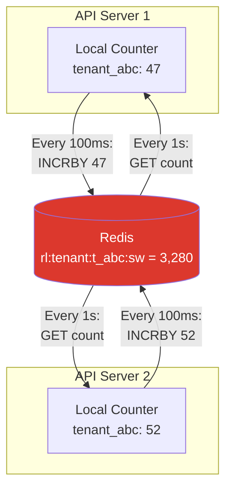

# 4. Data Model & Redis Design

> "Redis is not just a cache for rate limiting — it IS the database. Your Lua scripts are your stored procedures. Your key design is your schema. Treat it with the same rigor as a PostgreSQL schema."

---

## 🗄 Redis Key Design

### Key Naming Convention

```
Pattern: rl:{scope}:{identifier}:{algorithm}:{window_bucket}

Examples:
  rl:global:req:fw:1740345660          Global, fixed window, per-second bucket
  rl:ip:192.168.1.1:fw:29005761       Per-IP, fixed window, per-minute bucket
  rl:tenant:t_abc:sw:29005761         Per-tenant, sliding window, current minute
  rl:tenant:t_abc:sw:29005760         Per-tenant, sliding window, previous min
  rl:user:u_42:tb                      Per-user, token bucket (no window bucket)
  rl:user:u_42:ep:/api/search:sw:29005761  Per-user-per-endpoint
```

### Key Lifecycle

| Key Type | TTL | Cleanup |
|----------|-----|---------|
| Fixed window (per-second) | 2 seconds | Auto-expire |
| Fixed window (per-minute) | 2 minutes | Auto-expire |
| Sliding window (current + prev) | 2× window | Auto-expire |
| Token bucket | 2× (capacity / refill_rate) | Auto-expire on inactivity |
| Config cache | 5 minutes | Refresh on update |

---

## 📜 Lua Scripts

### Why Lua?

```
Rate limiting requires ATOMIC read-then-write:
  1. Read current count
  2. Compare against limit
  3. Increment count

Without atomicity (3 separate Redis commands):
  Server A: GET count → 99
  Server B: GET count → 99      ← Race condition!
  Server A: count < 100 → INCR → 100
  Server B: count < 100 → INCR → 101  ← limit breached!

With Lua script (single atomic execution):
  All 3 steps execute on Redis as one operation.
  No other command can interleave.
  ✅ No race condition.
```

### Script 1: Sliding Window Counter (Primary)

```lua
-- sliding_window_counter.lua
-- KEYS[1] = current window key
-- KEYS[2] = previous window key
-- ARGV[1] = limit
-- ARGV[2] = window size (seconds)
-- ARGV[3] = current time (unix seconds, float)

local curr_key = KEYS[1]
local prev_key = KEYS[2]
local limit = tonumber(ARGV[1])
local window = tonumber(ARGV[2])
local now = tonumber(ARGV[3])

-- Get counts
local curr = tonumber(redis.call('GET', curr_key) or '0')
local prev = tonumber(redis.call('GET', prev_key) or '0')

-- Calculate position in current window (0.0 - 1.0)
local elapsed = now % window
local weight = 1 - (elapsed / window)

-- Weighted count
local count = prev * weight + curr

if count >= limit then
    -- Return: rejected, current count, reset time
    local reset = window - elapsed
    return {0, math.ceil(count), math.ceil(reset)}
end

-- Allow: increment current window
local new_count = redis.call('INCR', curr_key)
if new_count == 1 then
    redis.call('EXPIRE', curr_key, window * 2 + 1)
end

-- Return: allowed, remaining, reset time
local remaining = limit - math.ceil(count) - 1
local reset = window - elapsed
return {1, math.max(0, remaining), math.ceil(reset)}
```

### Script 2: Token Bucket

```lua
-- token_bucket.lua
-- KEYS[1] = bucket key
-- ARGV[1] = capacity (max tokens)
-- ARGV[2] = refill_rate (tokens per second)
-- ARGV[3] = now (unix timestamp, milliseconds)
-- ARGV[4] = requested tokens (default 1)

local key = KEYS[1]
local capacity = tonumber(ARGV[1])
local rate = tonumber(ARGV[2])
local now = tonumber(ARGV[3])
local requested = tonumber(ARGV[4] or '1')

-- Get current state
local bucket = redis.call('HMGET', key, 'tokens', 'ts')
local tokens = tonumber(bucket[1])
local last_ts = tonumber(bucket[2])

-- Initialize if first request
if tokens == nil then
    tokens = capacity
    last_ts = now
end

-- Refill based on elapsed time
local elapsed_sec = (now - last_ts) / 1000
if elapsed_sec > 0 then
    tokens = math.min(capacity, tokens + elapsed_sec * rate)
    last_ts = now
end

-- Check and deduct
local allowed = 0
local remaining = tokens

if tokens >= requested then
    tokens = tokens - requested
    remaining = tokens
    allowed = 1
end

-- Save state
redis.call('HMSET', key, 'tokens', tokens, 'ts', last_ts)
-- TTL: enough time for bucket to refill from 0
redis.call('EXPIRE', key, math.ceil(capacity / rate) * 2 + 60)

-- Return: allowed, remaining_tokens
return {allowed, math.floor(remaining)}
```

### Script 3: Fixed Window (Fastest)

```lua
-- fixed_window.lua  (simplest, used for L1 gateway)
-- KEYS[1] = counter key (includes window bucket in name)
-- ARGV[1] = limit
-- ARGV[2] = window TTL

local key = KEYS[1]
local limit = tonumber(ARGV[1])
local window = tonumber(ARGV[2])

local count = redis.call('INCR', key)
if count == 1 then
    redis.call('EXPIRE', key, window)
end

if count > limit then
    return {0, 0}  -- rejected, 0 remaining
end

return {1, limit - count}  -- allowed, remaining
```

---

## 🏗 Redis Cluster Sharding

### Key Distribution

```
Redis Cluster uses hash slots (16,384 total).
Key: rl:tenant:t_abc:sw:29005761
Hash tag: {t_abc} → all keys for tenant t_abc go to same node

Wait — do we WANT same-shard or different-shard?

Same shard (using hash tags):
  Pro: Lua scripts can access both current + previous window keys
  Con: Hot tenant = hot shard

Different shards (no hash tags):
  Pro: Better distribution
  Con: Can't use multi-key Lua scripts

Our approach:
  Sliding window: use hash tag {t_abc} → same shard (Lua needs both keys)
  Token bucket: single key → natural distribution
  Fixed window: single key → natural distribution
```

### Hash Tag Implementation

```
Key format with hash tag:

  rl:tenant:{t_abc}:sw:29005761    ← hash tag: {t_abc}
  rl:tenant:{t_abc}:sw:29005760    ← same hash tag → same shard

  Both keys on same shard → Lua script can access both ✅

For token bucket (single key, no hash tag needed):
  rl:user:u_42:tb                  ← distributed naturally
```

### Hot Key Mitigation

```
Problem: tenant t_mega makes 20K req/sec
  → 20K Redis ops/sec on ONE shard (all keys hash to same node)
  → That shard is 10× busier than others

Solutions:
  1. Local counters (read below)
  2. Key splitting:
     Instead of 1 key per tenant per window:
     Split into N sub-keys: rl:tenant:{t_mega}:sw:29005761:0
                            rl:tenant:{t_mega}:sw:29005761:1
                            rl:tenant:{t_mega}:sw:29005761:2
     Each API server uses sub-key = server_id % N
     Final count = SUM(all sub-keys)
     
     Trade-off: less accurate (±N error), more Redis ops for SUM
  
  3. Accept ±5% error and use local counting for hot tenants
```

---

## ⚡ Local Counter Optimization

```
For the top 1% of tenants (100 tenants doing 200K req/sec total):

Instead of checking Redis for every request:
  1. Each API server maintains LOCAL counter (in-memory)
  2. Sync to Redis every 100ms (batch update)
  3. Read from Redis every 1 second (get global count)

  Before: 200K Redis ops/sec for top 100 tenants
  After:  20 servers × 10 syncs/sec × 100 tenants = 20K Redis ops/sec
  Reduction: 10× fewer Redis ops

  Accuracy impact:
    20 servers × 100ms sync interval × max local count
    Worst case: 20 × 100ms × 1000 req/sec = 2,000 requests unaccounted
    At 100K/min limit = 2% error → within ±5% tolerance ✅
```



---

## 🔧 Configuration Storage (PostgreSQL)

```sql
CREATE TABLE rate_limit_rules (
    id              UUID PRIMARY KEY DEFAULT gen_random_uuid(),
    name            VARCHAR(255) NOT NULL,
    
    -- Matching
    key_pattern     VARCHAR(255) NOT NULL,   -- "tenant:{api_key}"
    scope           VARCHAR(20) NOT NULL,    -- global, tenant, user, ip, endpoint
    
    -- Algorithm
    algorithm       VARCHAR(30) NOT NULL,    -- fixed_window, sliding_window, token_bucket
    
    -- Limits
    limit_count     INTEGER NOT NULL,        -- 1000
    window_seconds  INTEGER NOT NULL,        -- 60
    burst_limit     INTEGER,                 -- 1200 (token bucket only)
    refill_rate     DECIMAL,                 -- tokens/sec (token bucket only)
    
    -- Targeting
    plan_tiers      VARCHAR[] DEFAULT '{}',  -- {free, pro} or {} for all
    endpoints       VARCHAR[] DEFAULT '{}',  -- {/api/search} or {} for all
    
    -- Behavior
    action          VARCHAR(20) DEFAULT 'reject',  -- reject, throttle, log_only
    priority        INTEGER DEFAULT 100,     -- Lower = evaluated first
    enabled         BOOLEAN DEFAULT TRUE,
    
    created_at      TIMESTAMPTZ DEFAULT NOW(),
    updated_at      TIMESTAMPTZ DEFAULT NOW()
);

-- Rules are cached in Redis (refreshed every 30s or on Pub/Sub notification)
-- Config is NOT in the hot path — loaded at startup and on change
```

---

## ⬅️ [← Algorithms](03-algorithms.md) · [Distributed Challenges →](05-distributed-challenges.md)
