# 5. Distributed Challenges

> "Rate limiting a single server is a college homework problem. Rate limiting across 20 servers that share state through an eventually-consistent store, where network partitions happen and clocks drift — that's the real engineering challenge."

---

## 🔴 Challenge 1: Race Conditions

### The Problem

```
20 API servers, shared Redis, tenant limit: 100 req/min

Without atomic operations:

  Time 0ms:
    Server A: GET count → 99
    Server B: GET count → 99    (concurrent!)
    
  Time 1ms:
    Server A: 99 < 100 → ALLOW → INCR → count = 100
    Server B: 99 < 100 → ALLOW → INCR → count = 101  ← LIMIT BREACHED!

  Both servers read 99, both allowed, actual count = 101.
  With 20 servers, you could get up to 119 (99 + 20 concurrent reads).
```

### Solution: Lua Script Atomicity

```
Lua scripts in Redis execute ATOMICALLY:
  - No other command can run between GET and INCR
  - Multiple keys accessed in single Lua call
  - Serialized execution on Redis (single-threaded)

  Server A calls Lua: read(99) → check(99 < 100) → incr(100) → ALLOW
  Server B calls Lua: read(100) → check(100 < 100 = FALSE) → REJECT ✅

  This is THE solution. Not optimistic locking, not WATCH/MULTI.
  Lua scripts. Period.
```

### Alternative: INCR-First Pattern

```
Even simpler than Lua for fixed window:

  Instead of GET-then-INCR, just INCR first:
  
  count = INCR key
  if count == 1: EXPIRE key window
  if count > limit: REJECT (and optionally DECR to keep count accurate)
  else: ALLOW

  INCR is atomic in Redis. No race condition possible.
  
  Trade-off: we increment BEFORE checking.
  If rejected, counter is inflated by 1.
  For fixed window: negligible (counter resets soon).
  For sliding window: use Lua (need weighted calculation).
```

---

## 🟡 Challenge 2: Clock Skew

### The Problem

```
20 API servers, each with slightly different system clocks.

Server A clock: 12:01:00.000
Server B clock: 12:00:59.800  (200ms behind)

For minute-window rate limiting:
  Server A: bucket = 12:01 (new window, count starts at 0)
  Server B: bucket = 12:00 (old window, count at 95)

  Server A allows 100 requests in "12:01" window
  Server B allows 5 more in "12:00" window
  = 105 requests in ~200ms overlap ← slightly over limit

At minute granularity: 200ms skew = 0.3% error → negligible.
At second granularity: 200ms skew = 20% error → problematic!
```

### Solution

```
1. Use Redis server time (not local time):
   Instead of computing window bucket locally:
   
   local now = redis.call('TIME')  -- Redis server's clock
   
   All nodes use the SAME clock → no skew.
   Cost: 0 (TIME is part of the Lua script, no extra round trip).

2. NTP synchronization:
   All API servers sync to same NTP server.
   Modern NTP: < 1ms skew.
   For minute-level windows: completely irrelevant.

3. For sub-second precision:
   Always use Redis TIME inside Lua scripts.
   Never trust client-provided timestamps.
```

---

## 🟡 Challenge 3: Network Partition

### The Problem

```
Network partition splits API servers from Redis:

  Scenario A: Server can't reach Redis
    → Every rate limit check fails with timeout
    → What do we do? Allow or deny?

  Scenario B: Redis cluster split-brain
    → Two Redis primaries accept writes
    → Counters diverge → inaccurate limits
```

### Fail-Open vs Fail-Closed

```mermaid
graph TB
    RF["Redis Unreachable"] --> DEC{"Failure Policy?"}

    DEC -->|"Fail-Open<br/>(allow all)"| OPEN["✅ Allow request through<br/>• Service stays up<br/>• No rate protection<br/>• Risk: abuse during outage"]

    DEC -->|"Fail-Closed<br/>(deny all)"| CLOSED["❌ Reject all requests<br/>• Full protection maintained<br/>• Service is DOWN<br/>• Risk: self-inflicted outage"]

    DEC -->|"Fail-Local<br/>(local counter)"| LOCAL["⚠️ Use local counters<br/>• Service partially protected<br/>• ±20× accuracy error<br/>• Risk: per-server limits only"]

    style OPEN fill:#4caf50,color:#fff
    style CLOSED fill:#f44336,color:#fff
    style LOCAL fill:#ff9800,color:#fff
```



### Our Strategy: Tiered Failure Policy

```
Not all rate limits are equal during a Redis outage:

  DDoS/security limits (per-IP):     FAIL-CLOSED
    → Better to block all than let attack through
    → Use local in-memory fallback (per-server)

  API quota limits (per-tenant):      FAIL-OPEN
    → Better to slightly over-serve than cause outage
    → Quota overage can be billed after recovery

  Business limits (login attempts):   FAIL-LOCAL
    → Use local counter (per-server limit ÷ num_servers)
    → 100 attempts/hour ÷ 20 servers = 5/hour per server
    → Less accurate but better than nothing
```

---

## 🟡 Challenge 4: Multi-Node Counting Accuracy

### Local vs Global Counting

```
The fundamental trade-off:

  GLOBAL counting (Redis for every request):
    ✅ Accurate: exact global count
    ❌ Latency: 0.3-0.5ms per check (Redis round trip)
    ❌ Dependency: Redis must be available

  LOCAL counting (in-memory, sync periodically):
    ✅ Fast: ~0.01ms per check (memory read)
    ✅ Independent: works without Redis
    ❌ Inaccurate: count = per-server, not global
    At 20 servers: tenant could get 20× their limit

  HYBRID (our approach):
    Local counting with periodic Redis sync
    ✅ Fast hot path (~0.01ms)
    ✅ Accurate within ±5% after sync
    ⚠️ Brief window of inaccuracy between syncs
```

### Sync Protocol

```
Each API server maintains:
  - local_count: requests counted since last sync
  - global_count: last known global count (from Redis)
  - last_sync: timestamp of last Redis read

Every 100ms (configurable):
  1. INCRBY rl:tenant:t_abc:sw:bucket {local_count}
  2. global_count = GET rl:tenant:t_abc:sw:bucket
  3. local_count = 0  (reset)

Between syncs:
  effective_count = global_count + local_count
  if effective_count >= limit → REJECT

Accuracy:
  Max error = num_servers × max_requests_per_sync_interval
  = 20 servers × (1000 req/sec × 0.1 sec) = 2,000 requests
  At 100K/min limit: 2% error ✅
```

---

## 🟡 Challenge 5: Thundering Herd on Window Reset

### The Problem

```
Sliding window counter resets at minute boundary:

  12:00:59.999 → count = 100,000 (at limit)
  12:01:00.000 → count = 0 (new window!)

  All 10,000 tenants' counters reset simultaneously
  → Burst of requests that were queued/retried
  → 10,000 Redis INCR operations in < 100ms
```

### Solution: Stagger Windows

```
Instead of all windows aligned to clock minutes:

  Tenant A window: :00 - :60
  Tenant B window: :15 - :75
  Tenant C window: :30 - :90

  Offset = hash(tenant_id) % window_size

  Now window resets are distributed across the minute.
  No thundering herd.

  Implementation:
    adjusted_time = now - (hash(tenant_id) % window_seconds)
    bucket = floor(adjusted_time / window_seconds)
```

---

## 🟡 Challenge 6: Exactly-Once Counting

### The Problem

```
Request arrives → Lua script returns ALLOW → response sent to client

But what if:
  1. Request arrives
  2. Lua script increments counter → count = 100
  3. Lua returns ALLOW
  4. Server crashes before processing the request
  5. Request was counted but never actually processed

Counter incremented without actual work done.
Over time: counter inflated → fewer requests allowed than should be.
```

### Solution: Accept the Imprecision

```
This is an inherent trade-off:

  Option A: Increment BEFORE processing (pre-count)
    → Counter might be slightly inflated
    → Tenant gets slightly fewer requests than limit
    → We prefer this (conservative)

  Option B: Increment AFTER processing (post-count)
    → Counter might be slightly deflated
    → Tenant gets slightly more requests than limit
    → Risky (over-serving, security concern)

  Option C: Increment before, decrement on failure
    → Complex, extra Redis ops
    → Failure to decrement = same as Option A
    → Not worth the complexity

We choose Option A: pre-count, accept ±1-2% inflation.
At 100 req/min: user gets ~98-100 instead of exactly 100.
Nobody will notice.
```

---

## 📊 Accuracy Summary

| Challenge | Impact | Mitigation | Residual Error |
|-----------|--------|------------|----------------|
| Race conditions | Could allow 2× limit | Lua scripts (atomic) | 0% |
| Clock skew | ±ms at window boundary | Use Redis TIME | ~0% |
| Network partition | No limiting | Tiered fail policy | Varies (0-100%) |
| Multi-node counting | ±N per sync interval | 100ms sync | ±2-5% |
| Window boundary | 2× spike (fixed window) | Sliding window | ±0.003% |
| Pre-counting | Slightly inflated | Accept | ±1-2% |

**Net accuracy: ±5% under normal conditions (Redis healthy)**  
**Worst case: fail-open during Redis outage (no limiting)**

---

## ⬅️ [← Data Model & Redis](04-data-model-redis.md) · [Multi-Tenant Quotas →](06-multi-tenant.md)
