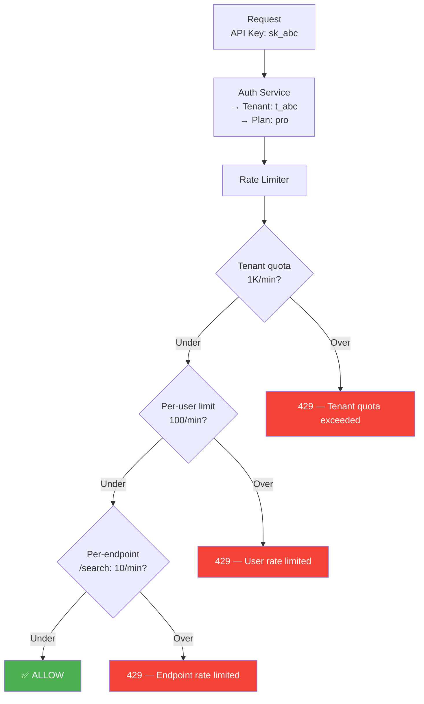

# 6. Multi-Tenant Quotas

> "A rate limiter without tenant isolation is just a global traffic light. Real multi-tenant quota management means: different limits per plan, burst allowances that don't steal from each other, and billing-grade accuracy for quota overages."

---

## 📊 Tenant Plans

### Plan Tiers

| Feature | Free | Pro ($49/mo) | Business ($199/mo) | Enterprise (Custom) |
|---------|------|-------------|-------------------|-------------------|
| Requests/min | 100 | 1,000 | 10,000 | 100,000+ |
| Requests/day | 10,000 | 100,000 | 1,000,000 | Unlimited |
| Burst allowance | None | 1.5× for 10s | 2× for 30s | 3× for 60s |
| Rate limit algorithm | Fixed window | Sliding window | Token bucket | Token bucket |
| Endpoints | All same limit | All same limit | Per-endpoint limits | Custom per-endpoint |
| Concurrent connections | 5 | 25 | 100 | Custom |
| Support | Community | Email (24h) | Priority (4h) | Dedicated (1h) |

### Why Different Algorithms Per Plan?

```
Free tier → Fixed window:
  Cheapest to compute (1 Redis op per check).
  Boundary spike (2×) is acceptable — free users don't need precision.
  
Pro tier → Sliding window counter:
  More accurate. Users paying $49/mo deserve fair counting.
  Still cheap (2 Redis ops per check).

Business/Enterprise → Token bucket:
  Burst-friendly. APIs have natural burst patterns.
  A business user sending 500 requests in 1 second then idle for 59s
  should NOT be rate limited (if under 10K/min total).
```

---

## 🏗 Quota Architecture



### Evaluation Order

```
Rate limits are checked in order of specificity:

  1. Global platform limit    (500K req/sec)     — protect infrastructure
  2. Per-IP limit             (50 req/min)        — block anonymous abuse
  3. Per-tenant limit         (plan-based)        — enforce quota
  4. Per-user limit           (100 req/min)       — per-user fairness
  5. Per-endpoint limit       (varies)            — protect expensive ops

  First limit hit → reject with specific error message.
  
  Short-circuit: if #1 or #2 rejects, don't even check #3-5.
  Saves Redis ops for clearly abusive requests.
```

---

## 💡 Burst Allowance

### Token Bucket Configuration Per Plan

| Plan | Sustained Rate | Bucket Size | Burst Duration | Max Burst Rate |
|------|---------------|-------------|---------------|---------------|
| Free | 1.67/sec (100/min) | 100 tokens | N/A (fixed window) | N/A |
| Pro | 16.7/sec (1K/min) | 25 tokens | 1.5s | 25 req instantly |
| Business | 167/sec (10K/min) | 500 tokens | 3s | 500 req instantly |
| Enterprise | 1,667/sec (100K/min) | 5,000 tokens | 3s | 5,000 req instantly |

```
Business plan example (10K/min = 167/sec):

  Scenario: API client batch-processes 500 records
  Sends 500 requests in 2 seconds

  Without burst: 500 req / 2 sec = 250/sec > 167/sec → REJECTED after 334 reqs
  With burst:    bucket has 500 tokens → all 500 pass instantly ✅
                 Then: refills at 167/sec (sustained rate)
                 After 3 seconds: bucket has ~500 tokens again

  Customer experience: batch jobs "just work" without complicated retry logic.
```

---

## 📊 Endpoint Cost Weighting

### The Problem

```
Not all requests are equal:

  GET /users/{id}          → 1ms, hits cache
  GET /search?q=complex    → 200ms, full-text search, heavy CPU
  POST /export/csv         → 5 seconds, scans entire dataset

Flat rate limiting (1000 req/min) means:
  1000 search requests = 200 seconds of CPU time
  1000 user gets = 1 second of CPU time

  Same "cost" to rate limiter, 200× different cost to infrastructure.
```

### Solution: Weighted Quotas

```
Each endpoint has a "cost" in tokens:

  GET  /users/{id}:        1 token
  GET  /users:             2 tokens (list operation)
  GET  /search:            5 tokens (expensive)
  POST /export:           50 tokens (very expensive)
  GET  /analytics:        10 tokens (aggregation)

Pro plan: 1,000 tokens/min (not "requests" — tokens)

  1,000 user gets (1 × 1,000 = 1,000 tokens)  ← uses full quota
  200 searches (5 × 200 = 1,000 tokens)        ← uses full quota
  20 exports (50 × 20 = 1,000 tokens)          ← uses full quota

Implementation:
  Token bucket with variable deduction:
  requested_tokens = endpoint_cost[request.path]
  if tokens >= requested_tokens → allow, deduct
  else → reject
```

---

## 🔄 Dynamic Quota Updates

### Real-Time Plan Changes

```
When a tenant upgrades from Pro → Business:

  1. Admin API: UPDATE plans SET tier = 'business' WHERE tenant_id = 't_abc'
  2. PostgreSQL trigger → publish event
  3. Redis Pub/Sub: PUBLISH 'config_update' '{"tenant":"t_abc","plan":"business"}'
  4. All API servers: receive → update local rule cache
  
  Time to take effect: < 2 seconds
  
  The current window counter stays (doesn't reset).
  New limit applies immediately.
  If old count < new limit → instantly unblocked.
```

### Temporary Quota Boost

```
Use case: tenant has a planned marketing campaign, needs 5× quota for 2 hours.

  POST /v1/rate-limits/overrides
  {
    "tenant_id": "t_abc",
    "multiplier": 5,
    "starts_at": "2026-02-23T14:00:00Z",
    "ends_at": "2026-02-23T16:00:00Z",
    "reason": "Product launch campaign"
  }

  Rate limiter:
    normal_limit = plan.limit  (1,000/min)
    if active_override: effective_limit = 1,000 × 5 = 5,000/min

  Override auto-expires. No manual cleanup needed.
```

---

## 📊 Quota Usage Dashboard

### Per-Tenant View

```
Tenant: Acme Corp (Business Plan)
Period: Last 24 hours

  Quota Usage:
  ███████████████████████████████░░░░░░ 78% of daily limit
  
  Requests today: 780,000 / 1,000,000

  By Endpoint:
  ┌────────────────────┬──────────┬─────────┐
  │ Endpoint           │ Requests │ % Total │
  ├────────────────────┼──────────┼─────────┤
  │ GET /users/{id}    │ 450,000  │ 57.7%   │
  │ GET /users         │ 180,000  │ 23.1%   │
  │ POST /users        │ 100,000  │ 12.8%   │
  │ GET /search        │ 40,000   │ 5.1%    │
  │ POST /export       │ 10,000   │ 1.3%    │
  └────────────────────┴──────────┴─────────┘

  Rate Limit Hits (429s): 342 (0.04%)
  Peak QPS: 450 req/sec (at 14:23 UTC)
  Avg Latency Impact: +0.3ms per request
```

### Quota Alerts

```
Alert rules:
  • Tenant at 80% of daily quota → email tenant (info)
  • Tenant at 95% of daily quota → email tenant (warning)
  • Tenant hitting 429s > 1% of requests → email tenant + internal alert
  • Tenant consistently at 100% for 3+ days → sales notification (upsell)
```

---

## ⬅️ [← Distributed Challenges](05-distributed-challenges.md) · [Failure & Recovery →](07-failure-recovery.md)
