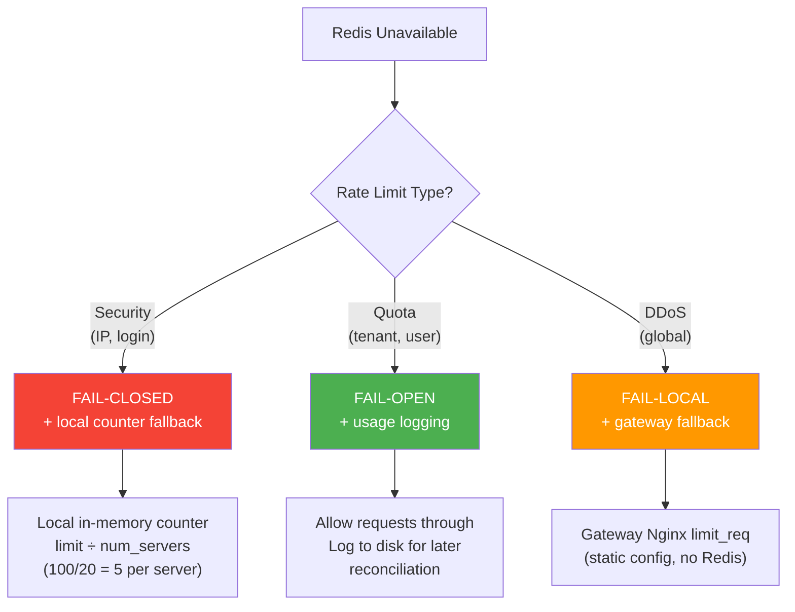

# 7. Failure Modes & Recovery

> "The irony of a rate limiter is that its failure modes are worse than the problems it prevents. A missing rate limiter lets bad traffic through. A broken rate limiter blocks ALL traffic."

---

## 📊 Failure Mode Catalog

| Failure | Probability | Impact | Default Policy |
|---------|------------|--------|---------------|
| **Redis primary down** | Low | 🔴 No rate limiting | Fail-open + local fallback |
| **Redis cluster split-brain** | Very Low | 🟡 Inaccurate counts | Accept temporary inaccuracy |
| **Redis latency spike** | Medium | 🟡 Added request latency | Timeout → fail-open |
| **Network partition (server↔Redis)** | Low | 🔴 Some servers can't check | Local fallback |
| **Lua script error** | Rare (deploy bug) | 🔴 All checks fail | Fail-open + alert |
| **Config DB down** | Low | 🟢 Stale rules (cached) | Continue with cached rules |
| **Hot key (single tenant)** | Medium | 🟡 One shard overloaded | Local counting for hot tenants |
| **Memory exhaustion** | Low | 🔴 Redis evicting keys | Over-provisioned (25× headroom) |

---

## 🔴 Scenario 1: Redis Cluster Down

### Impact

```
Redis cluster completely unreachable:
  ❌ No rate limit checks possible
  ❌ All 500K req/sec flow through unprotected
  ✅ Application services still work
  ✅ Business logic unaffected

Duration: depends on Redis recovery
  Single node failure: < 30sec (sentinel failover)
  Full cluster: minutes to hours
```

### Tiered Failure Strategy



### Local Fallback Implementation

```
In-memory fallback (activated when Redis is unreachable):

class LocalRateLimiter:
    counters = {}  # {key: {count: int, window_start: timestamp}}
    
    def check(key, limit, window):
        # Divide limit by number of servers (approximate global)
        local_limit = limit / NUM_SERVERS  # 1000 / 20 = 50
        
        now = time.now()
        entry = counters.get(key, {count: 0, window_start: now})
        
        if now - entry.window_start > window:
            entry = {count: 0, window_start: now}
        
        if entry.count >= local_limit:
            return REJECTED
        
        entry.count += 1
        counters[key] = entry
        return ALLOWED

Limitations:
  - Accuracy: ±20× (each server counts independently)
  - No cross-server visibility
  - Better than nothing (limits damage from single source)
  
Activation:
  - Redis health check fails 3 times in 5 seconds
  - Switch to local fallback
  - Check Redis every 10 seconds for recovery
  - When Redis healthy: drain local counters to Redis, switch back
```

---

## 🟡 Scenario 2: Redis Latency Spike

### The Problem

```
Normal Redis latency: 0.3ms
During spike: 50ms+ (slow commands, memory pressure, network)

Impact: 0.3ms → 50ms adds 50ms to EVERY request
  500K req/sec × 50ms = 25,000 seconds of added latency per second
  p99 goes from 2ms to 52ms → SLA breach

This is worse than Redis being down.
Down → we fail-open (0ms overhead)
Slow → we add latency to everything (50ms overhead)
```

### Solution: Aggressive Timeouts

```
Rate limit check timeout: 5ms (not the default 1s or even 100ms)

  if redis_response_within(5ms):
      apply rate limit decision
  else:
      log "redis_timeout"
      ALLOW request (fail-open)
      increment timeout_counter

  if timeout_counter > 100 in last 10 seconds:
      switch to local fallback mode
      alert: "Redis latency degraded, switched to local mode"

Why 5ms?
  Normal: 0.3ms → 5ms is 16× headroom
  If Redis takes > 5ms, it's already unhealthy
  We'd rather fail-open than add 50ms to every request
```

---

## 🟡 Scenario 3: Thundering Herd After Recovery

### The Problem

```
Redis was down for 2 minutes → all counters lost (TTL expired during outage)

Redis recovers:
  All 500K req/sec start checking Redis again
  All counters start from 0
  → Every tenant appears to have 0 requests → all limits "reset"
  → Tenants who were rate-limited suddenly get burst-through
  → Tenants who relied on burst protection have empty buckets

Also: 500K Redis commands/sec hitting freshly restarted Redis
  → Redis overwhelmed again → cascading failure
```

### Solution: Gradual Recovery

```
When Redis recovers from outage:

  1. Don't switch all traffic to Redis at once
  
  2. Ramp up:
     t+0s:   10% of rate limit checks go to Redis
     t+5s:   25%
     t+10s:  50%
     t+20s:  75%
     t+30s:  100%
  
  3. During ramp: remaining checks use local fallback
  
  4. Counters rebuild naturally:
     Within 1 minute window: counters are ~accurate again
     Token buckets: start full (conservative) — that's OK

  Implementation:
    recovery_pct = min(100, (time_since_recovery / 30) * 100)
    use_redis = random() < recovery_pct / 100
```

---

## 🟡 Scenario 4: Poison Key (Hot Spot)

### The Problem

```
One tenant generates 20K req/sec.
All their rate limit keys hash to one Redis shard.
That shard gets 20K ops/sec while others get 2K.

Symptoms:
  - One Redis node at 100% CPU
  - That node's latency: 10ms (normally 0.3ms)
  - All tenants whose keys hash to same shard: slow
  - "Noisy neighbor" problem
```

### Solution: Hot Key Detection + Local Counting

```
Monitor per-key operation rate:

  If any key exceeds 5K ops/sec (configurable):
    → Flag as "hot key"
    → Switch to local counting mode for that key
    → Sync to Redis at reduced frequency (every 500ms instead of 100ms)
    → Reduce shard load by 10×

  Detection:
    Each API server tracks: requests per tenant (local counter)
    If local_count > threshold_per_server: flag hot
    
    Threshold: 5K ops/sec ÷ 20 servers = 250 req/sec on any single server

  Recovery:
    When tenant's rate drops below threshold: switch back to Redis
    Hysteresis: require < 100 req/sec for 60 seconds before switching
    (prevents flapping between modes)
```

---

## 📊 Monitoring & Alerting

### Key Metrics

| Metric | Healthy | Warning | Critical |
|--------|---------|---------|----------|
| Redis latency (p99) | < 1ms | 1-5ms | > 5ms |
| Redis ops/sec | < 80% capacity | 80-90% | > 90% |
| Rate limit check errors | < 0.01% | 0.01-0.1% | > 0.1% |
| 429 responses (global) | < 0.5% of traffic | 0.5-2% | > 2% |
| Local fallback active | 0 servers | 1-3 servers | > 3 servers |
| Config sync lag | < 5s | 5-30s | > 30s |

### Alert Escalation

```
Level 1 (Auto-handled):
  - Single Redis node slow → sentinel failover
  - Config sync lag > 5s → force refresh from DB

Level 2 (On-call notification):
  - Redis cluster degraded (> 3 nodes affected)
  - > 1% of rate limit checks failing
  - Hot key detected (auto-mitigated, notify for awareness)

Level 3 (Immediate escalation):
  - Redis cluster fully down
  - All servers in local fallback mode
  - Rate limiting effectively disabled
```

---

## 🔁 Recovery Runbooks

### Runbook: Redis Cluster Recovery

```
Symptom: Rate limit checks returning errors

Step 1: Identify scope
  - How many Redis nodes affected?
  - Is it network (partition) or process (crash)?
  
Step 2: Check automatic recovery
  - Redis Sentinel should auto-failover in < 30s
  - Check: redis-cli -p 26379 sentinel masters
  
Step 3: If auto-recovery failed
  - Manual failover: redis-cli -p 26379 sentinel failover mymaster
  - Verify new primary: redis-cli -h new-primary ping
  
Step 4: Verify rate limiting restored
  - Check dashboard: error rate < 0.01%
  - Check local fallback status: should be 0 servers
  
Step 5: Post-incident
  - Check if any counters lost (acceptable — they rebuild)
  - Verify no tenant was charged for overages during outage
  - Run reconciliation report
```

---

## ⬅️ [← Multi-Tenant Quotas](06-multi-tenant.md) · [DDoS & Advanced →](08-ddos-advanced.md)
