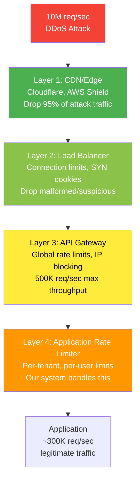
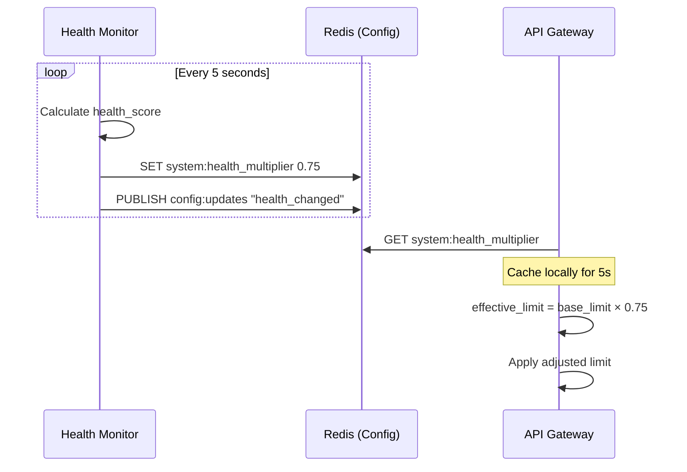

# 8. DDoS Protection & Advanced Patterns

> "Rate limiting is the first line of defense, not the last. A sophisticated attacker will find ways around simple counters. The question is: how many layers deep can you go before the cost of protection exceeds the cost of the attack?"

---

## 🛡️ DDoS vs. Rate Limiting

### They're Not the Same Thing

```
Rate Limiting:
  Purpose: Fair usage enforcement
  Target: Known users/tenants
  Volume: Normal traffic (500K req/sec)
  Action: 429 Too Many Requests

DDoS Protection:
  Purpose: Service availability
  Target: Unknown/malicious sources
  Volume: Attack traffic (10M+ req/sec)
  Action: Drop at network layer, never reach application

A rate limiter handles 500K req/sec.
A DDoS attack sends 10M+ req/sec.
Rate limiting alone ≠ DDoS protection.
```

### Defense Layers



---

## 🎯 Adaptive Rate Limiting

### The Problem with Static Limits

```
Static limits: "100 requests per minute per user"

Under normal load (200K req/sec):
  System capacity: 500K req/sec
  Headroom: 300K req/sec
  Static limits work fine

Under stress (450K req/sec):
  System near capacity
  Static limits still allow 100 req/min/user
  Server is struggling → p99 latency increasing
  We SHOULD tighten limits temporarily

Static limits don't react to system health.
```

### Adaptive Algorithm

```
System health score (0.0 to 1.0):

  health_score = weighted_average(
    cpu_utilization:        weight=0.3  → (1 - cpu_pct)
    memory_utilization:     weight=0.1  → (1 - mem_pct)
    redis_latency_p99:      weight=0.2  → max(0, 1 - latency_ms/10)
    error_rate:             weight=0.2  → (1 - error_rate/0.05)
    request_queue_depth:    weight=0.2  → max(0, 1 - queue/1000)
  )

Dynamic limit adjustment:

  health_score > 0.8:  multiplier = 1.0   (normal limits)
  health_score > 0.6:  multiplier = 0.75  (25% reduction)
  health_score > 0.4:  multiplier = 0.50  (50% reduction)  
  health_score > 0.2:  multiplier = 0.25  (75% reduction)
  health_score ≤ 0.2:  multiplier = 0.10  (emergency — 10% of normal)

  effective_limit = base_limit × multiplier

Example:
  Normal: 1000 req/min → health drops to 0.5 → 500 req/min
  User gets header: X-RateLimit-Limit: 500 (was 1000)
```

### Implementation: Feedback Loop



### Tenant Priority During Degradation

```
When limits tighten, not all tenants are equal:

  Priority 1 (Enterprise, $10K+/mo): multiplier × 1.5 (gentler reduction)
  Priority 2 (Business, $500/mo):    multiplier × 1.0 (standard reduction)
  Priority 3 (Pro, $49/mo):          multiplier × 0.8 (moderate reduction)
  Priority 4 (Free, $0/mo):          multiplier × 0.5 (aggressive reduction)

Example at health_score = 0.5 (multiplier = 0.5):
  Enterprise: 100K × 0.5 × 1.5 = 75K req/min (25% cut)
  Business:   10K  × 0.5 × 1.0 = 5K  req/min (50% cut)
  Pro:        1K   × 0.5 × 0.8 = 400 req/min (60% cut)
  Free:       100  × 0.5 × 0.5 = 25  req/min (75% cut)

Paying customers get proportionally gentler treatment.
```

---

## 🕵️ DDoS Detection Patterns

### Distinguishing Attack from Legitimate Spike

```
Legitimate spike (Black Friday):
  ✅ Authenticated users
  ✅ Normal request distribution (80/20 read/write)
  ✅ Geographic distribution matches user base
  ✅ Gradual ramp-up (hours)
  ✅ Valid payloads

DDoS attack:
  ❌ Mostly unauthenticated or spoofed tokens
  ❌ Unusual endpoint distribution (100% hits to /api/search)
  ❌ Geographic anomaly (90% from one ASN)
  ❌ Instant spike (0 to 10M in seconds)
  ❌ Repetitive/malformed payloads
```

### Detection Signals

```
Signal 1: Request fingerprinting

  For each request, calculate fingerprint:
    fp = hash(user_agent + accept_language + accept_encoding + tls_cipher)
  
  Normal: 10K+ unique fingerprints per minute
  Bot/DDoS: < 50 unique fingerprints hitting 10K+ req/sec
  
  Action: If single fingerprint > 1% of total traffic → flag

Signal 2: Endpoint distribution anomaly

  Normal distribution: GET /products (40%), POST /orders (15%), etc.
  Attack: GET /api/search (95% of traffic)
  
  Detect: KL divergence between current distribution and baseline
  If KL divergence > threshold → flag
  
  Action: Apply 10× tighter limits to anomalous endpoint

Signal 3: Geographic anomaly

  Track requests per ASN (Autonomous System Number):
  
  Normal: top ASN = 8% of traffic (AWS, Cloudflare, etc.)
  Attack: one ASN = 60% of traffic
  
  Action: If single ASN > 20% → apply ASN-level rate limit

Signal 4: New IP velocity

  Track: new IPs seen per minute
  
  Normal: ~500 new IPs per minute (gradual)
  DDoS: 50K+ new IPs per minute (sudden)
  
  Action: If new_ip_rate > 10× baseline:
    → Require proof-of-work or CAPTCHA for new IPs
    → Existing IPs continue normally
```

---

## 🌐 Global vs. Local Rate Limiting

### When to Use Each

```
LOCAL rate limiting (per-server, in-memory):
  ✅ Ultra-low latency (no network hop)
  ✅ No dependency on external service
  ❌ Inaccurate with multiple servers
  ❌ Uneven load → uneven limits
  
  Best for:
    - Connection-level limits (max concurrent)
    - CPU-protection limits (prevent single server overload)
    - As fallback when Redis is down

GLOBAL rate limiting (Redis-backed):
  ✅ Accurate across all servers
  ✅ Consistent user experience
  ❌ Network latency (0.3ms + per check)
  ❌ Redis dependency
  
  Best for:
    - Tenant/user API quotas (primary use case)
    - Billing-related limits
    - Fair usage enforcement

HYBRID (our approach):
  Layer 1 — Local: Connection limits, basic DDoS protection
  Layer 2 — Global: Tenant quotas, user limits, endpoint limits
  
  Why: L1 catches the cheap stuff without Redis overhead.
        L2 handles the important stuff with accuracy.
```

### Hierarchical Rate Limiting

```
Some limits are nested:

  Global:   500K req/sec (system capacity)
  └─ Tenant: 10K req/sec (Enterprise plan)
     └─ User: 100 req/sec (per user within tenant)
        └─ Endpoint: 10 req/sec (expensive operation)

Check order matters:
  1. Check global → if over → reject (no Redis needed, local counter)
  2. Check tenant → if over → reject (one Redis call)
  3. Check user → if over → reject (same Redis call, pipeline)
  4. Check endpoint → if over → reject (same pipeline)

  Total: 1 Redis round-trip for 3 checks (pipelining)

But what if user limit says "allow" but tenant limit says "reject"?
  → Always check broader scope first
  → Reject at the highest applicable level
  → Return 429 with: X-RateLimit-Scope: tenant (tells client WHY)
```

---

## ⚡ Rate Limiting at the Edge

### Why Edge Rate Limiting Matters

```
Without edge rate limiting:

  Attacker → CDN → Load Balancer → API Gateway → Rate Limiter
                                                   ↓
  Attack traffic traverses your entire infrastructure before being rejected.
  You're paying for bandwidth, compute, and Redis ops for attack traffic.

With edge rate limiting:

  Attacker → CDN (blocked here)
                ↓ (only clean traffic)
  CDN → Load Balancer → API Gateway → Rate Limiter
  
  95%+ of attack traffic never reaches your infrastructure.
  Cost savings: massive.
```

### Edge vs. Application Rate Limiting

| Aspect | Edge (CDN) | Application (Our System) |
|--------|-----------|-------------------------|
| **Latency** | ~0ms (at CDN POP) | ~1ms (Redis lookup) |
| **Granularity** | IP, path, headers | Tenant, user, token |
| **Accuracy** | Approximate (distributed CDN) | Precise (centralized Redis) |
| **Auth-aware** | No (pre-authentication) | Yes (post-authentication) |
| **Cost** | Included in CDN plan | Redis infra ($3.1K/mo) |
| **Config updates** | Minutes (CDN propagation) | Seconds (Redis Pub/Sub) |
| **DDoS protection** | Excellent (absorbs volume) | Limited (within capacity) |

### Recommended Split

```
Edge (Cloudflare/AWS CloudFront):
  - IP rate limiting: 1000 req/sec per IP (catches volumetric attacks)
  - Path rate limiting: /api/login → 10 req/min per IP
  - Geographic blocking: block entire countries if 0 legitimate users
  - Bot detection: challenge suspicious user agents

Application (our rate limiter):
  - Tenant quotas: per API key, accurate to plan limits
  - User limits: per authenticated user
  - Endpoint costs: weighted quotas for expensive operations
  - Adaptive limits: health-based adjustment
```

> **⚠️ Mitigation: CDN Propagation Delay**
>
> CDN edge rule updates (e.g., blocking a new attack pattern) take **30-90 seconds to propagate** across all PoPs globally. During this window, the application layer absorbs the attack traffic that the CDN hasn't started filtering yet. This is handled by: (1) **application-layer rate limiting is always active** — it's not a fallback, it's the primary defense, and CDN filtering is an optimization layer on top, (2) **the adaptive rate limiter** (health-score based) automatically tightens limits when it detects elevated traffic, regardless of whether CDN rules have propagated, (3) **pre-deployed CDN rules** for common attack patterns (SYN floods, known bad ASNs) are always active — only novel patterns require propagation.

---

## 🧩 Advanced Patterns

### Pattern 1: Token Bucket with Borrowing

```
Standard token bucket: request fails when bucket is empty.

With borrowing: request succeeds but "borrows" from future tokens.

  Bucket: 100 tokens, refill 10/sec
  Current: 0 tokens
  
  Standard: REJECT
  
  Borrowing: ALLOW, but debt = -1 token
    Next refill: +10 tokens → effective = 9 (pays back debt)
    Max debt: -20 tokens (2 seconds of refill)
    If debt > max: REJECT (can't borrow more)

Use case:
  Tenant has critical batch job that spikes briefly.
  Borrowing smooths the experience without raising limits.
  
  Trade-off:
    ✅ Better UX for bursty workloads
    ❌ Slightly higher peak throughput
    ❌ More complex implementation
```

### Pattern 2: Request Priority Queue

```
Not all requests are equal, even within rate limits:

  Priority 1: Health checks, auth tokens, payment webhooks
  Priority 2: Normal API calls
  Priority 3: Bulk operations, reports, exports

When system is under pressure (health_score < 0.6):
  Priority 1: Never rate-limited (critical path)
  Priority 2: Normal limits × multiplier
  Priority 3: Aggressively limited (multiplier × 0.3)

Implementation:
  Request arrives → classify priority (by path, header, or user role)
  → Apply priority-specific limits
  
  Priority is separate from tenant plan tier.
  An Enterprise tenant's bulk export is still Priority 3.
  A Free tenant's payment webhook is still Priority 1.
```

### Pattern 3: Sliding Window with Sub-Second Precision

```
Standard: window = 1 minute, precision = 1 minute
Fine-grained: window = 1 second, precision = 100ms

Why? For catching micro-bursts:

  Rate limit: 100 req/sec
  
  Standard 1-second window:
    100 requests in first 10ms → ALLOWED (under limit)
    Server hit with 100 req burst → bad for downstream

  Sub-second (100ms buckets within 1 second):
    10 buckets of 10 requests each
    100 requests in first 10ms → only 10 allowed in first bucket
    → Smooths traffic at sub-second level

Implementation (Redis):
  key = "rl:user:123:subsec:{timestamp_ms / 100}"
  INCR key → compare to limit/10
  EXPIRE key 2 (cleanup)
  
Trade-off:
  ✅ Smoother traffic for downstream services
  ❌ 10× more Redis operations per check
  ❌ Only worth it for very latency-sensitive backends
```

---

## 📊 Key Trade-offs Summary (Entire Case Study)

| Decision | Chose | Over | Why |
|----------|-------|------|-----|
| **Architecture** | Hybrid (Gateway + Library) | Pure gateway | Lower latency for L2 checks, no single bottleneck |
| **Algorithm** | Sliding Window Counter | Token Bucket | Best accuracy/cost ratio, 0.003% error |
| **Storage** | Redis Cluster | Memcached | Lua scripts, persistence on restart, Pub/Sub |
| **Accuracy vs. Performance** | ±5% tolerance | Exact counting | 10× fewer Redis ops with local aggregation |
| **Failure mode** | Tiered (closed/open/local) | Always fail-open | Security limits need different treatment than quotas |
| **Multi-tenant** | Weighted quotas | Simple counters | Fair billing when endpoints have different costs |
| **DDoS** | Edge + Application layers | Application only | Can't handle 10M+ req/sec at application layer |
| **Adaptive limits** | Health-score based | Static only | System protects itself under load |

---

## 🏁 Production Readiness Checklist

```
Core Implementation:
  ☐ Sliding window counter with Lua scripts
  ☐ Token bucket for burst-friendly tiers
  ☐ Redis Cluster (6 nodes) deployed
  ☐ Local fallback counters tested

Multi-Tenant:
  ☐ 4 plan tiers with different limits
  ☐ Weighted endpoint quotas
  ☐ Dynamic config updates via Pub/Sub
  ☐ Tenant dashboard with usage visibility

Resilience:
  ☐ Redis failure → tiered fallback (tested via chaos engineering)
  ☐ 5ms timeout on Redis checks
  ☐ Gradual recovery after Redis outage
  ☐ Hot key detection and mitigation

Observability:
  ☐ Redis latency, ops/sec, error rate dashboards
  ☐ Per-tenant 429 rate tracking
  ☐ Alert escalation (Level 1/2/3)
  ☐ Recovery runbooks documented

DDoS Protection:
  ☐ Edge rate limiting (CDN layer)
  ☐ Adaptive limits based on health score
  ☐ Request fingerprinting anomaly detection
  ☐ Geographic and ASN monitoring

Performance Targets:
  ☐ p50 < 0.5ms ✅
  ☐ p99 < 2ms ✅
  ☐ 500K decisions/sec ✅
  ☐ Monthly cost < $4K ✅ ($3.1K)
```

---

## 🔄 What I'd Do Differently in Real Production

| Area | What This Design Does | What I'd Change | Why |
|------|----------------------|-----------------|-----|
| **Build vs Buy** | Custom-built everything | Use a managed API gateway (Kong, AWS API Gateway) for L1, custom for L2 only | L1 rate limiting (IP, global) is commodity. Don't build what CloudFlare/AWS do better. Spend engineering time on the tenant-level logic that's unique to your platform |
| **5 algorithms** | Implements and compares 5 | Ship with sliding window counter only, add token bucket when a paying customer asks for burst support | Every algorithm is code to maintain and test. Ship one, iterate when you have real usage data |
| **Redis Cluster from Day 1** | 6-node Redis Cluster | Start with 2-node Redis Sentinel, upgrade to Cluster at 100K req/sec | Redis Cluster's operational complexity (slot management, resharding) isn't justified until single-node Redis is actually saturated |
| **Lua scripts** | All rate limit logic in Lua | Use Redis Lua for the core counter, but simple INCR+EXPIRE for basic tiers | Lua scripts are hard to debug and version. Keep them minimal — only use Lua where atomicity is truly required |
| **Adaptive rate limiting** | Health-score based dynamic limits | Start with static limits + manual override, add adaptive when you have 3+ months of traffic patterns | Adaptive systems need baseline data. Without historical norms, the system doesn't know what "abnormal" looks like |
| **Shadow mode** | Not mentioned in the design | Deploy in shadow mode (log, don't enforce) for 2 weeks before any production enforcement | The #1 cause of rate limiter outages is misconfigured limits. Shadow mode catches bad configs before they reject real traffic |

> **The honest truth:** The best rate limiter is one your API consumers never notice. I'd invest heavily in clear documentation (rate limit headers, error messages, upgrade paths) and a self-service dashboard before any of the advanced algorithms. A well-communicated 100 req/min limit causes fewer support tickets than a poorly-documented adaptive system.

---

## ⬅️ [← Failure & Recovery](07-failure-recovery.md) · [🏠 Back to Case Study](README.md)
