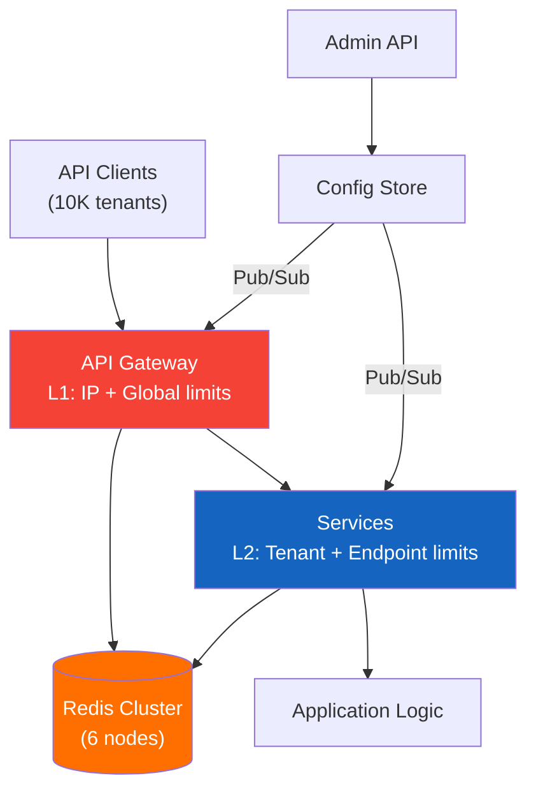

# 🚦 Case Study 4: Rate Limiting System

> **Interview Prompt:** "Design a distributed rate limiting system that protects a multi-tenant API platform serving 10,000 tenants with 500K requests/second aggregate traffic. Support multiple rate limiting algorithms, tenant-level quotas, and graceful degradation under extreme load."

---

## 📑 Table of Contents

| # | Section | Key Topics |
|---|---------|------------|
| 0 | [Overview & Requirements](00-overview.md) | Use cases, rate limit types, key assumptions |
| 1 | [Capacity Estimation](01-capacity-estimation.md) | QPS, Redis memory, counter storage |
| 2 | [High-Level Architecture](02-high-level-architecture.md) | Inline vs sidecar, API gateway integration |
| 3 | [Algorithms Deep Dive](03-algorithms.md) | Fixed window, sliding window, token bucket, leaky bucket |
| 4 | [Data Model & Redis Design](04-data-model-redis.md) | Redis data structures, Lua scripts, cluster sharding |
| 5 | [Distributed Challenges](05-distributed-challenges.md) | Race conditions, clock skew, multi-node consistency |
| 6 | [Multi-Tenant Quotas](06-multi-tenant.md) | Tiered plans, burst allowance, quota management |
| 7 | [Failure & Recovery](07-failure-recovery.md) | Redis failure (allow vs deny), degradation strategy |
| 8 | [DDoS & Advanced Patterns](08-ddos-advanced.md) | Adaptive limits, DDoS mitigation, global vs local |

---

## 🔑 Key Challenges

| Challenge | Why It's Hard |
|-----------|---------------|
| **Sub-millisecond latency** | Rate limiter is in the HOT PATH of every request — 1ms overhead = 500K ms/sec wasted |
| **Distributed counting** | 20 API servers each counting locally ≠ accurate global count |
| **Race conditions** | Two requests arrive simultaneously — both read count=99, both increment to 100 (should be 101) |
| **Redis failure mode** | Redis down: allow all (risk abuse) or deny all (outage)? |
| **Fairness** | One tenant's burst shouldn't starve others |
| **Multi-dimensional limits** | Rate limit per user AND per IP AND per endpoint AND per API key — simultaneously |

---

## 🏗 Architecture Overview

> Full architecture with all options compared: [02-high-level-architecture.md](02-high-level-architecture.md)

---

## 📖 Reading Guide

**If you have 15 minutes:** Read [00-overview](00-overview.md) + [03-algorithms](03-algorithms.md) + [05-distributed-challenges](05-distributed-challenges.md)  
**If you have 30 minutes:** Add [04-data-model-redis](04-data-model-redis.md) + [06-multi-tenant](06-multi-tenant.md)  
**For full depth:** Read all sections in order (0 → 8)

---

## 🏗 Technology Decisions Summary

| Component | Choice | Alternative Considered | Rationale |
|-----------|--------|----------------------|----------|
| **Architecture** | Hybrid (Gateway L1 + Library L2) | Pure gateway, sidecar | Lower latency for L2 checks; no single bottleneck |
| **Primary algorithm** | Sliding Window Counter | Token bucket, fixed window | 0.003% error (Cloudflare research), O(1) memory, 2 Redis ops |
| **Burst-friendly algorithm** | Token Bucket (Enterprise tier) | Leaky bucket | Allows controlled bursts; capacity + refill rate config |
| **Storage** | Redis Cluster (6 nodes) | Memcached, DynamoDB | Lua scripts for atomicity, Pub/Sub for config sync, persistence |
| **Accuracy tolerance** | ±5% (local aggregation) | Exact counting | 10× fewer Redis ops; acceptable for rate limiting |
| **Failure mode** | Tiered (closed/open/local) | Always fail-open | Security limits (IP, login) need fail-closed; quotas can fail-open |
| **Multi-tenant quotas** | Weighted endpoint costs | Simple counters | `/search` costs 5× more than `/status`; fair billing |
| **DDoS protection** | Edge (CDN) + Application layers | Application only | Can't handle 10M+ req/sec at application layer alone |

> Full trade-off analysis with reasoning: [08-ddos-advanced.md → Key Trade-offs Summary](08-ddos-advanced.md)

---

## ⬅️ [← Back to All Case Studies](../../README.md)
